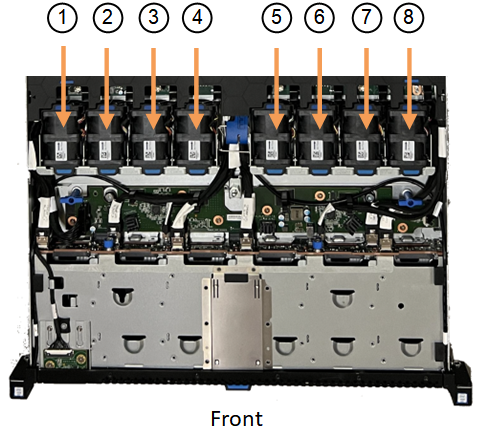

= 
:allow-uri-read: 

.A proposito di questa attività
Per evitare interruzioni del servizio, verificare che tutti gli altri nodi storage siano collegati alla griglia prima di iniziare la sostituzione della ventola o sostituire la ventola durante una finestra di manutenzione programmata in caso di accettabili periodi di interruzione del servizio. Consultare le informazioni su https://docs.netapp.com/us-en/storagegrid-118/monitor/monitoring-system-health.html#monitor-node-connection-states["monitoraggio degli stati di connessione del nodo"^].

CAUTION: Se è stata utilizzata una regola ILM che crea una sola copia di un oggetto, è necessario sostituire la ventola durante una finestra di manutenzione pianificata. In caso contrario, è possibile che l'accesso a tali oggetti venga temporaneamente perso durante questa procedura. Vedere le informazioni su https://docs.netapp.com/us-en/storagegrid-118/ilm/why-you-should-not-use-single-copy-replication.html["perché non utilizzare la replica a copia singola"^].

Il nodo dell'appliance non sarà accessibile durante la sostituzione della ventola.

La fotografia mostra una ventola per l'apparecchio. Il connettore elettrico viene evidenziato. Le ventole di raffreddamento sono accessibili dopo aver aperto il coperchio superiore dell'apparecchio.

NOTE: Ciascuna delle due unità di alimentazione contiene anche una ventola. Le ventole dell'alimentatore non sono incluse in questa procedura.

image::../media/sgf6112_fan_fru.png[FRU della ventola]

.Fasi
. Avvolgere l'estremità del braccialetto ESD intorno al polso e fissare l'estremità del fermaglio a una messa a terra metallica per evitare scariche elettrostatiche.
. Individuare la ventola da sostituire.
+
Le otto ventole si trovano nelle seguenti posizioni nello chassis (in figura è mostrata la metà anteriore dell'apparecchio StorageGRID con il coperchio superiore rimosso):

+

|===

|  | Gruppo ventola 

 a| 
1
 a| 
Fan_SYS0

 a| 
2
 a| 
Fan_SYS1

 a| 
3
 a| 
Fan_SYS2

 a| 
4
 a| 
Fan_SYS3

 a| 
5
 a| 
Fan_SYS4

 a| 
6
 a| 
Fan_SYS5

 a| 
7
 a| 
Fan_SYS6

 a| 
8
 a| 
Fan_SYS7

|===
. Utilizzando le linguette blu sulla ventola, estrarre la ventola guasta dal telaio.
+
image::../media/fan_removal.png[Rimozione della ventola]

. Far scorrere la ventola sostitutiva nello slot aperto dello chassis.
+
Assicurarsi di allineare il connettore della ventola con la presa della scheda a circuiti stampati.

. Premere con decisione il connettore della ventola nella scheda a circuiti stampati (presa evidenziata).
+
image::../media/sgf6112_fan_socket_check.png[Controllo del connettore della ventola]

