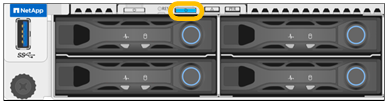

= 
:allow-uri-read: 

.Fasi
. Trova l'appliance nel data center.
+
** Verificare che nella parte anteriore o posteriore dell'apparecchio sia presente un LED di identificazione blu acceso.
+
Il LED di identificazione anteriore si trova dietro il pannello anteriore e potrebbe essere difficile vedere se il pannello è installato.

+

+
Il LED di identificazione posteriore si trova al centro del dispositivo, accanto allo slot Micro-SD.

** Verificare che il codice del ricambio corrisponda a quello riportato sulle etichette applicate sulla parte anteriore dell'apparecchio per verificare di aver trovato l'apparecchio corretto.

. Rimuovere il pannello anteriore, se installato, per accedere ai comandi e agli indicatori del pannello anteriore.

