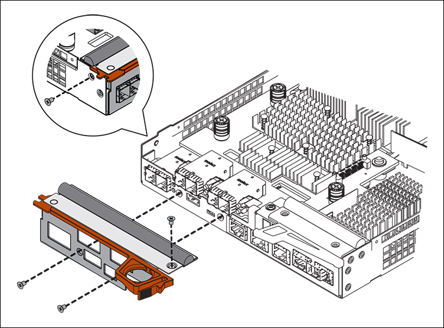

= Fase 5: Spostare l'HIC sulla nuova centralina, se necessario
:allow-uri-read: 

== Fase 5: Spostare l'HIC sulla nuova centralina, se necessario

Se il controller guasto include una scheda di interfaccia host (HIC), spostare l'HIC dal controller guasto al controller sostitutivo.

Un HIC separato viene utilizzato solo per il controller E2800B. L'HIC è montato sulla scheda del controller principale e include due connettori SPF.

NOTE: Le illustrazioni di questa procedura mostrano un HIC a 2 porte. L'HIC del controller potrebbe avere un numero di porte diverso.

[role="tabbed-block"]
====
.E2800A
--
Una centralina E2800A non dispone di un HIC.

Riposizionare il coperchio della centralina E2800A e passare a. <<step6_replace_controller,Fase 6: Sostituire la centralina>>

--
.E2800B
--
Spostare l'HIC dalla centralina E2800B guasta alla centralina sostitutiva.

.Fasi
. Rimuovere eventuali SFP dall'HIC.
. Utilizzando un cacciavite Phillips n. 1, rimuovere le viti che fissano la mascherina HIC al controller.
+
Sono presenti quattro viti: Una sulla parte superiore, una laterale e due sulla parte anteriore.

+

. Rimuovere la piastra anteriore dell'HIC.
. Utilizzando le dita o un cacciavite Phillips, allentare le tre viti a testa zigrinata che fissano l'HIC alla scheda del controller.
. Scollegare con cautela l'HIC dalla scheda del controller sollevandola e facendola scorrere all'indietro.
+

CAUTION: Fare attenzione a non graffiare o urtare i componenti sul fondo dell'HIC o sulla parte superiore della scheda del controller.

+
image::../media/28_dwg_e2800_hic_thumbscrews_maint-e2800.png[Viti a testa zigrinata HIC E2800A]

+
[cols="1a,2a"]
|===
| Etichetta | Descrizione 

 a| 
1
 a| 
Scheda di interfaccia host

 a| 
2
 a| 
Viti a testa zigrinata

|===
. Posizionare l'HIC su una superficie priva di elettricità statica.
. Utilizzando un cacciavite Phillips n. 1, rimuovere le quattro viti che fissano la mascherina vuota al controller sostitutivo, quindi rimuovere la mascherina.
. Allineare le tre viti a testa zigrinata sull'HIC con i fori corrispondenti sul controller sostitutivo e allineare il connettore sulla parte inferiore dell'HIC con il connettore di interfaccia HIC sulla scheda del controller.
+
Fare attenzione a non graffiare o urtare i componenti sul fondo dell'HIC o sulla parte superiore della scheda del controller.

. Abbassare con cautela l'HIC in posizione e inserire il connettore HIC premendo delicatamente sull'HIC.
+

CAUTION: *Possibili danni all'apparecchiatura* -- fare attenzione a non stringere il connettore a nastro dorato dei LED del controller tra l'HIC e le viti a testa zigrinata.

+
image::../media/28_dwg_e2800_hic_thumbscrews_maint-e2800.gif[Viti HIC E2800A]

+
[cols="1a,2a"]
|===
| Etichetta | Descrizione 

 a| 
1
 a| 
Scheda di interfaccia host

 a| 
2
 a| 
Viti a testa zigrinata

|===
. Serrare manualmente le viti a testa zigrinata HIC.
+
Non utilizzare un cacciavite per evitare di serrare eccessivamente le viti.

. Utilizzando un cacciavite Phillips n. 1, fissare la mascherina HIC rimossa dal controller originale al nuovo controller con quattro viti.
+

. Reinstallare eventuali SFP rimossi nell'HIC.

--
====