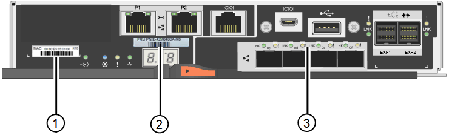

= 
:allow-uri-read: 

Queste figure mostrano il controller E2800A e il controller E2800B. La procedura per la sostituzione dei controller della serie E2800 e del controller EF570 è identica.

Storage controller E2800A:

image::../media/e2800_labels_on_controller.gif[Etichette MAC e FRU sul controller E2800A]

Storage controller E2800B:

[cols="1a,2a,4a"]
|===
| Etichetta | componente | Descrizione 

 a| 
1
 a| 
Indirizzo MAC
 a| 
L'indirizzo MAC per la porta di gestione 1 ("`P1 su E2800A e 0a su E2800B`"). Se si è utilizzato DHCP per ottenere l'indirizzo IP del controller originale, sarà necessario questo indirizzo per connettersi al nuovo controller.

 a| 
2
 a| 
Numero di parte della FRU
 a| 
Il numero di parte della FRU. Questo numero deve corrispondere al numero di parte di ricambio per il controller attualmente installato.

 a| 
3
 a| 
HIC a 4 porte
 a| 
La scheda HIC (host Interface Card) a 4 porte. Questa scheda deve essere spostata nel nuovo controller quando si esegue la sostituzione.

*Nota*: Il controller E2800A non dispone di un HIC.

|===