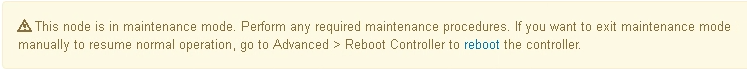

= Impostare l'apparecchio in modalità di manutenzione
:allow-uri-read: 
:icons: font
:imagesdir: ../media/

[role="lead"]
Prima di eseguire specifiche procedure di manutenzione, è necessario attivare la modalità di manutenzione dell'apparecchio.

.Prima di iniziare
* L'utente ha effettuato l'accesso a Grid Manager utilizzando un https://docs.netapp.com/us-en/storagegrid/admin/web-browser-requirements.html["browser web supportato"^].
* Si dispone dell'autorizzazione di accesso Maintenance o Root. Per ulteriori informazioni, consultare le istruzioni per l'amministrazione di StorageGRID.

.A proposito di questa attività
In rari casi, l'attivazione della modalità di manutenzione di un'appliance StorageGRID potrebbe rendere l'appliance non disponibile per l'accesso remoto.

NOTE: La password dell'account admin e le chiavi host SSH per un'appliance StorageGRID in modalità di manutenzione rimangono le stesse di quando l'appliance era in servizio.

.Fasi
. Da Grid Manager, selezionare *NODES*.
. Dalla vista ad albero della pagina Nodes (nodi), selezionare il nodo di storage dell'appliance.
. Selezionare *Tasks*.
. Selezionare *modalità di manutenzione*. Viene visualizzata una finestra di dialogo di conferma.
. Inserire la passphrase di provisioning e selezionare *OK*.
+
Una barra di avanzamento e una serie di messaggi, tra cui "richiesta inviata", "arresto di StorageGRID" e "riavvio", indicano che l'appliance sta completando la procedura per accedere alla modalità di manutenzione.

+
Quando l'appliance è in modalità di manutenzione, un messaggio di conferma elenca gli URL che è possibile utilizzare per accedere al programma di installazione dell'appliance StorageGRID.

+
image::../media/maintenance_mode_urls.png[URL della modalità di manutenzione]

. Per accedere al programma di installazione dell'appliance StorageGRID, selezionare uno degli URL visualizzati.
+
Se possibile, utilizzare l'URL contenente l'indirizzo IP della porta Admin Network dell'appliance.

+

NOTE: Se si dispone di una connessione diretta alla porta di gestione dell'appliance, utilizzare `+https://169.254.0.1:8443+` Per accedere alla pagina del programma di installazione dell'appliance StorageGRID.

. Dal programma di installazione dell'appliance StorageGRID, verificare che l'appliance sia in modalità di manutenzione.
+

. Eseguire le attività di manutenzione richieste.
. Dopo aver completato le attività di manutenzione, uscire dalla modalità di manutenzione e riprendere il normale funzionamento del nodo. Dal programma di installazione dell'appliance StorageGRID, selezionare *Avanzate* > *Riavvia controller*, quindi selezionare *Riavvia in StorageGRID*.
+
image::../media/reboot_controller_from_maintenance_mode.png[Riavviare il controller in modalità di manutenzione]

+
Il riavvio dell'appliance e il ricongiungersi alla griglia possono richiedere fino a 20 minuti. Per confermare che il riavvio è stato completato e che il nodo ha ricongiungersi alla griglia, tornare a Grid Manager. La pagina *NODES* dovrebbe visualizzare uno stato normale (icona con segno di spunta verde image:../media/icon_alert_green_checkmark.png["segno di spunta verde"] a sinistra del nome del nodo) per il nodo appliance, che indica che non sono attivi avvisi e che il nodo è connesso alla griglia.

+
image::../media/nodes_menu.png[Stato normale della pagina nodi]

