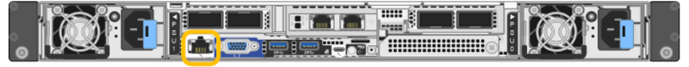

= Accedere all'interfaccia BMC
:allow-uri-read: 
:icons: font
:imagesdir: ../media/

[role="lead"]
È possibile accedere all'interfaccia BMC utilizzando l'indirizzo DHCP o l'indirizzo IP statico per la porta di gestione BMC sui seguenti modelli di appliance:

* SG100
* SG110
* SG1000
* SG1100
* SG6000
* SG6100

.Prima di iniziare
* Il client di gestione utilizza un https://docs.netapp.com/us-en/storagegrid-118/admin/web-browser-requirements.html["browser web supportato"^].
* La porta di gestione BMC dell'appliance è collegata alla rete di gestione che si intende utilizzare.
+
[role="tabbed-block"]
====
.SG100
--
image::../media/sg100_bmc_management_port.png[SG100 porta di gestione BMC]

--
.SG110
--
image::../media/sgf6112_cn_bmc_management_port.png[Porta di gestione BMC SG110]

--
.SG1000
--
image::../media/sg1000_bmc_management_port.png[Porta di gestione BMC SG1000]

--
.SG1100
--

--
.SG6000
--
image::../media/sg6000_cn_bmc_management_port.gif[Porta di gestione BMC del controller SG6000-CN]

--
.SG6100
--
image::../media/sgf6112_cn_bmc_management_port.png[SGF6112 porta di gestione BMC]

--
====

.Fasi
. Inserire l'URL dell'interfaccia BMC: +
`*https://_BMC_Port_IP_*`
+
Per `_BMC_Port_IP_`, Utilizzare l'indirizzo IP statico o DHCP per la porta di gestione BMC.

+
Viene visualizzata la pagina di accesso BMC.

+

NOTE: Se non hai ancora configurato `BMC_Port_IP`, seguire le istruzioni in link:configuring-bmc-interface.html["Configurare l'interfaccia BMC"].  Se non si riesce a seguire questa procedura a causa di un problema hardware e non si è ancora configurato un indirizzo IP BMC, potrebbe essere comunque possibile accedere al BMC. Per impostazione predefinita, il BMC ottiene un indirizzo IP utilizzando DHCP. Se DHCP è attivato sulla rete BMC, l'amministratore di rete può fornire l'indirizzo IP assegnato a BMC MAC, stampato sull'etichetta sul lato anteriore dell'appliance. Se DHCP non è attivato sulla rete BMC, il BMC non risponderà dopo alcuni minuti e si assegnerà l'IP statico predefinito `192.168.0.120`. Potrebbe essere necessario collegare il laptop direttamente alla porta BMC e modificare le impostazioni di rete per assegnare al laptop un indirizzo IP, ad esempio `192.168.0.200/24`, per accedere a. `192.168.0.120`.

. Immettere il nome utente e la password admin o root, utilizzando la password impostata link:changing-root-password-for-bmc-interface.html["è stata modificata la password predefinita"]:
+

NOTE: L'utente predefinito dipende dal momento in cui è stato installato il dispositivo StorageGRID. L'utente predefinito è *admin* per le nuove installazioni e *root* per le installazioni meno recenti.

. Selezionare *Accedi*.
+
image::../media/bmc_dashboard.gif[BMC Dashboard]

. Facoltativamente, creare utenti aggiuntivi selezionando *Impostazioni* > *Gestione utente* e facendo clic su qualsiasi utente "`dabilitato`".
+

NOTE: Quando gli utenti accedono per la prima volta, potrebbe essere richiesto di modificare la password per una maggiore sicurezza.

