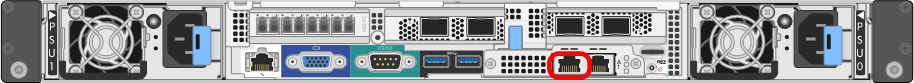

= Accedere al programma di installazione dell'appliance StorageGRID
:allow-uri-read: 
:icons: font
:imagesdir: ../media/

[role="lead"]
È necessario accedere al programma di installazione dell'appliance StorageGRID per verificare la versione del programma di installazione e configurare le connessioni tra l'appliance e le tre reti StorageGRID: Rete griglia, rete amministrativa (opzionale) e rete client (opzionale).

.Prima di iniziare
* Si sta utilizzando qualsiasi client di gestione in grado di connettersi alla rete amministrativa di StorageGRID o si dispone di un laptop di assistenza.
* Il client o il laptop di servizio dispone di un https://docs.netapp.com/us-en/storagegrid-118/admin/web-browser-requirements.html["browser web supportato"^].
* L'appliance di servizi o il controller dell'appliance di storage sono connessi a tutte le reti StorageGRID che si intende utilizzare.
* Su queste reti conosci l'indirizzo IP, il gateway e la subnet dell'appliance di servizi o del controller dell'appliance di storage.
* Sono stati configurati gli switch di rete che si intende utilizzare.

.A proposito di questa attività
Per accedere inizialmente al programma di installazione dell'appliance StorageGRID, è possibile utilizzare l'indirizzo IP assegnato da DHCP per la porta di rete Admin sul dispositivo di servizi o sul controller dell'appliance di storage (purché sia connesso alla rete amministrativa), in alternativa, è possibile collegare un laptop di assistenza direttamente al controller dell'appliance di servizi o dell'appliance di storage.

.Fasi
. Se possibile, utilizzare l'indirizzo DHCP per la porta Admin Network sul controller dell'appliance di servizi o dell'appliance di storage. La porta Admin Network viene evidenziata nella figura seguente. (Utilizzare l'indirizzo IP sulla rete griglia se la rete di amministrazione non è connessa).
+
[role="tabbed-block"]
====
.SG100
--
image::../media/sg100_admin_network_port.png[Admin Network Port (porta di rete amministrativa) su SG100]

--
.SG1000
--
image::../media/sg1000_admin_network_port.png[Porta di rete Admin sul SG1000]

--
.E5700SG
--
Per E5700SG, è possibile eseguire una delle seguenti operazioni:

** Osservare il display a sette segmenti sul controller E5700SG. Se le porte di gestione 1 e 10/25-GbE 2 e 4 del controller E5700SG sono collegate a reti con server DHCP, il controller tenta di ottenere indirizzi IP assegnati dinamicamente all'accensione dell'enclosure. Una volta completato il processo di accensione, il display a sette segmenti visualizza *ho*, seguito da una sequenza di due numeri.
+
[listing]
----
HO -- IP address for Admin Network -- IP address for Grid Network HO
----
+
Nella sequenza:

+
*** Il primo set di numeri è l'indirizzo DHCP per il nodo di storage dell'appliance sulla rete di amministrazione, se connesso. Questo indirizzo IP viene assegnato alla porta di gestione 1 sul controller E5700SG.
*** Il secondo gruppo di numeri è l'indirizzo DHCP per il nodo di storage dell'appliance sulla rete di rete. Questo indirizzo IP viene assegnato alle porte 2 e 4 10/25-GbE quando si alimenta l'appliance per la prima volta.
+

NOTE: Se non è stato possibile assegnare un indirizzo IP utilizzando DHCP, viene visualizzato 0.0.0.0.

--
.SG6000-CN
--

--
.SGF6112
--
image::../media/sg6100_admin_network_port.png[Porta di rete Admin sul SGF6112]

--
====
+
.. Ottenere l'indirizzo DHCP per il dispositivo sulla rete di amministrazione dall'amministratore di rete.
.. Dal client, inserire questo URL per il programma di installazione dell'appliance StorageGRID: +
`*https://_Appliance_IP_:8443*`
+
Per `_Appliance_IP_`, Utilizzare l'indirizzo DHCP (utilizzare l'indirizzo IP della rete amministrativa, se disponibile).

.. Se viene richiesto un avviso di protezione, visualizzare e installare il certificato utilizzando l'installazione guidata del browser.
+
L'avviso non verrà visualizzato al successivo accesso a questo URL.

+
Viene visualizzata la pagina iniziale del programma di installazione dell'appliance StorageGRID. Le informazioni e i messaggi visualizzati al primo accesso a questa pagina dipendono dalla modalità di connessione dell'appliance alle reti StorageGRID. Potrebbero essere visualizzati messaggi di errore che verranno risolti nelle fasi successive.

+
image::../media/appliance_installer_home_5700_5600.png[Schermata della parte superiore della home page del programma di installazione dell'appliance StorageGRID webscale]

. Se non è possibile ottenere un indirizzo IP utilizzando DHCP, è possibile utilizzare una connessione link-local.
+
[role="tabbed-block"]
====
.SG100
--
Collegare un laptop di assistenza direttamente alla porta RJ-45 più a destra dell'appliance di servizi, utilizzando un cavo Ethernet.

image::../media/sg100_link_local_port.png[Connessione SG100 link-Local]

--
.SG1000
--
Collegare un laptop di assistenza direttamente alla porta RJ-45 più a destra dell'appliance di servizi, utilizzando un cavo Ethernet.

image::../media/sg1000_link_local_port.png[SG1000 collegamento locale]

--
.E5700SG
--
Collegare il laptop di servizio alla porta di gestione 2 del controller E5700SG, utilizzando un cavo Ethernet.

image::../media/e5700sg_mgmt_port_2.gif[Posizione della porta di gestione 2 sul controller E5700SG]

--
.SG6000-CN
--
Collegare un laptop di assistenza direttamente alla porta RJ-45 più a destra del controller SG6000-CN utilizzando un cavo Ethernet.

image::../media/sg6000_cn_link_local_port.png[Posizione della porta di gestione per SG6000-CN]

--
.SGF6112
--
Collegare un laptop di assistenza direttamente alla porta RJ-45 più a destra dell'appliance, utilizzando un cavo Ethernet.

image::../media/sg6100_link_local_port.png[Connessione link-Local SGF6112]

--
====
+
.. Aprire un browser Web sul laptop di assistenza.
.. Inserire questo URL per il programma di installazione dell'appliance StorageGRID: +
`*\https://169.254.0.1:8443*`
+
Viene visualizzata la pagina iniziale del programma di installazione dell'appliance StorageGRID. Le informazioni e i messaggi visualizzati al primo accesso a questa pagina dipendono dalla modalità di connessione dell'appliance alle reti StorageGRID. Potrebbero essere visualizzati messaggi di errore che verranno risolti nelle fasi successive.

+

NOTE: Se non è possibile accedere alla home page tramite una connessione link-local, configurare l'indirizzo IP del laptop di servizio come `169.254.0.2`e riprovare.

.Al termine
Dopo aver effettuato l'accesso al programma di installazione dell'appliance StorageGRID:

* Verificare che la versione del programma di installazione dell'appliance StorageGRID corrisponda alla versione software installata sul sistema StorageGRID. Se necessario, aggiornare il programma di installazione dell'appliance StorageGRID.
+
link:verifying-and-upgrading-storagegrid-appliance-installer-version.html["Verificare e aggiornare la versione del programma di installazione dell'appliance StorageGRID"]

* Esaminare tutti i messaggi visualizzati nella home page del programma di installazione dell'appliance StorageGRID e configurare la configurazione del collegamento e dell'IP, secondo necessità.
+
image::../media/appliance_installer_home_services_appliance.png[Installazione dell'appliance Home]

