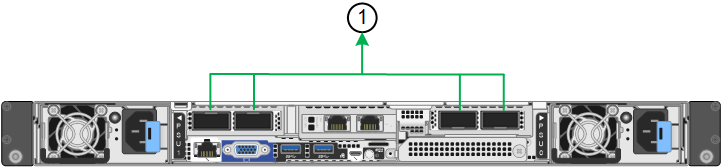

= Configurare i collegamenti di rete
:allow-uri-read: 
:icons: font
:imagesdir: ../media/

[role="lead"]
È possibile configurare i collegamenti di rete per le porte utilizzate per collegare l'appliance a Grid Network, Client Network e Admin Network. È possibile impostare la velocità di collegamento e le modalità di connessione di rete e porta.

TIP: Se si utilizza ConfigBuilder per generare un file JSON, è possibile configurare automaticamente i collegamenti di rete. Vedere link:automating-appliance-installation-and-configuration.html["Automazione dell'installazione e della configurazione delle appliance"].

.Prima di iniziare
* Lo hai fatto link:obtaining-additional-equipment-and-tools.html["ha ottenuto l'apparecchiatura aggiuntiva"] necessario per il tipo di cavo e la velocità di collegamento.
* Sono stati installati i ricetrasmettitori corretti nelle porte, in base alla velocità di collegamento che si intende utilizzare.
* Le porte di rete sono state collegate a switch che supportano la velocità scelta.

Se si intende utilizzare la modalità aggregate port bond, LACP network bond mode o tagging VLAN:

* Le porte di rete dell'appliance sono state collegate a switch in grado di supportare VLAN e LACP.
* Se nel bond LACP partecipano più switch, questi supportano i gruppi MLAG (Multi-chassis link Aggregation groups) o equivalenti.
* Si comprende come configurare gli switch per l'utilizzo di VLAN, LACP e MLAG o equivalente.
* Si conosce il tag VLAN univoco da utilizzare per ciascuna rete. Questo tag VLAN verrà aggiunto a ciascun pacchetto di rete per garantire che il traffico di rete venga instradato alla rete corretta.

.A proposito di questa attività
È necessario configurare le impostazioni nella pagina Configurazione collegamento solo se si desidera utilizzare valori diversi da<<default_values,impostazioni predefinite>> .

NOTE: Le modifiche alla velocità della PDU LACP apportate seguendo queste istruzioni rimangono persistenti nell'ambiente StorageGRID .  Per apportare modifiche temporanee alla velocità LACP PDU durante l'esecuzione di operazioni di manutenzione sui componenti di rete installati nell'appliance, vedere https://docs.netapp.com/us-en/storagegrid/maintain/changing-nodes-network-configuration.html#temporarily-changing-the-lacp-pdu-rate["Modifica temporanea della velocità PDU LACP"^] .

[[port_config_tables]]Le figure e le tabelle riepilogano le opzioni per la modalità di collegamento porta e la modalità di collegamento rete per ciascun dispositivo.  Per maggiori informazioni vedere quanto segue:

* link:gathering-installation-information-sg100-and-sg1000.html#port-bond-modes["Modalità Port bond (SG1000 e SG100)"]
* link:gathering-installation-information-sg110-and-sg1100.html#port-bond-modes["Modalità Port bond (SG1100 e SG110)"]
* link:gathering-installation-information-sg5700.html#port-bond-modes["Modalità Port bond (E5700SG)"]
* link:gathering-installation-information-sg5800.html#port-bond-modes["Modalità Port bond (SG5800)"]
* link:gathering-installation-information-sg6000.html#port-bond-modes["Modalità Port Bond (SG6000-CN)"]
* link:gathering-installation-information-sg6100.html#port-bond-modes["Modalità Port bond (SGF6112 e SG6100-CN)"]

[role="tabbed-block"]
====
.SG100 e SG1000
--
Modalità Fixed port bond (predefinita)::
+
--
Le figure mostrano il modo in cui le quattro porte di rete su SG1000 o SG100 sono collegate in modalità Fixed Port Bond (configurazione predefinita).

SG1000:

image::../media/sg1000_fixed_port.png[Modalità Bond a SG1000 porte fisse]

SG100:

image::../media/sg100_fixed_port_draft.png[SG100 Fixed Port Bond Mode]

[cols="1a,3a"]
|===
| Didascalia | Quali porte sono collegate 

 a| 
C.
 a| 
Le porte 1 e 3 sono collegate tra loro per la rete client, se viene utilizzata questa rete.

 a| 
G
 a| 
Le porte 2 e 4 sono collegate tra loro per la rete Grid.

|===
La tabella riassume le opzioni per la configurazione delle quattro porte di rete. Se si desidera utilizzare un'impostazione non predefinita, è necessario configurare le impostazioni nella pagina di configurazione del collegamento.

[cols="1a,2a,2a"]
|===
| Network bond mode (modalità bond di | Rete client disabilitata | Rete client abilitata (predefinita) 

 a| 
Active-Backup (impostazione predefinita)
 a| 
* Le porte 2 e 4 utilizzano un bond di backup attivo per Grid Network.
* Le porte 1 e 3 non vengono utilizzate.
* Un tag VLAN è opzionale.

 a| 
* Le porte 2 e 4 utilizzano un bond di backup attivo per Grid Network.
* Le porte 1 e 3 utilizzano un bond di backup attivo per la rete client.
* I tag VLAN possono essere specificati per entrambe le reti per comodità dell'amministratore di rete.

 a| 
LACP (802.3ad)
 a| 
* Le porte 2 e 4 utilizzano un collegamento LACP per la rete Grid.
* Le porte 1 e 3 non vengono utilizzate.
* Un tag VLAN è opzionale.
* Nella sezione Rete Grid è possibile specificare i valori della velocità PDU LACP e della policy hash di trasmissione LACP.

 a| 
* Le porte 2 e 4 utilizzano un collegamento LACP per la rete Grid.
* Le porte 1 e 3 utilizzano un collegamento LACP per la rete client.
* I tag VLAN possono essere specificati per entrambe le reti per comodità dell'amministratore di rete.
* I valori della velocità PDU LACP e della policy hash di trasmissione LACP possono essere specificati nelle sezioni Rete Grid e Rete Client.

|===
--
Modalità aggregate port bond::
+
--
Queste figure mostrano come le quattro porte di rete sono collegate in modalità aggregate port bond.

SG1000:

image::../media/sg1000_aggregate_ports.png[Modalità Bond porta aggregata SG1000]

SG100:

image::../media/sg100_aggregate_ports.png[Aggregate Port Bond Mode SG100]

[cols="1a,3a"]
|===
| Didascalia | Quali porte sono collegate 

 a| 
1
 a| 
Tutte e quattro le porte sono raggruppate in un unico collegamento LACP, consentendo l'utilizzo di tutte le porte per il traffico Grid Network e Client Network.

|===
La tabella riassume le opzioni per la configurazione delle quattro porte di rete. Se si desidera utilizzare un'impostazione non predefinita, è necessario configurare le impostazioni nella pagina di configurazione del collegamento.

[cols="1a,2a,2a"]
|===
| Network bond mode (modalità bond di | Rete client disabilitata | Rete client abilitata (predefinita) 

 a| 
Solo LACP (802.3ad)
 a| 
* Le porte 1-4 utilizzano un unico collegamento LACP per la rete Grid.
* Un singolo tag VLAN identifica i pacchetti Grid Network.
* Nella sezione Impostazioni collegamento è possibile specificare i valori della velocità PDU LACP e della policy hash di trasmissione LACP.

 a| 
* Le porte 1-4 utilizzano un unico collegamento LACP per Grid Network e Client Network.
* Due tag VLAN consentono di separare i pacchetti Grid Network dai pacchetti Client Network.
* Nella sezione Impostazioni collegamento è possibile specificare i valori della velocità PDU LACP e della policy hash di trasmissione LACP.

|===
--
Modalità bond di rete Active-Backup per le porte di gestione::
+
--
Queste figure mostrano come le due porte di gestione 1-GbE sulle appliance sono collegate in modalità bond di rete Active-Backup per la rete di amministrazione.

SG1000:

image::../media/sg1000_bonded_management_ports.png[Porte di rete dell'amministratore collegate SG1000]

SG100:

image::../media/sg100_bonded_management_ports.png[Admin Network Ports Bonded SG100]

--

--
.SG110 e SG1100
--
Modalità Fixed port bond (predefinita)::
+
--
Le figure mostrano come le quattro porte di rete su SG1100 o SG110 sono collegate in modalità di collegamento a porta fissa (configurazione predefinita).

SG1100:

image::../media/sg1100_fixed_port.png[Modalità Bond a SG1100 porte fisse]

SG110:

image::../media/sgf6112_fixed_port.png[Modalità Bond a SG110 porte fisse]

[cols="1a,3a"]
|===
| Didascalia | Quali porte sono collegate 

 a| 
C.
 a| 
Le porte 1 e 3 sono collegate tra loro per la rete client, se viene utilizzata questa rete.

 a| 
G
 a| 
Le porte 2 e 4 sono collegate tra loro per la rete Grid.

|===
La tabella riassume le opzioni per la configurazione delle quattro porte di rete. Se si desidera utilizzare un'impostazione non predefinita, è necessario configurare le impostazioni nella pagina di configurazione del collegamento.

[cols="1a,2a,2a"]
|===
| Network bond mode (modalità bond di | Rete client disabilitata | Rete client abilitata (predefinita) 

 a| 
Active-Backup (impostazione predefinita)
 a| 
* Le porte 2 e 4 utilizzano un bond di backup attivo per Grid Network.
* Le porte 1 e 3 non vengono utilizzate.
* Un tag VLAN è opzionale.

 a| 
* Le porte 2 e 4 utilizzano un bond di backup attivo per Grid Network.
* Le porte 1 e 3 utilizzano un bond di backup attivo per la rete client.
* I tag VLAN possono essere specificati per entrambe le reti per comodità dell'amministratore di rete.

 a| 
LACP (802.3ad)
 a| 
* Le porte 2 e 4 utilizzano un collegamento LACP per la rete Grid.
* Le porte 1 e 3 non vengono utilizzate.
* Un tag VLAN è opzionale.
* Nella sezione Rete Grid è possibile specificare i valori della velocità PDU LACP e della policy hash di trasmissione LACP.

 a| 
* Le porte 2 e 4 utilizzano un collegamento LACP per la rete Grid.
* Le porte 1 e 3 utilizzano un collegamento LACP per la rete client.
* I tag VLAN possono essere specificati per entrambe le reti per comodità dell'amministratore di rete.
* I valori della velocità PDU LACP e della policy hash di trasmissione LACP possono essere specificati nelle sezioni Rete Grid e Rete Client.

|===
--
Modalità aggregate port bond::
+
--
Queste figure mostrano come le quattro porte di rete sono collegate in modalità aggregate port bond.

SG1100:

SG110:

image::../media/sgf6112_aggregate_ports.png[Modalità Bond porta aggregata SG110]

[cols="1a,3a"]
|===
| Didascalia | Quali porte sono collegate 

 a| 
1
 a| 
Tutte e quattro le porte sono raggruppate in un unico collegamento LACP, consentendo l'utilizzo di tutte le porte per il traffico Grid Network e Client Network.

|===
La tabella riassume le opzioni per la configurazione delle porte di rete. Se si desidera utilizzare un'impostazione non predefinita, è necessario configurare le impostazioni nella pagina di configurazione del collegamento.

[cols="1a,2a,2a"]
|===
| Network bond mode (modalità bond di | Rete client disabilitata | Rete client abilitata (predefinita) 

 a| 
Solo LACP (802.3ad)
 a| 
* Le porte 1-4 utilizzano un unico collegamento LACP per la rete Grid.
* Un singolo tag VLAN identifica i pacchetti Grid Network.
* Nella sezione Impostazioni collegamento è possibile specificare i valori della velocità PDU LACP e della policy hash di trasmissione LACP.

 a| 
* Le porte 1-4 utilizzano un unico collegamento LACP per Grid Network e Client Network.
* Due tag VLAN consentono di separare i pacchetti Grid Network dai pacchetti Client Network.
* Nella sezione Impostazioni collegamento è possibile specificare i valori della velocità PDU LACP e della policy hash di trasmissione LACP.

|===
--
Modalità bond di rete Active-Backup per le porte di gestione::
+
--
Queste figure mostrano come le due porte di gestione 1-GbE sulle appliance sono collegate in modalità bond di rete Active-Backup per la rete di amministrazione.

SG1100:

image::../media/sg1100_bonded_management_ports.png[Porte di rete dell'amministratore collegate SG1100]

SG110:

image::../media/sgf6112_bonded_management_ports.png[Porte di rete dell'amministratore collegate SG110]

--

--
.SG5700
--
Modalità Fixed port bond (predefinita)::
+
--
Questa figura mostra il modo in cui le quattro porte 10/25-GbE sono collegate in modalità Fixed Port Bond (configurazione predefinita).

image::../media/e5700sg_fixed_port.gif[Immagine che mostra come le porte 10/25-GbE del controller E5700SG sono collegate in modalità fissa]

[cols="1a,3a"]
|===
| Didascalia | Quali porte sono collegate 

 a| 
C.
 a| 
Le porte 1 e 3 sono collegate tra loro per la rete client, se viene utilizzata questa rete.

 a| 
G
 a| 
Le porte 2 e 4 sono collegate tra loro per la rete Grid.

|===
La tabella riassume le opzioni per la configurazione delle quattro porte 10/25-GbE. Se si desidera utilizzare un'impostazione non predefinita, è necessario configurare le impostazioni nella pagina di configurazione del collegamento.

[cols="1a,2a,2a"]
|===
| Network bond mode (modalità bond di | Rete client disabilitata | Rete client abilitata (predefinita) 

 a| 
Active-Backup (impostazione predefinita)
 a| 
* Le porte 2 e 4 utilizzano un bond di backup attivo per Grid Network.
* Le porte 1 e 3 non vengono utilizzate.
* Un tag VLAN è opzionale.

 a| 
* Le porte 2 e 4 utilizzano un bond di backup attivo per Grid Network.
* Le porte 1 e 3 utilizzano un bond di backup attivo per la rete client.
* I tag VLAN possono essere specificati per entrambe le reti per comodità dell'amministratore di rete.

 a| 
LACP (802.3ad)
 a| 
* Le porte 2 e 4 utilizzano un collegamento LACP per la rete Grid.
* Le porte 1 e 3 non vengono utilizzate.
* Un tag VLAN è opzionale.
* Nella sezione Rete Grid è possibile specificare i valori della velocità PDU LACP e della policy hash di trasmissione LACP.

 a| 
* Le porte 2 e 4 utilizzano un collegamento LACP per la rete Grid.
* Le porte 1 e 3 utilizzano un collegamento LACP per la rete client.
* I tag VLAN possono essere specificati per entrambe le reti per comodità dell'amministratore di rete.
* I valori della velocità PDU LACP e della policy hash di trasmissione LACP possono essere specificati nelle sezioni Rete Grid e Rete Client.

|===
--
Modalità aggregate port bond::
+
--
Questa figura mostra come le quattro porte 10/25-GbE sono collegate in modalità aggregate port bond.

image::../media/e5700sg_aggregate_port.gif[Immagine che mostra come le porte 10/25-GbE del controller E5700SG sono collegate in modalità aggregata]

[cols="1a,3a"]
|===
| Didascalia | Quali porte sono collegate 

 a| 
1
 a| 
Tutte e quattro le porte sono raggruppate in un unico collegamento LACP, consentendo l'utilizzo di tutte le porte per il traffico Grid Network e Client Network.

|===
La tabella riassume le opzioni per la configurazione delle quattro porte 10/25-GbE. Se si desidera utilizzare un'impostazione non predefinita, è necessario configurare le impostazioni nella pagina di configurazione del collegamento.

[cols="1a,2a,2a"]
|===
| Network bond mode (modalità bond di | Rete client disabilitata | Rete client abilitata (predefinita) 

 a| 
Solo LACP (802.3ad)
 a| 
* Le porte 1-4 utilizzano un unico collegamento LACP per la rete Grid.
* Un singolo tag VLAN identifica i pacchetti Grid Network.
* Nella sezione Impostazioni collegamento è possibile specificare i valori della velocità PDU LACP e della policy hash di trasmissione LACP.

 a| 
* Le porte 1-4 utilizzano un unico collegamento LACP per Grid Network e Client Network.
* Due tag VLAN consentono di separare i pacchetti Grid Network dai pacchetti Client Network.
* Nella sezione Impostazioni collegamento è possibile specificare i valori della velocità PDU LACP e della policy hash di trasmissione LACP.

|===
--
Modalità bond di rete Active-Backup per le porte di gestione::
+
--
Questa figura mostra come le due porte di gestione 1-GbE sul controller E5700SG sono collegate in modalità bond di rete Active-Backup per la rete di amministrazione.

image::../media/e5700sg_bonded_management_ports.gif[E5700SG Bonded Management Ports (Porte a gestione collegata E57]

--

--
.SG5800
--
Modalità Fixed port bond (predefinita)::
+
--
Questa figura mostra il modo in cui le quattro porte 10/25-GbE sono collegate in modalità Fixed Port Bond (configurazione predefinita).

image::../media/sg5800_fixed_port.png[Immagine che mostra come le porte 10/25-GbE sul controller SG5800 sono collegate in modalità fissa]

[cols="1a,3a"]
|===
| Didascalia | Quali porte sono collegate 

 a| 
C.
 a| 
Le porte 1 e 3 sono collegate tra loro per la rete client, se viene utilizzata questa rete.

 a| 
G
 a| 
Le porte 2 e 4 sono collegate tra loro per la rete Grid.

|===
La tabella riassume le opzioni per la configurazione delle quattro porte 10/25-GbE. Se si desidera utilizzare un'impostazione non predefinita, è necessario configurare le impostazioni nella pagina di configurazione del collegamento.

[cols="1a,2a,2a"]
|===
| Network bond mode (modalità bond di | Rete client disabilitata | Rete client abilitata (predefinita) 

 a| 
Active-Backup (impostazione predefinita)
 a| 
* Le porte 2 e 4 utilizzano un bond di backup attivo per Grid Network.
* Le porte 1 e 3 non vengono utilizzate.
* Un tag VLAN è opzionale.

 a| 
* Le porte 2 e 4 utilizzano un bond di backup attivo per Grid Network.
* Le porte 1 e 3 utilizzano un bond di backup attivo per la rete client.
* I tag VLAN possono essere specificati per entrambe le reti per comodità dell'amministratore di rete.

 a| 
LACP (802.3ad)
 a| 
* Le porte 2 e 4 utilizzano un collegamento LACP per la rete Grid.
* Le porte 1 e 3 non vengono utilizzate.
* Un tag VLAN è opzionale.
* Nella sezione Rete Grid è possibile specificare i valori della velocità PDU LACP e della policy hash di trasmissione LACP.

 a| 
* Le porte 2 e 4 utilizzano un collegamento LACP per la rete Grid.
* Le porte 1 e 3 utilizzano un collegamento LACP per la rete client.
* I tag VLAN possono essere specificati per entrambe le reti per comodità dell'amministratore di rete.
* I valori della velocità PDU LACP e della policy hash di trasmissione LACP possono essere specificati nelle sezioni Rete Grid e Rete Client.

|===
--
Modalità aggregate port bond::
+
--
Questa figura mostra come le quattro porte 10/25-GbE sono collegate in modalità aggregate port bond.

image::../media/sg5800_aggregate_port.png[Immagine che mostra come le porte 10/25-GbE sul controller SG5800 sono unite in modalità aggregata]

[cols="1a,3a"]
|===
| Didascalia | Quali porte sono collegate 

 a| 
1
 a| 
Tutte e quattro le porte sono raggruppate in un unico collegamento LACP, consentendo l'utilizzo di tutte le porte per il traffico Grid Network e Client Network.

|===
La tabella riassume le opzioni per la configurazione delle quattro porte 10/25-GbE. Se si desidera utilizzare un'impostazione non predefinita, è necessario configurare le impostazioni nella pagina di configurazione del collegamento.

[cols="1a,2a,2a"]
|===
| Network bond mode (modalità bond di | Rete client disabilitata | Rete client abilitata (predefinita) 

 a| 
Solo LACP (802.3ad)
 a| 
* Le porte 1-4 utilizzano un unico collegamento LACP per la rete Grid.
* Un singolo tag VLAN identifica i pacchetti Grid Network.
* Nella sezione Impostazioni collegamento è possibile specificare i valori della velocità PDU LACP e della policy hash di trasmissione LACP.

 a| 
* Le porte 1-4 utilizzano un unico collegamento LACP per Grid Network e Client Network.
* Due tag VLAN consentono di separare i pacchetti Grid Network dai pacchetti Client Network.
* Nella sezione Impostazioni collegamento è possibile specificare i valori della velocità PDU LACP e della policy hash di trasmissione LACP.

|===
--

--
.SG6000
--
Modalità Fixed port bond (predefinita)::
+
--
Questa figura mostra come le quattro porte di rete sono collegate in modalità Fixed Port Bond (configurazione predefinita)

image::../media/sg6000_cn_fixed_port.gif[Immagine che mostra come le porte di rete del controller SG6000-CN sono collegate in modalità fissa]

[cols="1a,3a"]
|===
| Didascalia | Quali porte sono collegate 

 a| 
C.
 a| 
Le porte 1 e 3 sono collegate tra loro per la rete client, se viene utilizzata questa rete.

 a| 
G
 a| 
Le porte 2 e 4 sono collegate tra loro per la rete Grid.

|===
La tabella riassume le opzioni per la configurazione delle porte di rete. Se si desidera utilizzare un'impostazione non predefinita, è necessario configurare le impostazioni nella pagina di configurazione del collegamento.

[cols="1a,3a,3a"]
|===
| Network bond mode (modalità bond di | Rete client disabilitata | Rete client abilitata (predefinita) 

 a| 
Active-Backup (impostazione predefinita)
 a| 
* Le porte 2 e 4 utilizzano un bond di backup attivo per Grid Network.
* Le porte 1 e 3 non vengono utilizzate.
* Un tag VLAN è opzionale.

 a| 
* Le porte 2 e 4 utilizzano un bond di backup attivo per Grid Network.
* Le porte 1 e 3 utilizzano un bond di backup attivo per la rete client.
* I tag VLAN possono essere specificati per entrambe le reti per comodità dell'amministratore di rete.

 a| 
LACP (802.3ad)
 a| 
* Le porte 2 e 4 utilizzano un collegamento LACP per la rete Grid.
* Le porte 1 e 3 non vengono utilizzate.
* Un tag VLAN è opzionale.
* Nella sezione Rete Grid è possibile specificare i valori della velocità PDU LACP e della policy hash di trasmissione LACP.

 a| 
* Le porte 2 e 4 utilizzano un collegamento LACP per la rete Grid.
* Le porte 1 e 3 utilizzano un collegamento LACP per la rete client.
* I tag VLAN possono essere specificati per entrambe le reti per comodità dell'amministratore di rete.
* I valori della velocità PDU LACP e della policy hash di trasmissione LACP possono essere specificati nelle sezioni Rete Grid e Rete Client.

|===
--
Modalità aggregate port bond::
+
--
Questa figura mostra come le quattro porte di rete sono collegate in modalità aggregate port bond.

image::../media/sg6000_cn_aggregate_port.gif[Immagine che mostra come le porte di rete del controller SG6000-CN sono collegate in modalità aggregata]

[cols="1a,3a"]
|===
| Didascalia | Quali porte sono collegate 

 a| 
1
 a| 
Tutte e quattro le porte sono raggruppate in un unico collegamento LACP, consentendo l'utilizzo di tutte le porte per il traffico Grid Network e Client Network.

|===
La tabella riassume le opzioni per la configurazione delle porte di rete. Se si desidera utilizzare un'impostazione non predefinita, è necessario configurare le impostazioni nella pagina di configurazione del collegamento.

[cols="1a,3a,3a"]
|===
| Network bond mode (modalità bond di | Rete client disabilitata | Rete client abilitata (predefinita) 

 a| 
Solo LACP (802.3ad)
 a| 
* Le porte 1-4 utilizzano un unico collegamento LACP per la rete Grid.
* Un singolo tag VLAN identifica i pacchetti Grid Network.
* Nella sezione Impostazioni collegamento è possibile specificare i valori della velocità PDU LACP e della policy hash di trasmissione LACP.

 a| 
* Le porte 1-4 utilizzano un unico collegamento LACP per Grid Network e Client Network.
* Due tag VLAN consentono di separare i pacchetti Grid Network dai pacchetti Client Network.
* Nella sezione Impostazioni collegamento è possibile specificare i valori della velocità PDU LACP e della policy hash di trasmissione LACP.

|===
--
Modalità bond di rete Active-Backup per le porte di gestione::
+
--
Questa figura mostra come le due porte di gestione 1-GbE sul controller SG6000-CN sono collegate in modalità di connessione di rete Active-Backup per la rete amministrativa.

image::../media/sg6000_cn_bonded_managemente_ports.png[Porte di rete amministrative collegate]

--

--
.SG6100
--
Modalità Fixed port bond (predefinita)::
+
--
La figura mostra come le quattro porte di rete sono collegate in modalità Fixed Port Bond (configurazione predefinita).

*SGF6112*:

image::../media/sgf6112_fixed_port.png[Modalità Bond a SGF6112 porte fisse]

*SG6100*:

image::../media/sg6100_cn_fixed_port.png[SG6100-CN Fixed Port Bond Mode (modalità Bond a porta fissa)]

[cols="1a,3a"]
|===
| Didascalia | Quali porte sono collegate 

 a| 
C.
 a| 
Le porte 1 e 3 sono collegate tra loro per la rete client, se viene utilizzata questa rete.

 a| 
G
 a| 
Le porte 2 e 4 sono collegate tra loro per la rete Grid.

|===
La tabella riassume le opzioni per la configurazione delle porte di rete. Se si desidera utilizzare un'impostazione non predefinita, è necessario configurare le impostazioni nella pagina di configurazione del collegamento.

[cols="1a,2a,2a"]
|===
| Network bond mode (modalità bond di | Rete client disabilitata | Rete client abilitata (predefinita) 

 a| 
Active-Backup (impostazione predefinita)
 a| 
* Le porte 2 e 4 utilizzano un bond di backup attivo per Grid Network.
* Le porte 1 e 3 non vengono utilizzate.
* Un tag VLAN è opzionale.

 a| 
* Le porte 2 e 4 utilizzano un bond di backup attivo per Grid Network.
* Le porte 1 e 3 utilizzano un bond di backup attivo per la rete client.
* I tag VLAN possono essere specificati per entrambe le reti per comodità dell'amministratore di rete.

 a| 
LACP (802.3ad)
 a| 
* Le porte 2 e 4 utilizzano un collegamento LACP per la rete Grid.
* Le porte 1 e 3 non vengono utilizzate.
* Un tag VLAN è opzionale.
* Nella sezione Rete Grid è possibile specificare i valori della velocità PDU LACP e della policy hash di trasmissione LACP.

 a| 
* Le porte 2 e 4 utilizzano un collegamento LACP per la rete Grid.
* Le porte 1 e 3 utilizzano un collegamento LACP per la rete client.
* I tag VLAN possono essere specificati per entrambe le reti per comodità dell'amministratore di rete.
* I valori della velocità PDU LACP e della policy hash di trasmissione LACP possono essere specificati nelle sezioni Rete Grid e Rete Client.

|===
--
Modalità aggregate port bond::
+
--
La figura mostra come le quattro porte di rete sono collegate in modalità aggregate port bond.

*SGF6112*:

image::../media/sgf6112_aggregate_ports.png[Modalità Bond porta aggregata SGF6112]

*SG6100*:

image::../media/sg6100_cn_aggregate_ports.png[Modalità Bond porta aggregata SG6100-CN]

[cols="1a,3a"]
|===
| Didascalia | Quali porte sono collegate 

 a| 
1
 a| 
Tutte e quattro le porte sono raggruppate in un unico collegamento LACP, consentendo l'utilizzo di tutte le porte per il traffico Grid Network e Client Network.

|===
La tabella riassume le opzioni per la configurazione delle porte di rete. Se si desidera utilizzare un'impostazione non predefinita, è necessario configurare le impostazioni nella pagina di configurazione del collegamento.

[cols="1a,2a,2a"]
|===
| Network bond mode (modalità bond di | Rete client disabilitata | Rete client abilitata (predefinita) 

 a| 
Solo LACP (802.3ad)
 a| 
* Le porte 1-4 utilizzano un unico collegamento LACP per la rete Grid.
* Un singolo tag VLAN identifica i pacchetti Grid Network.
* Nella sezione Impostazioni collegamento è possibile specificare i valori della velocità PDU LACP e della policy hash di trasmissione LACP.

 a| 
* Le porte 1-4 utilizzano un unico collegamento LACP per Grid Network e Client Network.
* Due tag VLAN consentono di separare i pacchetti Grid Network dai pacchetti Client Network.
* Nella sezione Impostazioni collegamento è possibile specificare i valori della velocità PDU LACP e della policy hash di trasmissione LACP.

|===
--
Modalità bond di rete Active-Backup per le porte di gestione::
+
--
Questa figura mostra come le due porte di gestione 1-GbE sono collegate in modalità di connessione di rete Active-Backup per la rete di amministrazione.

*SGF6112*:

image::../media/sgf6112_bonded_management_ports.png[Porte di rete dell'amministratore collegate SGF6112]

*SG6100*:

image::../media/sg6100_cn_bonded_management_ports.png[Porte di rete amministrative collegate SG6100-CN]

--

--
====
.Fasi
. Dalla barra dei menu del programma di installazione dell'appliance StorageGRID, fare clic su *Configura rete* > *Configurazione del collegamento*.
+
La pagina Network link Configuration (Configurazione collegamento di rete) visualizza un diagramma dell'appliance con le porte di rete e di gestione numerate.

+
La tabella link Status (Stato collegamento) elenca lo stato del collegamento, la velocità del collegamento e altre statistiche delle porte numerate.

+

NOTE: Per SG5800, lo stato del collegamento per la porta 1 non è disponibile nel software e deve essere verificato fisicamente tramite il LED di stato sul controller SG5800.

+
[[default_values]]La prima volta che accedi a questa pagina, i valori predefiniti sono:

+
** *Velocità di collegamento* impostata su *Auto*.
** *Port bond mode* è impostato su *Fixed*.
** *La policy hash di trasmissione LACP* è impostata su *Layer2+3*.
** *La velocità PDU LACP* è impostata su *Veloce*.
** *Network bond mode* è impostato su *Active-Backup* per Grid Network.
** L'opzione *Admin Network* (rete amministrativa) è attivata e la modalità Network bond (bond di rete) è impostata su *Independent* (indipendente).
** La *Rete client* è abilitata.

. Selezionare la velocità di collegamento per le porte di rete dall'elenco a discesa *velocità di collegamento*.
+
Anche gli switch di rete utilizzati per la rete di rete e la rete client devono supportare ed essere configurati per questa velocità. È necessario utilizzare gli adattatori o i ricetrasmettitori appropriati per la velocità di collegamento configurata. Se possibile, utilizza la velocità di collegamento automatica perché questa opzione negozia sia la velocità di collegamento che la modalità FEC (Forward Error Correction) con il partner di collegamento.

+
Se si prevede di utilizzare la velocità di collegamento 25-GbE per le porte di rete SG6100, SG6000, SG5800 o SG5700:

+
** Utilizzare i ricetrasmettitori SFP28 e i cavi twinax SFP28 o i cavi ottici.
** Per SG5700, selezionare *25GbE* dall'elenco a discesa *velocità di collegamento*.
** Per SG5800, SG6000 o SG6100, selezionare *Auto* dall'elenco a discesa *velocità collegamento*.

. Attivare o disattivare le reti StorageGRID che si intende utilizzare.
+
La rete grid è obbligatoria. Impossibile disattivare questa rete.

+
.. Se l'appliance non è connessa alla rete di amministrazione, deselezionare la casella di controllo *Enable network* (attiva rete) per la rete di amministrazione.
.. Se l'appliance è connessa alla rete client, selezionare la casella di controllo *Enable network* (attiva rete) per la rete client.
+
Vengono visualizzate le impostazioni di rete client per le porte NIC dati.

. Fare riferimento al<<port_config_tables,tabella di configurazione della modalità di legame porta fissa e aggregata>> per ogni tipo di appliance e configurare la modalità di bonding della porta e la modalità di bonding della rete in modo che corrispondano alla configurazione della rete.
+
È necessario specificare tag VLAN univoci per la griglia e le reti client.  È possibile selezionare valori compresi tra 0 e 4095.

. Una volta selezionate le opzioni desiderate, fare clic su *Save* (Salva).
+

NOTE: La connessione potrebbe andare persa se sono state apportate modifiche alla rete o al collegamento tramite il quale si è connessi. Se non si riesce a riconnettersi entro 1 minuto, immettere nuovamente l'URL del programma di installazione dell'appliance StorageGRID utilizzando uno degli altri indirizzi IP assegnati all'appliance: +
`*https://_appliance_IP_:8443*`

