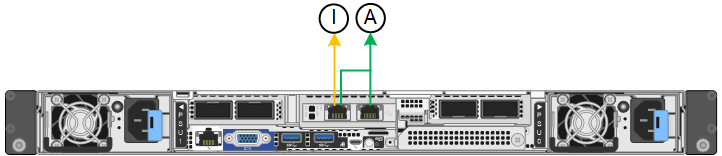

= Raccogliere informazioni sulla rete (SG110 e SG1100)
:allow-uri-read: 
:icons: font
:imagesdir: ../media/

[role="lead"]
Utilizzando le tabelle, registrare le informazioni richieste per ciascuna rete collegata all'appliance. Questi valori sono necessari per installare e configurare l'hardware.

TIP: Invece di utilizzare le tabelle, utilizzare la guida fornita con ConfigBuilder. L'utilizzo della guida ConfigBuilder consente di caricare le informazioni di sistema e generare un file JSON per completare automaticamente alcuni passaggi di configurazione nel programma di installazione dell'appliance StorageGRID. Vedere link:automating-appliance-installation-and-configuration.html["Automazione dell'installazione e della configurazione delle appliance"].

== Controllare la versione di StorageGRID

Prima di installare un'appliance di servizi SG110 o SG1100, verificare che il sistema StorageGRID utilizzi una versione richiesta del software StorageGRID.

[cols="1a,2a"]
|===
| Appliance | Versione StorageGRID richiesta 

 a| 
SG1100
 a| 
11,8 o versione successiva (si consiglia l'aggiornamento rapido più recente)

 a| 
SG110
 a| 
11,8 o versione successiva (si consiglia l'aggiornamento rapido più recente)

|===

== Porte di amministrazione e manutenzione

La rete amministrativa per StorageGRID è una rete opzionale utilizzata per l'amministrazione e la manutenzione del sistema. L'appliance si connette alla rete amministrativa utilizzando le seguenti porte di gestione 1/10-GbE sull'appliance.

SG110 porte RJ-45:

image::../media/sg6100_rj_45_ports_circled.png[SG110 porte RJ-45]

SG1100 porte RJ-45:

[cols="2a,1a"]
|===
| Informazioni necessarie | Il tuo valore 

 a| 
Admin Network attivato
 a| 
Scegliere una delle seguenti opzioni:

* No
* Sì (impostazione predefinita)

 a| 
Network bond mode (modalità bond di
 a| 
Scegliere una delle seguenti opzioni:

* Indipendente (impostazione predefinita)
* Backup attivo

 a| 
Porta dello switch per la porta sinistra cerchiata nel diagramma (porta attiva predefinita per la modalità Independent network bond)
 a| 

 a| 
Porta dello switch per la porta destra cerchiata nel diagramma (solo modalità bond di rete Active-Backup)
 a| 

 a| 
Indirizzo IP assegnato da DHCP per la porta Admin Network, se disponibile dopo l'accensione

*Nota:* contattare l'amministratore di rete per l'indirizzo IP assegnato da DHCP della porta di rete dell'amministratore.
 a| 
* Indirizzo IPv4 (CIDR):
* Gateway:

 a| 
Indirizzo IP statico che si intende utilizzare per il nodo appliance nella rete di amministrazione

*Nota:* se la rete non dispone di un gateway, specificare lo stesso indirizzo IPv4 statico per il gateway.
 a| 
* Indirizzo IPv4 (CIDR):
* Gateway:

 a| 
Subnet di rete amministrativa (CIDR)
 a| 

|===

== Porte di rete

Le quattro porte di rete dell'appliance si collegano alla rete StorageGRID Grid e alla rete client opzionale.

[cols="2a,1a"]
|===
| Informazioni necessarie | Il tuo valore 

 a| 
Velocità di collegamento
 a| 
Per SG110, scegliere una delle seguenti opzioni:

* Auto (impostazione predefinita)
* 10 GbE
* 25 GbE

Per SG1100, scegliere una delle seguenti opzioni:

* Auto (impostazione predefinita)
* 10 GbE
* 25 GbE
* 40 GbE
* 100 GbE

*Nota:* per le velocità SG1100, 10 e 25 GbE è necessario utilizzare adattatori QSA.

 a| 
Modalità Port Bond
 a| 
Scegliere una delle seguenti opzioni:

* Fisso (impostazione predefinita)
* Aggregato

 a| 
Porta dello switch per la porta 1 (rete client per la modalità fissa)
 a| 

 a| 
Porta dello switch per la porta 2 (rete di rete per la modalità fissa)
 a| 

 a| 
Porta dello switch per la porta 3 (rete client per la modalità fissa)
 a| 

 a| 
Porta dello switch per la porta 4 (Grid Network per la modalità fissa)
 a| 

|===

== Porte Grid Network

La rete grid per StorageGRID è una rete richiesta, utilizzata per tutto il traffico StorageGRID interno. L'appliance si collega alla rete Grid tramite le quattro porte di rete.

[cols="2a,1a"]
|===
| Informazioni necessarie | Il tuo valore 

 a| 
Network bond mode (modalità bond di
 a| 
Scegliere una delle seguenti opzioni:

* Active-Backup (impostazione predefinita)
* LACP (802.3ad)

 a| 
Tagging VLAN attivato
 a| 
Scegliere una delle seguenti opzioni:

* No (impostazione predefinita)
* Sì

 a| 
Tag VLAN (se è attivata la codifica VLAN)
 a| 
Immettere un valore compreso tra 0 e 4095:

 a| 
Indirizzo IP assegnato da DHCP per Grid Network, se disponibile dopo l'accensione
 a| 
* Indirizzo IPv4 (CIDR):
* Gateway:

 a| 
Indirizzo IP statico che si intende utilizzare per il nodo appliance sulla rete Grid

*Nota:* se la rete non dispone di un gateway, specificare lo stesso indirizzo IPv4 statico per il gateway.
 a| 
* Indirizzo IPv4 (CIDR):
* Gateway:

 a| 
Subnet Grid Network (CIDR)
 a| 

 a| 
Impostazione MTU (Maximum Transmission Unit) (opzionale)è possibile utilizzare il valore predefinito 1500 o impostare MTU su un valore adatto per i frame jumbo, ad esempio 9000.
 a| 

|===

== Porte di rete client

La rete client per StorageGRID è una rete opzionale, generalmente utilizzata per fornire l'accesso del protocollo client alla griglia. L'appliance si connette alla rete client utilizzando le quattro porte di rete.

[cols="2a,1a"]
|===
| Informazioni necessarie | Il tuo valore 

 a| 
Rete client abilitata
 a| 
Scegliere una delle seguenti opzioni:

* No (impostazione predefinita)
* Sì

 a| 
Network bond mode (modalità bond di
 a| 
Scegliere una delle seguenti opzioni:

* Active-Backup (impostazione predefinita)
* LACP (802.3ad)

 a| 
Tagging VLAN attivato
 a| 
Scegliere una delle seguenti opzioni:

* No (impostazione predefinita)
* Sì

 a| 
Tag VLAN (se è attivata la codifica VLAN)
 a| 
Immettere un valore compreso tra 0 e 4095:

 a| 
Indirizzo IP assegnato da DHCP per la rete client, se disponibile dopo l'accensione
 a| 
* Indirizzo IPv4 (CIDR):
* Gateway:

 a| 
Indirizzo IP statico che si intende utilizzare per il nodo appliance sulla rete client

*Nota:* se la rete client è attivata, il percorso predefinito dell'appliance utilizzerà il gateway specificato.
 a| 
* Indirizzo IPv4 (CIDR):
* Gateway:

|===

== Porte di rete per la gestione BMC

È possibile accedere all'interfaccia BMC dell'appliance di servizi utilizzando la porta di gestione 1-GbE cerchiata nel diagramma. Questa porta supporta la gestione remota dell'hardware del controller su Ethernet utilizzando lo standard IPMI (Intelligent Platform Management Interface).

NOTE: È possibile attivare o disattivare l'accesso IPMI remoto per tutti i dispositivi che contengono un BMC. L'interfaccia IPMI remota consente l'accesso hardware di basso livello alle apparecchiature StorageGRID da parte di chiunque disponga di un account BMC e di una password. Se non è necessario l'accesso IPMI remoto al BMC, disattivare questa opzione utilizzando uno dei seguenti metodi: +
In Grid Manager, andare a *CONFIGURAZIONE* > *sicurezza* > *Impostazioni di protezione* > *dispositivi* e deselezionare la casella di controllo *Abilita accesso IPMI remoto*. +
Nell'API di gestione griglia, utilizzare l'endpoint privato: `PUT /private/bmc`.

SG110 porta di gestione BMC:

image::../media/sgf6112_cn_bmc_management_port.png[Porta di gestione da SG110 GbE]

SG1100 porta di gestione BMC:

image::../media/sg1100_bmc_management_port.png[SG1100 porta di gestione BMC]

[cols="2a,1a"]
|===
| Informazioni necessarie | Il tuo valore 

 a| 
Porta dello switch Ethernet da collegare alla porta di gestione BMC (cerchiata nel diagramma)
 a| 

 a| 
Indirizzo IP assegnato da DHCP per la rete di gestione BMC, se disponibile dopo l'accensione
 a| 
* Indirizzo IPv4 (CIDR):
* Gateway:

 a| 
Indirizzo IP statico che si intende utilizzare per la porta di gestione BMC
 a| 
* Indirizzo IPv4 (CIDR):
* Gateway:

|===

== Modalità Port bond

Quando link:configuring-network-links.html["configurazione dei collegamenti di rete"] Per le apparecchiature SG110 e SG1100, è possibile utilizzare il binding delle porte che si collegano alla rete Grid e alla rete client opzionale e le porte di gestione 1-GbE1/10-GbE che si collegano alla rete amministrativa opzionale. Il port bonding consente di proteggere i dati fornendo percorsi ridondanti tra le reti StorageGRID e l'appliance.

=== Network Bond

Le porte di rete sul dispositivo di servizi supportano la modalità Fixed Port Bond o aggregate Port Bond per le connessioni di rete Grid Network e Client Network.

==== Modalità fissa port bond

Fixed port bond mode è la configurazione predefinita per le porte di rete. Le figure mostrano come le porte di rete su SG1100 o SG110 sono collegate in modalità di collegamento a porta fissa.

SG110:

image::../media/sgf6112_fixed_port.png[Modalità Bond a SG110 porte fisse]

SG1100:

image::../media/sg1100_fixed_port.png[Modalità Bond a SG1100 porte fisse]

[cols="1a,3a"]
|===
| Didascalia | Quali porte sono collegate 

 a| 
C.
 a| 
Le porte 1 e 3 sono collegate tra loro per la rete client, se viene utilizzata questa rete.

 a| 
G
 a| 
Le porte 2 e 4 sono collegate tra loro per la rete Grid.

|===
Quando si utilizza la modalità Fixed Port Bond, è possibile collegare le porte utilizzando la modalità Active-backup o la modalità link Aggregation Control Protocol (LACP 802.3ad).

* In modalità Active-backup (impostazione predefinita), è attiva una sola porta alla volta. In caso di guasto della porta attiva, la relativa porta di backup fornisce automaticamente una connessione di failover. La porta 4 fornisce un percorso di backup per la porta 2 (rete griglia), mentre la porta 3 fornisce un percorso di backup per la porta 1 (rete client).
* In modalità LACP, ciascuna coppia di porte forma un canale logico tra l'appliance di servizi e la rete, consentendo un throughput più elevato. In caso di guasto di una porta, l'altra porta continua a fornire il canale. Il throughput viene ridotto, ma la connettività non viene influenzata.

NOTE: Se non sono necessarie connessioni ridondanti, è possibile utilizzare una sola porta per ciascuna rete. Tuttavia, tenere presente che l'avviso *collegamento dell'appliance dei servizi* potrebbe essere attivato in Gestione griglia dopo l'installazione di StorageGRID, a indicare che un cavo è scollegato. È possibile disattivare questa regola di avviso in modo sicuro.

==== Modalità aggregate port bond

La modalità aggregate port bond aumenta significativamente il throughput per ciascuna rete StorageGRID e fornisce percorsi di failover aggiuntivi. Queste figure mostrano come le porte di rete sono collegate in modalità aggregate port bond.

SG110:

image::../media/sgf6112_aggregate_ports.png[Modalità bind porta aggregata SG110]

SG1100:

image::../media/sg1100_aggregate_ports.png[Modalità Bond porta aggregata SG1100]

[cols="1a,3a"]
|===
| Didascalia | Quali porte sono collegate 

 a| 
1
 a| 
Tutte le porte connesse sono raggruppate in un unico collegamento LACP, consentendo l'utilizzo di tutte le porte per il traffico di rete Grid Network e Client Network.

|===
Se si intende utilizzare la modalità aggregate port bond:

* È necessario utilizzare la modalità di collegamento di rete LACP.
* È necessario specificare un tag VLAN univoco per ciascuna rete. Questo tag VLAN verrà aggiunto a ciascun pacchetto di rete per garantire che il traffico di rete venga instradato alla rete corretta.
* Le porte devono essere collegate a switch in grado di supportare VLAN e LACP. Se nel bond LACP partecipano più switch, questi devono supportare gruppi MLAG (Multi-chassis link Aggregation groups) o equivalenti.
* Si comprende come configurare gli switch per l'utilizzo di VLAN, LACP e MLAG o equivalente.

Se non si desidera utilizzare tutte e quattro le porte, è possibile utilizzare una, due o tre porte. L'utilizzo di più porte aumenta al massimo la possibilità che una parte della connettività di rete rimanga disponibile in caso di guasto di una delle porte.

NOTE: Se si sceglie di utilizzare meno di quattro porte di rete, è possibile che venga attivato un avviso *Services appliance link down* in Grid Manager dopo l'installazione del nodo appliance, che indica che un cavo è scollegato. È possibile disattivare questa regola di avviso per l'avviso attivato.

=== Network bond mode per le porte di gestione

Per le due porte di gestione 1/10-GbE sull'appliance Services, è possibile scegliere la modalità Independent network bond o la modalità Active-Backup network bond per connettersi alla rete Admin opzionale. Queste figure mostrano come le porte di gestione delle appliance sono collegate in modalità Network Bond per la rete di amministrazione.

SG110:

image::../media/sgf6112_bonded_management_ports.png[SG110 porte di gestione di rete collegate]

SG1100:

[cols="1a,3a"]
|===
| Didascalia | Network bond mode (modalità bond di 

 a| 
R
 a| 
Modalità Active-Backup. Entrambe le porte di gestione sono collegate a una porta di gestione logica collegata alla rete di amministrazione.

 a| 
IO
 a| 
Modalità indipendente. La porta a sinistra è collegata alla rete di amministrazione. La porta a destra è disponibile per le connessioni locali temporanee (indirizzo IP 169.254.0.1).

|===
In modalità indipendente, solo la porta di gestione a sinistra è connessa alla rete di amministrazione. Questa modalità non fornisce un percorso ridondante. La porta di gestione a destra è disconnessa e disponibile per le connessioni locali temporanee (utilizza l'indirizzo IP 169.254.0.1)

In modalità Active-Backup, entrambe le porte di gestione sono collegate alla rete di amministrazione. È attiva una sola porta alla volta. In caso di guasto della porta attiva, la relativa porta di backup fornisce automaticamente una connessione di failover. L'Unione di queste due porte fisiche in una porta di gestione logica fornisce un percorso ridondante alla rete di amministrazione.

NOTE: Se è necessario stabilire una connessione locale temporanea all'appliance servizi quando le porte di gestione 1/10-GbE sono configurate per la modalità di backup attivo, rimuovere i cavi da entrambe le porte di gestione, collegare il cavo temporaneo alla porta di gestione sulla destra e accedere all'appliance utilizzando l'indirizzo IP 169.254.0.1.

.Informazioni correlate
* link:cabling-appliance.html["Apparecchio via cavo"]
* link:setting-ip-configuration.html["Configurare gli indirizzi IP StorageGRID"]

