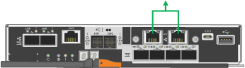

= Raccogliere informazioni sulla rete (SG5700)
:allow-uri-read: 
:icons: font
:imagesdir: ../media/

[role="lead"]
Utilizzando le tabelle, registrare le informazioni richieste per ciascuna rete collegata all'appliance. Questi valori sono necessari per installare e configurare l'hardware.

TIP: Invece di utilizzare le tabelle, utilizzare la guida fornita con ConfigBuilder. L'utilizzo della guida ConfigBuilder consente di caricare le informazioni di sistema e generare un file JSON per completare automaticamente alcuni passaggi di configurazione nel programma di installazione dell'appliance StorageGRID. Vedere link:automating-appliance-installation-and-configuration.html["Automazione dell'installazione e della configurazione delle appliance"].

== Informazioni necessarie per la connessione a Gestore di sistema SANtricity sul controller E2800

Il controller della serie E2800 viene collegato alla rete di gestione che verrà utilizzata per Gestore di sistema SANtricity.

[cols="2a,1a"]
|===
| Informazioni necessarie | Il tuo valore 

 a| 
Porta dello switch Ethernet si collega alla porta di gestione 1
 a| 

 a| 
Indirizzo MAC per la porta di gestione 1 (stampato su un'etichetta vicino alla porta P1)
 a| 

 a| 
Indirizzo IP assegnato da DHCP per la porta di gestione 1, se disponibile dopo l'accensione

*Nota:* se la rete che si desidera collegare al controller E2800 include un server DHCP, l'amministratore di rete può utilizzare l'indirizzo MAC per determinare l'indirizzo IP assegnato dal server DHCP.
 a| 

 a| 
Velocità e modalità duplex

*Nota:* assicurarsi che lo switch Ethernet per la rete di gestione del gestore di sistema SANtricity sia impostato su negoziazione automatica.
 a| 
Deve essere:

* Negoziazione automatica (impostazione predefinita)

 a| 
Formato dell'indirizzo IP
 a| 
Scegliere una delle seguenti opzioni:

* IPv4
* IPv6

 a| 
Indirizzo IP statico che si intende utilizzare per l'appliance sulla rete di gestione
 a| 
Per IPv4:

* Indirizzo IPv4:
* Subnet mask:
* Gateway:

Per IPv6:

* Indirizzo IPv6:
* Indirizzo IP instradabile:
* E2800 Controller Router IP address (Indirizzo IP router controller E2800):

|===

== Informazioni necessarie per collegare il controller E5700SG alla rete di amministrazione

La rete amministrativa per StorageGRID è una rete opzionale utilizzata per l'amministrazione e la manutenzione del sistema. L'appliance si connette alla rete di amministrazione utilizzando le porte di gestione 1-GbE sul controller E5700SG.

[cols="2a,1a"]
|===
| Informazioni necessarie | Il tuo valore 

 a| 
Admin Network attivato
 a| 
Scegliere una delle seguenti opzioni:

* No
* Sì (impostazione predefinita)

 a| 
Network bond mode (modalità bond di
 a| 
Scegliere una delle seguenti opzioni:

* Indipendente
* Backup attivo

 a| 
Porta dello switch per la porta 1
 a| 

 a| 
Porta dello switch per la porta 2 (solo modalità bond di rete Active-Backup)
 a| 

 a| 
Indirizzo IP assegnato da DHCP per la porta di gestione 1, se disponibile dopo l'accensione

*Nota:* se la rete di amministrazione include un server DHCP, il controller E5700SG visualizza l'indirizzo IP assegnato da DHCP sul display a sette segmenti dopo l'avvio. È inoltre possibile determinare l'indirizzo IP assegnato da DHCP utilizzando l'indirizzo MAC per cercare l'indirizzo IP assegnato.
 a| 
* Indirizzo IPv4 (CIDR):
* Gateway:

 a| 
Indirizzo IP statico che si intende utilizzare per il nodo di storage dell'appliance nella rete di amministrazione

*Nota:* se la rete non dispone di un gateway, specificare lo stesso indirizzo IPv4 statico per il gateway.
 a| 
* Indirizzo IPv4 (CIDR):
* Gateway:

 a| 
Subnet di rete amministrativa (CIDR)
 a| 

|===

== Informazioni necessarie per collegare e configurare le porte 10/25-GbE sul controller E5700SG

Le quattro porte 10/25-GbE del controller E5700SG si collegano alla rete di rete StorageGRID e alla rete client.

NOTE: Vedere link:gathering-installation-information-sg5700.html#port-bond-modes["Modalità di collegamento porte (controller E5700SG)"].

[cols="2a,1a"]
|===
| Informazioni necessarie | Il tuo valore 

 a| 
Velocità di collegamento

*Nota:* se si seleziona 25 GbE, installare i ricetrasmettitori SPF28. La negoziazione automatica non è supportata, pertanto è necessario configurare anche le porte e gli switch collegati per 25 GbE.
 a| 
Scegliere una delle seguenti opzioni:

* 10 GbE (impostazione predefinita)
* 25 GbE

 a| 
Modalità Port Bond
 a| 
Scegliere una delle seguenti opzioni:

* Fisso (impostazione predefinita)
* Aggregato

 a| 
Porta dello switch per la porta 1 (rete client)
 a| 

 a| 
Porta dello switch per la porta 2 (Grid Network)
 a| 

 a| 
Porta dello switch per la porta 3 (rete client)
 a| 

 a| 
Porta dello switch per la porta 4 (rete a griglia)
 a| 

|===

== Informazioni necessarie per collegare il controller E5700SG alla rete di rete

La rete grid per StorageGRID è una rete richiesta, utilizzata per tutto il traffico StorageGRID interno. L'appliance si connette alla rete Grid utilizzando le porte 10/25-GbE sul controller E5700SG.

NOTE: Vedere link:gathering-installation-information-sg5700.html#port-bond-modes["Modalità di collegamento porte (controller E5700SG)"].

[cols="2a,1a"]
|===
| Informazioni necessarie | Il tuo valore 

 a| 
Network bond mode (modalità bond di
 a| 
Scegliere una delle seguenti opzioni:

* Active-Backup (impostazione predefinita)
* LACP (802.3ad)

 a| 
Tagging VLAN attivato
 a| 
Scegliere una delle seguenti opzioni:

* No (impostazione predefinita)
* Sì

 a| 
Tag VLAN (se è attivata la codifica VLAN)
 a| 
Immettere un valore compreso tra 0 e 4095:

 a| 
Indirizzo IP assegnato da DHCP per Grid Network, se disponibile dopo l'accensione

*Nota:* se Grid Network include un server DHCP, il controller E5700SG visualizza l'indirizzo IP assegnato da DHCP per Grid Network sul display a sette segmenti dopo l'avvio.
 a| 
* Indirizzo IPv4 (CIDR):
* Gateway:

 a| 
Indirizzo IP statico che si intende utilizzare per il nodo di storage dell'appliance sulla rete Grid

*Nota:* se la rete non dispone di un gateway, specificare lo stesso indirizzo IPv4 statico per il gateway.
 a| 
* Indirizzo IPv4 (CIDR):
* Gateway:

 a| 
Subnet Grid Network (CIDR)

*Nota:* se la rete client non è attivata, il percorso predefinito sul controller utilizzerà il gateway specificato in questo punto.
 a| 

|===

== Informazioni necessarie per collegare il controller E5700SG alla rete client

La rete client per StorageGRID è una rete opzionale, generalmente utilizzata per fornire l'accesso del protocollo client alla griglia. L'appliance si connette alla rete client utilizzando le porte 10/25-GbE sul controller E5700SG.

NOTE: Vedere link:gathering-installation-information-sg5700.html#port-bond-modes["Modalità di collegamento porte (controller E5700SG)"].

[cols="2a,1a"]
|===
| Informazioni necessarie | Il tuo valore 

 a| 
Rete client abilitata
 a| 
Scegliere una delle seguenti opzioni:

* No (impostazione predefinita)
* Sì

 a| 
Network bond mode (modalità bond di
 a| 
Scegliere una delle seguenti opzioni:

* Active-Backup (impostazione predefinita)
* LACP (802.3ad)

 a| 
Tagging VLAN attivato
 a| 
Scegliere una delle seguenti opzioni:

* No (impostazione predefinita)
* Sì

 a| 
Tag VLAN

(Se è attivata la codifica VLAN)
 a| 
Immettere un valore compreso tra 0 e 4095:

 a| 
Indirizzo IP assegnato da DHCP per la rete client, se disponibile dopo l'accensione
 a| 
* Indirizzo IPv4 (CIDR):
* Gateway:

 a| 
Indirizzo IP statico che si intende utilizzare per il nodo di storage dell'appliance sulla rete client

*Nota:* se la rete client è attivata, il percorso predefinito sul controller utilizzerà il gateway specificato in questo punto.
 a| 
* Indirizzo IPv4 (CIDR):
* Gateway:

|===

== Modalità Port bond

Quando link:configuring-network-links.html["configurazione dei collegamenti di rete"] Per il controller E5700SG, è possibile utilizzare il bonding della porta per le porte 10/25-GbE che si collegano alla rete Grid e alla rete client opzionale e per le porte di gestione 1-GbE che si collegano alla rete amministrativa opzionale. Il port bonding consente di proteggere i dati fornendo percorsi ridondanti tra le reti StorageGRID e l'appliance.

=== Modalità Network Bond per porte 10/25-GbE

Le porte di rete 10/25-GbE sul controller E5700SG supportano la modalità Fixed Port Bond o aggregate Port Bond per le connessioni di rete Grid Network e Client Network.

==== Modalità fissa port bond

La modalità fissa è la configurazione predefinita per le porte di rete 10/25-GbE.

image::../media/e5700sg_fixed_port.gif[Porte utilizzate per la modalità di port bond fissa]

[cols="1a,3a"]
|===
| Didascalia | Quali porte sono collegate 

 a| 
C.
 a| 
Le porte 1 e 3 sono collegate tra loro per la rete client, se viene utilizzata questa rete.

 a| 
G
 a| 
Le porte 2 e 4 sono collegate tra loro per la rete Grid.

|===
Quando si utilizza la modalità Fixed Port Bond, è possibile utilizzare una delle due modalità di connessione di rete: Active-Backup o link Aggregation Control Protocol (LACP).

* In modalità Active-Backup (impostazione predefinita), è attiva una sola porta alla volta. In caso di guasto della porta attiva, la relativa porta di backup fornisce automaticamente una connessione di failover. La porta 4 fornisce un percorso di backup per la porta 2 (rete griglia), mentre la porta 3 fornisce un percorso di backup per la porta 1 (rete client).
* In modalità LACP, ciascuna coppia di porte forma un canale logico tra il controller e la rete, consentendo un throughput più elevato. In caso di guasto di una porta, l'altra porta continua a fornire il canale. Il throughput viene ridotto, ma la connettività non viene influenzata.

NOTE: Se non sono necessarie connessioni ridondanti, è possibile utilizzare una sola porta per ciascuna rete. Tuttavia, tenere presente che, dopo l'installazione di StorageGRID, viene generato un allarme in Gestione griglia, a indicare che un cavo è scollegato. È possibile riconoscere questo allarme in modo sicuro per cancellarlo.

==== Modalità aggregate port bond

La modalità aggregate port bond aumenta significativamente l'intero percorso di ogni rete StorageGRID e fornisce percorsi di failover aggiuntivi.

image::../media/e5700sg_aggregate_port.gif[Porte utilizzate per la modalità aggregate port bond]

[cols="1a,3a"]
|===
| Didascalia | Quali porte sono collegate 

 a| 
1
 a| 
Tutte le porte connesse sono raggruppate in un unico collegamento LACP, consentendo l'utilizzo di tutte le porte per il traffico di rete Grid Network e Client Network.

|===
Se si intende utilizzare la modalità aggregate port bond:

* È necessario utilizzare la modalità di collegamento di rete LACP.
* È necessario specificare un tag VLAN univoco per ciascuna rete. Questo tag VLAN verrà aggiunto a ciascun pacchetto di rete per garantire che il traffico di rete venga instradato alla rete corretta.
* Le porte devono essere collegate a switch in grado di supportare VLAN e LACP. Se nel bond LACP partecipano più switch, questi devono supportare gruppi MLAG (Multi-chassis link Aggregation groups) o equivalenti.
* Si comprende come configurare gli switch per l'utilizzo di VLAN, LACP e MLAG o equivalente.

Se non si desidera utilizzare tutte e quattro le porte 10/25-GbE, è possibile utilizzare una, due o tre porte. L'utilizzo di più porte aumenta al massimo la possibilità che una parte della connettività di rete rimanga disponibile in caso di guasto di una delle porte 10/25-GbE.

NOTE: Se si sceglie di utilizzare meno di quattro porte, tenere presente che, dopo l'installazione di StorageGRID, verranno generati uno o più allarmi in Gestione griglia, a indicare che i cavi sono scollegati. È possibile riconoscere gli allarmi in modo sicuro per cancellarli.

=== Modalità Network Bond per porte di gestione a 1 GbE

Per le due porte di gestione 1-GbE sul controller E5700SG, è possibile scegliere la modalità Independent network bond o la modalità Active-Backup network bond per connettersi alla rete amministrativa opzionale.

In modalità indipendente, alla rete di amministrazione è collegata solo la porta di gestione 1. Questa modalità non fornisce un percorso ridondante. La porta di gestione 2 viene lasciata non cablata e disponibile per le connessioni locali temporanee (utilizzare l'indirizzo IP 169.254.0.1)

In modalità Active-Backup, entrambe le porte di gestione 1 e 2 sono collegate alla rete di amministrazione. È attiva una sola porta alla volta. In caso di guasto della porta attiva, la relativa porta di backup fornisce automaticamente una connessione di failover. L'Unione di queste due porte fisiche in una porta di gestione logica fornisce un percorso ridondante alla rete di amministrazione.

NOTE: Se è necessario stabilire una connessione locale temporanea al controller E5700SG quando le porte di gestione 1-GbE sono configurate per la modalità Active-Backup, rimuovere i cavi da entrambe le porte di gestione, collegare il cavo temporaneo alla porta di gestione 2 e accedere all'appliance utilizzando l'indirizzo IP 169.254.0.1.

.Informazioni correlate
* link:cabling-appliance-sg5700.html["Apparecchio via cavo (SG5700)"]
* link:gathering-installation-information-sg5700.html#port-bond-modes["Modalità di collegamento porte (controller E5700SG)"]
* link:configuring-hardware.html["Configurare l'hardware (SG5700)"]

