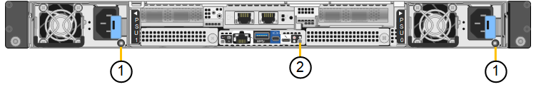

= StorageGRID SG120 e SG1200 appliances
:allow-uri-read: 
:icons: font
:imagesdir: ../media/

[role="lead"]
Gli appliance di servizi StorageGRID SG120 e SG1200 possono funzionare sia come Gateway Node che come Admin Node per fornire servizi di bilanciamento del carico ad alta disponibilità in un sistema StorageGRID. Entrambi gli appliance possono funzionare contemporaneamente come Gateway Node e Admin Node (primari o non primari).

== Caratteristiche dell'appliance

Gli apparecchi SG120 e SG1200 offrono le seguenti caratteristiche:

* Funzioni nodo gateway o nodo amministratore per un sistema StorageGRID.
* Il programma di installazione dell'appliance StorageGRID per semplificare l'implementazione e la configurazione dei nodi.
* Una volta implementato, può accedere al software StorageGRID da un nodo di amministrazione esistente o dal software scaricato su un disco locale. Per semplificare ulteriormente il processo di implementazione, una versione recente del software viene precaricata sull'appliance durante la produzione.
* Un BMC (Baseboard Management Controller) per il monitoraggio e la diagnosi di alcuni componenti hardware dell'appliance.
* La possibilità di connettersi a tutte e tre le reti StorageGRID, tra cui la rete di rete, la rete amministrativa e la rete client:
+
** L'SG120 supporta fino a quattro connessioni 10 o 25 GbE alla Grid Network e alla Client Network.
** L'SG1200 supporta fino a quattro connessioni 10, 25, 40 o 100 GbE verso la Grid Network e la Client Network (oppure fino a quattro connessioni 200 GbE con NIC 200 GbE opzionale).

== Schemi SG120 e SG1200

Questa figura mostra la parte frontale dell'SG120 e dell'SG1200 con la cornice rimossa. Vista frontalmente, i due apparecchi sono identici, fatta eccezione per il nome del prodotto sulla cornice.

image::../media/sg120_sg1200_front_with_ssds.png[Pannello frontale con SSD SG120 e SG1200]

Le due unità a stato solido (SSD), indicate dal contorno arancione, vengono utilizzate per l'archiviazione del sistema operativo StorageGRID e sono replicate tramite RAID 1 per ridondanza. Quando l'appliance di servizi SG120 o SG1200 è configurata come Admin Node, queste unità possono essere utilizzate per archiviare log di audit, metriche e tabelle di database. Gli slot per unità rimanenti sono vuoti.

Questa figura mostra la posizione dell'alimentatore e identifica i LED sul retro di SG120 e SG1200. Ulteriori LED di stato e di attività sono presenti sulle porte dell'appliance. Questi LED possono variare a seconda del modello dell'appliance.

[cols="1a,2a,3a"]
|===
| Didascalia | LED | Stato 

 a| 
1
 a| 
LED dell'alimentatore
 a| 
* Verde, fisso: Alimentazione applicata all'apparecchio, pulsante di accensione acceso.
* Verde lampeggiante: Alimentazione applicata all'apparecchio, pulsante di accensione spento.
* Spento: L'apparecchio non è alimentato.
* Ambra: Guasto all'alimentazione.

 a| 
2
 a| 
Identificare il LED
 a| 
* Blu, lampeggiante: Identifica l'apparecchio nell'armadio o nel rack.
* Blu, fisso: Identifica l'apparecchio nell'armadio o nel rack.
* Spento: l'appliance non è visivamente identificabile all'interno del cabinet o del rack.

|===

== Connettori SG120

Questa figura mostra il retro dell'SG120, comprese le porte, le ventole e gli alimentatori.

image::../media/sg120_rear_connectors.png[Connettori posteriori SG120]

[cols="1a,2a,2a,2a"]
|===
| Didascalia | Porta | Tipo | Utilizzare 

 a| 
1
 a| 
Porte di rete 1-4
 a| 
10/25-GbE, basato sul tipo di ricetrasmettitore via cavo o SFP (sono supportati i moduli SFP28 e SFP+), la velocità dello switch e la velocità di collegamento configurata
 a| 
Connettersi alla rete griglia e alla rete client per StorageGRID.

 a| 
2
 a| 
Porta di gestione BMC
 a| 
1 GbE (RJ-45)
 a| 
Connettersi al controller di gestione della scheda base dell'appliance.

 a| 
3
 a| 
Porte di supporto e diagnostica
 a| 
* Mini display port
* Porta USB 3.0
* Porta per console micro-USB

 a| 
Riservato per l'utilizzo del supporto tecnico.

 a| 
4
 a| 
Admin Network port (porta di rete amministratore) 1
 a| 
1/10-GbE (RJ-45)
 a| 
Collegare l'appliance alla rete di amministrazione per StorageGRID.

 a| 
5
 a| 
Admin Network Port (porta di rete amministratore) 2
 a| 
1/10-GbE (RJ-45)
 a| 
Opzioni:

* Collegamento con la porta di gestione 1 per una connessione ridondante alla rete di amministrazione per StorageGRID.
* Lasciare disconnesso e disponibile per l'accesso locale temporaneo (IP 169.254.0.1).
* Durante l'installazione, utilizzare la porta 2 per la configurazione IP se gli indirizzi IP assegnati da DHCP non sono disponibili.

|===

== Connettori SG1200

Questa figura mostra i connettori sul retro dell'SG1200.

image::../media/sg1200_rear_connectors.png[Connettori posteriori SG1200]

[cols="1a,2a,2a,2a"]
|===
| Didascalia | Porta | Tipo | Utilizzare 

 a| 
1
 a| 
Porte di rete 1-4
 a| 
10/25/40/100/200-GbE, in base al tipo di cavo o ricetrasmettitore, alla velocità dello switch e alla velocità di collegamento configurata.

QSFP56 (max 200GbE/porta), QSFP28 (max 100GbE/porta) e QSFP+ (40GbE) sono supportati nativamente (le velocità di 200GbE richiedono l'opzione NIC da 200GbE). È possibile utilizzare ricetrasmettitori SFP+ (10GbE) o SFP28 (25GbE) opzionali con un QSA (venduto separatamente).
 a| 
Connettersi alla rete griglia e alla rete client per StorageGRID.

 a| 
2
 a| 
Porta di gestione BMC
 a| 
1 GbE (RJ-45)
 a| 
Connettersi al controller di gestione della scheda base dell'appliance.

 a| 
3
 a| 
Porte di supporto e diagnostica
 a| 
* Mini display port
* Porta USB 3.0
* Porta per console micro-USB

 a| 
Riservato per l'utilizzo del supporto tecnico.

 a| 
4
 a| 
Admin Network port (porta di rete amministratore) 1
 a| 
1/10-GbE (RJ-45)
 a| 
Collegare l'appliance alla rete di amministrazione per StorageGRID.

 a| 
5
 a| 
Admin Network Port (porta di rete amministratore) 2
 a| 
1/10-GbE (RJ-45)
 a| 
Opzioni:

* Collegamento con la porta di gestione 1 per una connessione ridondante alla rete di amministrazione per StorageGRID.
* Lasciare disconnesso e disponibile per l'accesso locale temporaneo (IP 169.254.0.1).
* Durante l'installazione, utilizzare la porta 2 per la configurazione IP se gli indirizzi IP assegnati da DHCP non sono disponibili.

|===

== Applicazioni SG120 e SG1200

È possibile configurare gli StorageGRID services appliance nei seguenti modi per fornire servizi gateway e ridondanza di alcuni servizi di amministrazione della griglia.

* Aggiungere a una griglia nuova o esistente come nodo gateway
* Aggiungere a una nuova griglia come nodo di amministrazione primario o non primario o a una griglia esistente come nodo di amministrazione non primario
* Operare contemporaneamente come nodo gateway e nodo amministratore (primario o non primario)

L'appliance facilita l'utilizzo di gruppi ad alta disponibilità (ha) e il bilanciamento intelligente del carico per le connessioni dei percorsi dati S3 o Swift.

I seguenti esempi descrivono come massimizzare le funzionalità dell'appliance:

* Utilizzare due appliance SG120 o due appliance SG1200 per fornire servizi gateway configurandoli come Gateway Node.
+

IMPORTANT: L'utilizzo combinato di dispositivi di servizio con diversi livelli di prestazioni nello stesso sito, come ad esempio un SG110 o un SG120 con un SG1100 o un SG1200, può causare risultati imprevedibili e incoerenti quando si utilizzano più nodi in un gruppo ad alta disponibilità o quando si bilancia il carico dei client su più dispositivi di servizio

* Utilizzare due appliance SG120 o due appliance SG1200 per fornire la ridondanza di alcuni servizi di amministrazione della grid. Eseguire questa operazione configurando ciascuna appliance come Admin Node.
* Utilizza due appliance SG120 o due appliance SG1200 per fornire servizi di bilanciamento del carico e di gestione del traffico ad alta disponibilità, accessibili tramite uno o più indirizzi IP virtuali. A tale scopo, configura le appliance come qualsiasi combinazione di nodi di amministrazione o nodi gateway e aggiungi entrambi i nodi allo stesso gruppo ad alta disponibilità.
+

IMPORTANT: Se si utilizza una porta solo per Admin Node e Gateway Node nello stesso gruppo ad alta disponibilità, la porta solo per Admin Node non eseguirà il failover. Vedere le istruzioni per  https://docs.netapp.com/us-en/storagegrid/admin/configure-high-availability-group.html["Configurazione dei gruppi ha"^].

Se utilizzati con gli appliance di storage StorageGRID, sia l'appliance di servizio SG120 che l'SG1200 consentono la distribuzione di grid basate esclusivamente su appliance, senza dipendenze da hypervisor esterni o hardware di calcolo.
