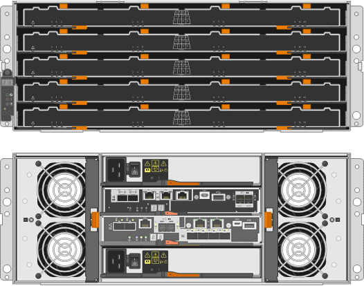

= Appliance SG5700: Panoramica
:allow-uri-read: 
:icons: font
:imagesdir: ../media/

[role="lead"]
L'appliance SG5700 StorageGRID è una piattaforma di storage e calcolo integrata che opera come nodo di storage in un grid StorageGRID. L'appliance può essere utilizzata in un ambiente di grid ibrido che combina nodi storage dell'appliance e nodi storage virtuali (basati su software).

L'appliance StorageGRID serie SG5700 offre le seguenti funzionalità:

* Integrare gli elementi di storage e calcolo per un nodo di storage StorageGRID.
* Includere il programma di installazione dell'appliance StorageGRID per semplificare l'implementazione e la configurazione del nodo di storage.
* Include Gestione di sistema SANtricity e-Series per la gestione e il monitoraggio dell'hardware.
* Supporta fino a quattro connessioni 10 GbE o 25 GbE alla rete grid e alla rete client StorageGRID.
* Supporto di dischi FDE (Full Disk Encryption) o FIPS. Quando questi dischi vengono utilizzati con la funzione di protezione del disco in Gestione di sistema di SANtricity, viene impedito l'accesso non autorizzato ai dati.

L'appliance SG5700 è disponibile in quattro modelli: SG5712 e SG5712X, SG5760 e SG5760X. Non esistono differenze di specifiche o di funzionalità tra SG5712 e SG5712X, ad eccezione della posizione delle porte di interconnessione sul controller dello storage. Allo stesso modo, non esistono differenze di specifiche o di funzionalità tra SG5760 e SG5760X, ad eccezione della posizione delle porte di interconnessione sul controller di storage.

== SG5700 componenti

I modelli SG5700 includono i seguenti componenti:

[role="tabbed-block"]
====
.SG5712
--
Controller di calcolo:: Controller E5700SG
Controller dello storage:: Controller E2800A
Chassis:: Enclosure e-Series DE212C, un enclosure a due unità rack (2U)
Dischi:: 12 unità NL-SAS (3.5")
Alimentatori e ventole ridondanti:: Due contenitori per ventole di alimentazione

--
.SG5712X
--
Controller di calcolo:: Controller E5700SG
Controller dello storage:: Controller E2800B
Chassis:: Enclosure e-Series DE212C, un enclosure a due unità rack (2U)
Dischi:: 12 unità NL-SAS (3.5")
Alimentatori e ventole ridondanti:: Due contenitori per ventole di alimentazione

--
.SG5760
--
Controller di calcolo:: Controller E5700SG
Controller dello storage:: Controller E2800A
Chassis:: Enclosure e-Series DE460C, un enclosure a quattro unità rack (4U)
Dischi:: Dischi NL-SAS da 60 TB (3,5 pollici)
Alimentatori e ventole ridondanti:: Due contenitori di alimentazione e due contenitori per ventole

--
.SG5760X
--
Controller di calcolo:: Controller E5700SG
Controller dello storage:: Controller E2800B
Chassis:: Enclosure e-Series DE460C, un enclosure a quattro unità rack (4U)
Dischi:: Dischi NL-SAS da 60 TB (3,5 pollici)
Alimentatori e ventole ridondanti:: Due contenitori di alimentazione e due contenitori per ventole

--
====
Lo storage raw massimo disponibile nell'appliance StorageGRID è fisso, in base al numero di dischi in ogni enclosure. Non è possibile espandere lo storage disponibile aggiungendo uno shelf con dischi aggiuntivi.

== SG5700 diagrammi

=== Vista anteriore e posteriore di SG5712

Le figure mostrano la parte anteriore e posteriore di SG5712, un enclosure 2U in grado di contenere 12 dischi.

image::../media/sg5712_front_and_back_views.gif[La parte anteriore e posteriore dell'appliance SG5712]

=== SG5712 componenti

SG5712 include due controller e due contenitori per ventole di alimentazione.

image::../media/sg5712_with_callouts.gif[Controller e contenitori per ventole di alimentazione nell'appliance SG5712]

[cols="1a,3a"]
|===
| Didascalia | Descrizione 

 a| 
1
 a| 
Controller E2800A (storage controller)

 a| 
2
 a| 
Controller E5700SG (controller di calcolo)

 a| 
3
 a| 
Contenitori per ventole di alimentazione

|===

=== SG5712X viste anteriore e posteriore

Le figure mostrano la parte anteriore e posteriore del SG5712X, un enclosure 2U che contiene 12 unità.

image::../media/sg5712x_front_and_back_views.gif[La parte anteriore e posteriore dell'apparecchio SG5712X]

=== SG5712X componenti

Il sistema SG5712X include due controller e due canister per ventole di alimentazione.

image::../media/sg5712x_with_callouts.gif[Controller e canister della ventola di alimentazione nell'appliance SG5712X]

[cols="1a,3a"]
|===
| Didascalia | Descrizione 

 a| 
1
 a| 
Controller E2800B (storage controller)

 a| 
2
 a| 
Controller E5700SG (controller di calcolo)

 a| 
3
 a| 
Contenitori per ventole di alimentazione

|===

=== SG5760 viste anteriore e posteriore

Le figure mostrano la parte anteriore e posteriore del modello SG5760, un enclosure 4U in grado di contenere 60 dischi in 5 cassetti.

=== SG5760 componenti

Il modello SG5760 include due controller, due contenitori per ventole e due contenitori di alimentazione.

image::../media/sg5760_with_callouts.gif[Controller,fan canisters,and power canisters in SG5760 appliance]

[cols="1a,2a"]
|===
| Didascalia | Descrizione 

 a| 
1
 a| 
Controller E2800A (storage controller)

 a| 
2
 a| 
Controller E5700SG (controller di calcolo)

 a| 
3
 a| 
Filtro a carboni attivi della ventola (1 di 2)

 a| 
4
 a| 
Filtro a carboni attivi (1 di 2)

|===

=== SG5760X viste anteriore e posteriore

Le figure mostrano la parte anteriore e posteriore del modello SG5760X, un contenitore 4U che contiene 60 unità in cassetti per 5 unità.

image::../media/sg5760x_front_and_back_views.gif[Parte anteriore e posteriore dell'apparecchio SG5760X]

=== SG5760X componenti

Il sistema SG5760X include due controller, due ventole e due filtri di alimentazione.

image::../media/sg5760x_with_callouts.gif[Controller,fan canisters,and power canisters in SG5760X appliance]

[cols="1a,3a"]
|===
| Didascalia | Descrizione 

 a| 
1
 a| 
Controller E2800B (storage controller)

 a| 
2
 a| 
Controller E5700SG (controller di calcolo)

 a| 
3
 a| 
Filtro a carboni attivi della ventola (1 di 2)

 a| 
4
 a| 
Filtro a carboni attivi (1 di 2)

|===

== SG5700 controller

I modelli SG5712 e SG5712X a 12 dischi e SG5760 e SG5760X a 60 dischi dell'appliance StorageGRID includono un controller di calcolo E5700SG e uno storage controller E2800 e-Series.

* SG5712 e SG5760 utilizzano un controller E2800A.
* SG5712X e SG5760X utilizzano un controller E2800B.

I controller E2800A e E2800B hanno caratteristiche e funzioni identiche, ad eccezione della posizione delle porte di interconnessione.

=== Controller di calcolo E5700SG

* Funziona come server di calcolo per l'appliance.
* Include il programma di installazione dell'appliance StorageGRID.
+

NOTE: Il software StorageGRID non è preinstallato sull'appliance. L'accesso a questo software viene effettuato dal nodo di amministrazione durante l'implementazione dell'appliance.

* Può connettersi a tutte e tre le reti StorageGRID, incluse la rete griglia, la rete amministrativa e la rete client.
* Si collega al controller E2800 e funziona come iniziatore.

==== Connettori E5700SG

image::../media/e5700sg_controller_with_callouts.gif[Connettori sul controller E5700SG]

[cols="1a,2a,2a,2a"]
|===
| Didascalia | Porta | Tipo | Utilizzare 

 a| 
1
 a| 
Porte di interconnessione 1 e 2
 a| 
Fibre Channel (FC) da 16 GB/s, SFP ottico
 a| 
Collegare il controller E5700SG al controller E2800.

 a| 
2
 a| 
Porte di supporto e diagnostica
 a| 
* Porta seriale RJ-45
* Porta seriale micro USB
* Porta USB

 a| 
Riservato al supporto tecnico.

 a| 
3
 a| 
Porte di espansione del disco
 a| 
SAS 12 GB/s.
 a| 
Non utilizzato.

 a| 
4
 a| 
Porte di rete 1-4
 a| 
10-GbE o 25-GbE, in base al tipo di ricetrasmettitore SFP, alla velocità dello switch e alla velocità di collegamento configurata
 a| 
Connettersi alla rete griglia e alla rete client per StorageGRID.

 a| 
5
 a| 
Porta di gestione 1
 a| 
Ethernet da 1 GB (RJ-45)
 a| 
Connettersi alla rete amministrativa per StorageGRID.

 a| 
6
 a| 
Porta di gestione 2
 a| 
Ethernet da 1 GB (RJ-45)
 a| 
Opzioni:

* Collegamento con la porta di gestione 1 per una connessione ridondante alla rete di amministrazione per StorageGRID.
* Lasciare la connessione non cablata e disponibile per l'accesso locale temporaneo (IP 169.254.0.1).
* Durante l'installazione, utilizzare la porta 2 per la configurazione IP se gli indirizzi IP assegnati da DHCP non sono disponibili.

|===

=== Storage controller E2800

Le appliance SG5700 utilizzano due versioni del controller di storage E2800: E2800 e E2800. E2800A non dispone di un HIC e E2800B dispone di un HIC a quattro porte. Le due versioni dei controller hanno caratteristiche e funzioni identiche, ad eccezione della posizione delle porte di interconnessione.

Lo storage controller della serie E2800 ha le seguenti specifiche:

* Funziona come controller di storage per l'appliance.
* Gestisce lo storage dei dati sui dischi.
* Funziona come controller standard e-Series in modalità simplex.
* Include il software SANtricity OS (firmware del controller).
* Include Gestione di sistema SANtricity per il monitoraggio dell'hardware dell'appliance e per la gestione degli avvisi, la funzione AutoSupport e la funzione di protezione del disco.
* Si collega al controller E5700SG e funziona come destinazione.

==== Connettori E2800A

image::../media/e2800_controller_with_callouts.gif[Connettori sulla centralina E2800A]

==== Connettori E2800B

image::../media/e2800B_controller_with_callouts.gif[Connettori sulla centralina E2800B]

[cols="1a,2a,2a,2a"]
|===
| Didascalia | Porta | Tipo | Utilizzare 

 a| 
1
 a| 
Porte di interconnessione 1 e 2
 a| 
SFP ottico FC da 16 GB/s.
 a| 
Collegare il controller E2800 al controller E5700SG.

 a| 
2
 a| 
Porte di gestione 1 e 2
 a| 
Ethernet da 1 GB (RJ-45)
 a| 
* Opzioni porta 1:
+
** Connettersi a una rete di gestione per abilitare l'accesso TCP/IP diretto a Gestione di sistema SANtricity
** Lasciare scollegato per salvare la porta e l'indirizzo IP dello switch.  Accedere a Gestore di sistema di SANtricity utilizzando il gestore di griglie o il programma di installazione del dispositivo di griglia di archiviazione.

*Nota*: Alcune funzionalità SANtricity opzionali, come ad esempio la sincronizzazione NTP per ottenere timestamp dei registri precisi, non sono disponibili quando si sceglie di lasciare la porta 1 non cablata.

*Nota*: StorageGRID 11.5 o superiore e SANtricity 11.70 o superiore sono necessari quando si lascia la porta 1 non cablata.

* La porta 2 è riservata al supporto tecnico.

 a| 
3
 a| 
Porte di supporto e diagnostica
 a| 
* Porta seriale RJ-45
* Porta seriale micro USB
* Porta USB

 a| 
Riservato per l'utilizzo del supporto tecnico.

 a| 
4
 a| 
Porte di espansione del disco.
 a| 
SAS 12 GB/s.
 a| 
Non utilizzato.

|===
.Informazioni correlate
http://mysupport.netapp.com/info/web/ECMP1658252.html["Sito di documentazione dei sistemi NetApp e-Series"^]
