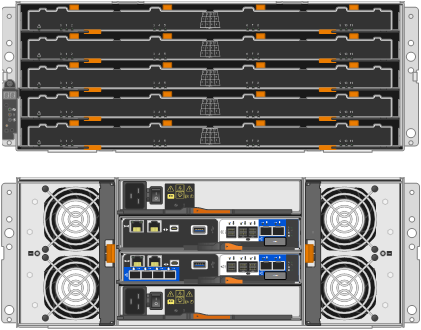

= Appliance SG5800: Panoramica
:allow-uri-read: 
:icons: font
:imagesdir: ../media/

[role="lead"]
Le appliance StorageGRID della serie SG5800 sono piattaforme integrate di storage e calcolo che operano come nodi storage in un grid StorageGRID.

Le appliance StorageGRID serie SG5800 offrono le seguenti caratteristiche:

* Integrare gli elementi di storage e calcolo per un nodo di storage StorageGRID.
* Includere il programma di installazione dell'appliance StorageGRID per semplificare l'implementazione e la configurazione del nodo di storage.
* Include e-Series SANtricity System Manager per la gestione e il monitoring dell'hardware.
* Supporta fino a quattro connessioni 10 GbE o 25 GbE alla rete grid e alla rete client StorageGRID.
* Supporto di dischi FDE (Full Disk Encryption) o FIPS. Quando questi dischi vengono utilizzati con la funzione di protezione del disco in Gestione di sistema di SANtricity, viene impedito l'accesso non autorizzato ai dati.

L'appliance SG5800 è disponibile in due modelli: SG5812 e SG5860.

== SG5800 componenti

I modelli SG5800 includono i seguenti componenti:

[role="tabbed-block"]
====
.SG5812
--
Controller di calcolo:: Controller SG5800
Controller dello storage:: Controller E4000
Chassis:: Enclosure e-Series DE212C, un enclosure a due unità rack (2U)
Dischi:: 12 unità NL-SAS (3.5")
Alimentatori e ventole ridondanti:: Due contenitori per ventole di alimentazione

--
.SG5860
--
Controller di calcolo:: Controller SG5800
Controller dello storage:: Controller E4000
Chassis:: Enclosure e-Series DE460C, un enclosure a quattro unità rack (4U)
Dischi:: Dischi NL-SAS da 60 TB (3,5 pollici)
Alimentatori e ventole ridondanti:: Due contenitori di alimentazione e due contenitori per ventole

--
====
Lo storage raw massimo disponibile nell'appliance StorageGRID è fisso, in base al numero di dischi in ogni enclosure. Non è possibile espandere lo storage disponibile aggiungendo uno shelf con dischi aggiuntivi.

== SG5800 diagrammi

=== SG5812 viste anteriore e posteriore

Le figure mostrano la parte anteriore e posteriore del SG5812, un enclosure 2U che contiene 12 unità.

image::../media/sg5812_front_and_back_views.png[La parte anteriore e posteriore dell'apparecchio SG5812]

=== SG5812 componenti

Il sistema SG5812 include due controller e due canister per ventole di alimentazione.

image::../media/sg5812_with_callouts.png[Controller e canister della ventola di alimentazione nell'appliance SG5812]

[cols="1a,3a"]
|===
| Didascalia | Descrizione 

 a| 
1
 a| 
Controller E4000 (storage controller)

 a| 
2
 a| 
Controller SG5800 (controller di calcolo)

 a| 
3
 a| 
Contenitori per ventole di alimentazione

|===

=== SG5860 viste anteriore e posteriore

Le figure mostrano la parte anteriore e posteriore del modello SG5860, un contenitore 4U che contiene 60 unità in cassetti per 5 unità.

=== SG5860 componenti

Il sistema SG5860 include due controller, due ventole e due filtri di alimentazione.

image::../media/sg5860_with_callouts.png[Controller,fan canisters,and power canisters in SG5860 appliance]

[cols="1a,2a"]
|===
| Didascalia | Descrizione 

 a| 
1
 a| 
Controller E4000 (storage controller)

 a| 
2
 a| 
Controller SG5800 (controller di calcolo)

 a| 
3
 a| 
Filtro a carboni attivi della ventola (1 di 2)

 a| 
4
 a| 
Filtro a carboni attivi (1 di 2)

|===

== Controller SG5800

I modelli SG5812 a 12 dischi e SG5860 a 60 dischi dell'appliance StorageGRID includono un controller di calcolo SG5800 e uno storage controller e-Series E4000.

=== Controller di calcolo SG5800

* Funziona come server di calcolo per l'appliance.
* Include il programma di installazione dell'appliance StorageGRID.
+

NOTE: Il software StorageGRID non è preinstallato sull'appliance. L'accesso a questo software viene effettuato dal nodo di amministrazione durante l'implementazione dell'appliance.

* Può connettersi a tutte e tre le reti StorageGRID, incluse la rete griglia, la rete amministrativa e la rete client.
* Si collega al controller E4000 e funziona come iniziatore.

==== Connettori SG5800

image::../media/sg5800_controller_with_callouts.png[Connettori sulla centralina SG5800]

[cols="1a,2a,2a,2a"]
|===
| Didascalia | Porta | Tipo | Utilizzare 

 a| 
1
 a| 
Porta di gestione 1
 a| 
Ethernet da 1 GB (RJ-45)
 a| 
Connettersi alla rete amministrativa per StorageGRID.

 a| 
2
 a| 
Porte di supporto e diagnostica
 a| 
* Porta seriale RJ-45
* Porta seriale USB-C.
* Porta USB

 a| 
Riservato al supporto tecnico.

 a| 
3
 a| 
Porte di espansione del disco
 a| 
SAS 12 GB/s.
 a| 
Non utilizzato.

 a| 
4
 a| 
Porte di interconnessione 1 e 2
 a| 
ISCSI da 25GbE Gbit
 a| 
Collegare il controller SG5800 al controller E4000.

 a| 
5
 a| 
Porte di rete 1-4
 a| 
10-GbE o 25-GbE, in base al tipo di ricetrasmettitore SFP, alla velocità dello switch e alla velocità di collegamento configurata
 a| 
Connettersi alla rete griglia e alla rete client per StorageGRID.

|===

=== Storage controller E4000

Lo storage controller della serie E4000 presenta le seguenti specifiche:

* Funziona come controller di storage per l'appliance.
* Gestisce lo storage dei dati sui dischi.
* Funziona come controller standard e-Series in modalità simplex.
* Include il software SANtricity OS (firmware del controller).
* Include Gestione di sistema SANtricity per il monitoraggio dell'hardware dell'appliance e per la gestione degli avvisi, la funzione AutoSupport e la funzione di protezione del disco.
* Si collega al controller SG5800 e funziona come destinazione.

==== Connettori E4000

image::../media/e4000_controller_with_callouts.png[Connettori sulla centralina E4000]

[cols="1a,2a,2a,2a"]
|===
| Didascalia | Porta | Tipo | Utilizzare 

 a| 
1
 a| 
Porta di gestione
 a| 
Ethernet da 1 GB (RJ-45)
 a| 
Opzioni porta:
** Collegarsi a una rete di gestione per abilitare l'accesso TCP/IP diretto al Gestore di sistema di SANtricity
** Lasciare non cablato per salvare una porta dello switch e un indirizzo IP.  Accedere a Gestore di sistema di SANtricity utilizzando il gestore di griglie o il programma di installazione del dispositivo di griglia di archiviazione.

*Nota*: Alcune funzionalità SANtricity opzionali, come la sincronizzazione NTP per timestamp del registro precisi, non sono disponibili quando si sceglie di lasciare la porta di gestione non cablata.

*Nota*: StorageGRID 11,8 o superiore e SANtricity 11,8 o superiore sono necessari quando si lascia la porta di gestione non cablata.

 a| 
2
 a| 
Porte di supporto e diagnostica
 a| 
* Porta seriale RJ-45
* Porta seriale USB-C.
* Porta USB

 a| 
Riservato per l'utilizzo del supporto tecnico.

 a| 
3
 a| 
Porte di espansione del disco.
 a| 
SAS 12 GB/s.
 a| 
Non utilizzato.

 a| 
4
 a| 
Porte di interconnessione 1 e 2
 a| 
ISCSI da 25GbE Gbit
 a| 
Collegare il controller E4000 al controller SG5800.

|===
.Informazioni correlate
https://docs.netapp.com/us-en/e-series-family/index.html["Documentazione di NetApp e-Series"^]
