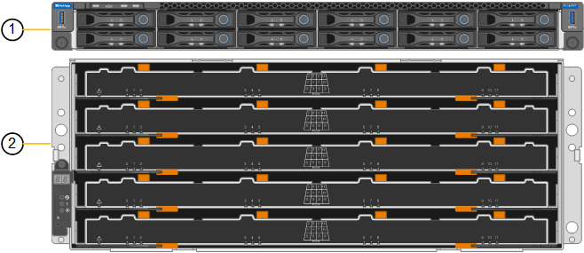
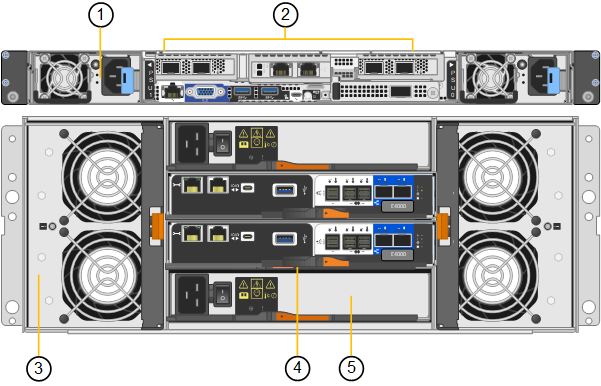

= Appliance SG6100: Panoramica
:allow-uri-read: 
:icons: font
:imagesdir: ../media/

[role="lead"]
Le appliance della serie StorageGRID SG6100 operano come nodi storage in un sistema StorageGRID.  Come tutte le appliance StorageGRID, possono essere liberamente combinate con altri modelli di appliance e con nodi software-only in una singola implementazione.

L'appliance StorageGRID SG6160 include un controller di calcolo con una coppia di SSD NVMe che funzionano come cache di lettura e uno shelf dello storage controller che contiene due storage controller e dischi rigidi NL-SAS da 60 TB. Può essere espanso fino a un massimo di 180 dischi rigidi NL-SAS aggiungendo fino a due shelf di espansione opzionali. L'appliance StorageGRID SGF6112 è un'appliance all-flash con un form factor compatto di 1U popolato con SSD da 12 NVMe.

Le appliance SGF6112 e SG6160 offrono le seguenti caratteristiche:

* Integra gli elementi di storage e calcolo per un nodo di storage StorageGRID.
* Include il programma di installazione dell'appliance StorageGRID per semplificare l'implementazione e la configurazione del nodo di storage.
* Include un BMC (Baseboard Management Controller) per il monitoraggio e la diagnosi dell'hardware nel controller di calcolo.

Il sistema SGF6112 offre le seguenti funzioni di protezione dei dati:

* Capacità di funzionare dopo il guasto di un singolo SSD senza alcun impatto sulla disponibilità degli oggetti.
* Capacità di funzionare dopo guasti a più SSD con una riduzione minima necessaria della disponibilità degli oggetti (in base alla progettazione dello schema RAID sottostante).
+

NOTE: A seconda dei criteri ILM configurati, le richieste di oggetti localmente non disponibili possono essere gestite da altri nodi, pertanto in genere non ci saranno riduzioni di disponibilità.

* Completamente ripristinabile, durante il servizio, da guasti SSD che non causano danni estremi al RAID che ospita il volume root del nodo (il sistema operativo StorageGRID).
* Se più guasti agli SSD comportano una perdita di dati locale, i dati degli oggetti possono essere ripristinati automaticamente dalle copie o da blocchi con erasure coding su altri nodi.

Il sistema SG6160 offre le seguenti funzioni di protezione dei dati:

* Possibilità di funzionare dopo il guasto di due hard disk (HDD) senza impatti sulla disponibilità degli oggetti.
* Evacuazione e ricostruzione rapida degli HDD durante i guasti e gli eventi di sostituzione (quando configurati per DDP o DDP16 durante l'installazione), migliorando la durata dei dati rispetto allo standard RAID6.
* Soluzione completamente ripristinabile, durante il servizio, dal guasto di due HDD.
* Se guasti multipli agli HDD producono una perdita di dati locale, i dati degli oggetti possono essere ripristinati automaticamente dalle copie o da blocchi codificati con erasure coding su altri nodi.

== SG6100 componenti hardware

=== Appliance SGF6112

L'apparecchio SGF6112 comprende i seguenti componenti:

Piattaforma di calcolo e storage:: Un server con un'unità rack (1U) che include:
+
--
* Due processori da 165 W a 2,1/2,6 GHz con 48 core (96 thread)
* 256 GB DI RAM
* 2 × 1/10 porte GBase-T.
* 4 porte Ethernet da 10/25 GbE per il traffico di rete Grid/Client
* 1 × disco di avvio interno da 256 GB (include il software StorageGRID)
* Baseboard Management Controller (BMC) che semplifica la gestione dell'hardware
* Alimentatori e ventole ridondanti

--

=== Appliance SG6160

L'apparecchio SG6160 comprende i seguenti componenti:

Controller di calcolo:: Il controller SG6100-CN è un server a un rack (1U) che include:
+
--
* 48 core (96 thread)
* 256 GB DI RAM
* Larghezza di banda Ethernet aggregata fino a 4 x 25 GbE (o fino a 4 x 100 GbE con SKU NIC 100g opzionale)
* Interconnessione 1 x 100 GbE
* Due SSD NVMe per la cache di lettura
* Baseboard Management Controller (BMC) che semplifica la gestione dell'hardware
* Alimentatori e ventole ridondanti

--
Shelf dello storage controller:: Lo shelf del controller e-Series E4000 (storage array) è uno shelf 4U che include:
+
--
* Due controller della serie E4000 (configurazione duplex) per fornire supporto per il failover del controller di storage
* Shelf di dischi a cinque cassetti in grado di contenere sessanta dischi NL-SAS da 3,5 pollici
* Alimentatori e ventole ridondanti

--
Opzionale: Shelf di espansione dello storage:: Ogni appliance SG6160 può avere uno o due shelf di espansione per un totale di 180 dischi.
+
--

NOTE: È possibile installare shelf di espansione durante l'implementazione iniziale o aggiungerli in un secondo momento.

L'enclosure della e-Series DE460C è uno shelf 4U che include:

* Due moduli di input/output (IOM)
* Cinque cassetti, ciascuno contenente 12 unità NL-SAS, per un totale di 60 unità
* Alimentatori e ventole ridondanti

--

== Schemi SGF6112 e SG6160

=== Vista frontale di SGF6112

Questa figura mostra la parte anteriore di SGF6112 senza il pannello. L'appliance include una piattaforma di calcolo e storage 1U che contiene 12 unità SSD.

image::../media/sgf6112_front_with_ssds.png[SGF6112 Vista frontale]

=== Vista posteriore di SGF6112

Questa figura mostra la parte posteriore di SGF6112, incluse le porte, le ventole e gli alimentatori.

image::../media/sgf6112_rear_view.png[SGF6112 Vista posteriore]

[cols="1a,2a,2a,2a"]
|===
| Didascalia | Porta | Tipo | Utilizzare 

 a| 
1
 a| 
Porte di rete 1-4
 a| 
10/25-GbE, basato sul tipo di ricetrasmettitore via cavo o SFP (sono supportati i moduli SFP28 e SFP+), la velocità dello switch e la velocità di collegamento configurata.
 a| 
Connettersi alla rete griglia e alla rete client per StorageGRID.

 a| 
2
 a| 
Porta di gestione BMC
 a| 
1 GbE (RJ-45)
 a| 
Connettersi al controller di gestione della scheda base dell'appliance.

 a| 
3
 a| 
Porte di supporto e diagnostica
 a| 
* VGA
* USB
* Porta per console micro-USB
* Modulo slot micro-SD

 a| 
Riservato per l'utilizzo del supporto tecnico.

 a| 
4
 a| 
Admin Network port (porta di rete amministratore) 1
 a| 
1/10-GbE (RJ-45)
 a| 
Collegare l'appliance alla rete di amministrazione per StorageGRID.

 a| 
5
 a| 
Admin Network Port (porta di rete amministratore) 2
 a| 
1/10-GbE (RJ-45)
 a| 
Opzioni:

* Collegare con la porta di rete amministrativa 1 per una connessione ridondante alla rete amministrativa per StorageGRID.
* Lasciare disconnesso e disponibile per l'accesso locale temporaneo (IP 169.254.0.1).
* Durante l'installazione, utilizzare la porta 2 per la configurazione IP se gli indirizzi IP assegnati da DHCP non sono disponibili.

|===

=== SG6160 Vista frontale

Questa figura mostra la parte anteriore di SG6160, che include un controller di calcolo 1U e uno shelf 4U con due storage controller e 60 dischi in cinque cassetti.

[cols="1a,2a"]
|===
| Didascalia | Descrizione 

 a| 
1
 a| 
Controller di calcolo SG6100-CN con pannello frontale rimosso

 a| 
2
 a| 
Shelf del controller E4000 con pannello anteriore rimosso (lo shelf di espansione opzionale sembra identico)

|===

=== SG6160 Vista posteriore

Questa figura mostra la parte posteriore di SG6160, inclusi controller di calcolo e storage, ventole e alimentatori.

[cols="1a,2a"]
|===
| Didascalia | Descrizione 

 a| 
1
 a| 
Alimentatore (1 di 2) per controller di calcolo SG6100-CN

 a| 
2
 a| 
Connettori per controller di elaborazione SG6100-CN

 a| 
3
 a| 
Fan (1 di 2) per shelf controller E4000

 a| 
4
 a| 
Storage controller e-Series E400 (1 di 2) e connettori

 a| 
5
 a| 
Alimentatore (1 di 2) per shelf di controller E4000

|===

== SG6100 controller

=== Controller di calcolo SG6100-CN

* Fornisce risorse di calcolo per l'appliance.
* Include il programma di installazione dell'appliance StorageGRID.
+

NOTE: Il software StorageGRID non è preinstallato sull'appliance. Questo software viene recuperato dal nodo di amministrazione quando si implementa l'appliance.

* Può connettersi a tutte e tre le reti StorageGRID, incluse la rete griglia, la rete amministrativa e la rete client.
* Si connette ai controller di storage e-Series e funziona come iniziatore.

image::../media/sg6100_cn_rear_connectors.png[Connettori posteriori SG6100-CN]

[cols="1a,2a,2a,3a"]
|===
| Didascalia | Porta | Tipo | Utilizzare 

 a| 
1
 a| 
Porte di rete 1-4
 a| 
10-GbE, 25-GbE o 100-GbE in base al tipo di ricetrasmettitore SFP o via cavo, alla velocità dello switch e alla velocità di collegamento configurata
 a| 
Connettersi alla rete griglia e alla rete client per StorageGRID.

 a| 
2
 a| 
Porta di gestione BMC
 a| 
1 GbE (RJ-45)
 a| 
Collegamento al controller di gestione della scheda di base SG6100-CN.

 a| 
3
 a| 
Porte di supporto e diagnostica
 a| 
* VGA
* USB
* Porta per console micro-USB
* Modulo slot micro-SD

 a| 
Riservato per l'utilizzo del supporto tecnico.

 a| 
4
 a| 
Admin Network port (porta di rete amministratore) 1
 a| 
1/10-GbE (RJ-45)
 a| 
Collegare l'SG6100-CN alla rete di amministrazione per StorageGRID.

 a| 
5
 a| 
Admin Network Port (porta di rete amministratore) 2
 a| 
1/10-GbE (RJ-45)
 a| 
Opzioni:

* Collegamento con la porta di gestione 1 per una connessione ridondante alla rete di amministrazione per StorageGRID.
* Lasciare la connessione non cablata e disponibile per l'accesso locale temporaneo (IP 169.254.0.1).
* Durante l'installazione, utilizzare la porta 2 per la configurazione IP se gli indirizzi IP assegnati da DHCP non sono disponibili.

 a| 
6
 a| 
Porta di interconnessione
 a| 
100 GbE
 a| 
Collegare la centralina SG6100-CN alle centraline E4000.

|===

=== SG6160: Storage controller E4000

* Due controller per il supporto del failover.
* Gestire lo storage dei dati sui dischi.
* Funziona come controller standard e-Series in una configurazione duplex.
* Includere il software SANtricity OS (firmware del controller).
* Include Gestione di sistema di SANtricity per il monitoraggio dell'hardware di storage e la gestione degli avvisi, la funzione AutoSupport e la funzione di protezione del disco.
* Collegarsi al controller SG6100-CN e fornire l'accesso allo storage.

image::../media/e4000_controller_with_callouts.png[Connettori sulla centralina E4000]

[cols="1a,2a,2a,3a"]
|===
| Didascalia | Porta | Tipo | Utilizzare 

 a| 
1
 a| 
Porta di gestione 1
 a| 
Ethernet da 1 GB (RJ-45)
 a| 
* Opzioni porta 1:
+
** Connettersi a una rete di gestione per abilitare l'accesso TCP/IP diretto a Gestione di sistema SANtricity
** Lasciare scollegato per salvare la porta e l'indirizzo IP dello switch.  Accedere a Gestore di sistema di SANtricity utilizzando il gestore di griglie o il programma di installazione del dispositivo di griglia di archiviazione.

*Nota*: Alcune funzionalità SANtricity opzionali, come la sincronizzazione NTP per timestamp del registro precisi, non sono disponibili quando si sceglie di lasciare la porta 1 non cablata.

 a| 
2
 a| 
Porte di supporto e diagnostica
 a| 
* Porta seriale RJ-45
* Porta seriale micro USB
* Porta USB

 a| 
Riservato per l'utilizzo del supporto tecnico.

 a| 
3
 a| 
Porte di espansione 1 e 2 dei dischi
 a| 
SAS 12 GB/s.
 a| 
Collegare le porte alle porte di espansione del disco sugli IOM nello shelf di espansione.

 a| 
4
 a| 
Porte di interconnessione 1 e 2
 a| 
ISCSI da 25GbE Gbit
 a| 
Collegare ciascuna delle E4000 unità di controllo alla centralina SG6100-CN.

Sono presenti quattro collegamenti alla centralina SG6100-CN (due da ogni E4000).

|===

=== SG6160: IOM per shelf di espansione opzionali

Lo shelf di espansione contiene due moduli di input/output (IOM) che si collegano ai controller di storage o ad altri shelf di espansione.

==== Connettori IOM

image::../media/iom_connectors.gif[IOM posteriore]

[cols="1a,2a,2a,3a"]
|===
| Didascalia | Porta | Tipo | Utilizzare 

 a| 
1
 a| 
Porte di espansione del disco 1-4
 a| 
SAS 12 GB/s.
 a| 
Collegare ciascuna porta ai controller di storage o allo shelf di espansione aggiuntivo (se presente).

|===