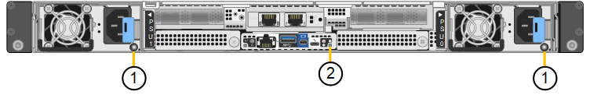

= Appliance StorageGRID SG6200
:allow-uri-read: 
:icons: font
:imagesdir: ../media/

[role="lead"]
Gli appliance della serie StorageGRID SG6200 funzionano come Storage Nodes in un sistema StorageGRID. Come tutti gli appliance StorageGRID, possono essere liberamente combinati con altri modelli di appliance e nodi software-only in un'unica implementazione.

L'appliance StorageGRID SG6260 include un compute controller con una coppia di SSD NVMe che funzionano come cache di lettura e uno shelf storage controller che contiene due storage controller e 60 dischi rigidi NL-SAS. Può essere espansa fino a 180 dischi rigidi NL-SAS tramite l'aggiunta di un massimo di due shelf di espansione opzionali. L'appliance StorageGRID SGF6212 è un'appliance all-flash con un compatto form factor 1U dotato di 12 SSD NVMe.

== Caratteristiche dell'appliance

=== Caratteristiche generali

Gli apparecchi SGF6212 e SG6260 offrono le seguenti caratteristiche:

* Integra gli elementi di storage e calcolo per un nodo di storage StorageGRID.
* Include il programma di installazione dell'appliance StorageGRID per semplificare l'implementazione e la configurazione del nodo di storage.
* Include un BMC (Baseboard Management Controller) per il monitoraggio e la diagnosi dell'hardware nel controller di calcolo.

=== Funzionalità di protezione dei dati

Il dispositivo SGF6212 offre le seguenti funzionalità di protezione dei dati:

* Capacità di funzionare dopo il guasto di un singolo SSD senza alcun impatto sulla disponibilità degli oggetti.
* Capacità di funzionare dopo guasti a più SSD con una riduzione minima necessaria della disponibilità degli oggetti (in base alla progettazione dello schema RAID sottostante).
+

NOTE: A seconda dei criteri ILM configurati, le richieste di oggetti localmente non disponibili possono essere gestite da altri nodi, pertanto in genere non ci saranno riduzioni di disponibilità.

* Completamente ripristinabile, durante il servizio, da guasti SSD che non causano danni estremi al RAID che ospita il volume root del nodo (il sistema operativo StorageGRID).
* Se più guasti agli SSD comportano una perdita di dati locale, i dati degli oggetti possono essere ripristinati automaticamente dalle copie o da blocchi con erasure coding su altri nodi.
* Capacità di operare come https://docs.netapp.com/us-en/storagegrid/admin/managing-load-balancing.html["Nodo gateway con memorizzazione nella cache"^] .

Il modello SG6260 offre le seguenti funzionalità di protezione dei dati:

* Possibilità di funzionare dopo il guasto di due hard disk (HDD) senza impatti sulla disponibilità degli oggetti.
* Evacuazione e ricostruzione rapida degli HDD durante i guasti e gli eventi di sostituzione (quando configurati per DDP o DDP16 durante l'installazione), migliorando la durata dei dati rispetto allo standard RAID6.
* Soluzione completamente ripristinabile, durante il servizio, dal guasto di due HDD.
* Se guasti multipli agli HDD producono una perdita di dati locale, i dati degli oggetti possono essere ripristinati automaticamente dalle copie o da blocchi codificati con erasure coding su altri nodi.

== Componenti hardware SG6200

=== Appliance SGF6212

Il dispositivo SGF6212 comprende i seguenti componenti:

Piattaforma di calcolo e storage:: Un server con un'unità rack (1U) che include:
+
--
* 256 GB DI RAM
* Unità di avvio interna da 240 GB (include StorageGRID software)
* 2 × 1/10 porte GBase-T.
* 4 × porte Ethernet 10/25/40/100GbE per traffico di rete Grid/Client (oppure 4 × 200GbE con scheda di rete 200 GbE opzionale)
* 12 SSD NVMe per l'archiviazione dei dati
* Baseboard Management Controller (BMC) che semplifica la gestione dell'hardware
* Alimentatori e ventole ridondanti

--

=== Appliance SG6260

L'appliance SG6260 include i seguenti componenti:

Controller di calcolo:: Il controller SG6200-CN è un server da un'unità rack (1U) che include:
+
--
* 256 GB DI RAM
* Unità di avvio interna da 240 GB (include StorageGRID software)
* 2 × 1/10 porte GBase-T.
* 4 × porte Ethernet 10/25/40/100GbE per traffico di rete Grid/Client (oppure 4 × 200GbE con scheda di rete 200 GbE opzionale)
* 1 porta di interconnessione per storage da 100 GbE
* Due SSD NVMe per la cache di lettura
* Baseboard Management Controller (BMC) che semplifica la gestione dell'hardware
* Alimentatori e ventole ridondanti

--
Shelf dello storage controller:: Lo shelf del controller e-Series E4000 (storage array) è uno shelf 4U che include:
+
--
* Due controller della serie E4000 (configurazione duplex) per fornire supporto per il failover del controller di storage
* Shelf di dischi a cinque cassetti in grado di contenere sessanta dischi NL-SAS da 3,5 pollici
* Alimentatori e ventole ridondanti

--
Opzionale: Shelf di espansione dello storage:: Ogni appliance SG6260 può disporre di uno o due alloggiamenti di espansione, per un totale di 180 unità. Gli alloggiamenti di espansione possono essere installati durante la fase di implementazione iniziale o aggiunti in un secondo momento.
+
--
L'enclosure della e-Series DE460C è uno shelf 4U che include:

* Due moduli di input/output (IOM)
* Cinque cassetti, ciascuno contenente 12 unità NL-SAS, per un totale di 60 unità
* Alimentatori e ventole ridondanti

--

== Schemi SGF6212 e SG6260

=== Vista frontale SGF6212

Questa figura mostra la parte frontale dell'SGF6212 senza la cornice. Il dispositivo include una piattaforma di calcolo e storage 1U che contiene 12 unità SSD.

image::../media/s25_front_with_ssds.png[Vista frontale SGF6212]

=== Vista posteriore SGF6212

Questa figura mostra il retro del SGF6212, comprese le porte, le ventole e gli alimentatori.

image::../media/sgf6212_rear_connectors.png[Vista posteriore SGF6212]

[cols="1a,2a,2a,2a"]
|===
| Didascalia | Porta | Tipo | Utilizzare 

 a| 
1
 a| 
Porte di rete 1-4
 a| 
10/25/40/100/200-GbE, in base al tipo di cavo o ricetrasmettitore, alla velocità dello switch e alla velocità di collegamento configurata.

QSFP56 (max 200GbE/porta), QSFP28 (max 100GbE/porta) e QSFP+ (40GbE) sono supportati nativamente (le velocità di 200GbE richiedono l'opzione NIC da 200GbE). È possibile utilizzare ricetrasmettitori SFP+ (10GbE) o SFP28 (25GbE) opzionali con un QSA (venduto separatamente).
 a| 
Connettersi alla rete griglia e alla rete client per StorageGRID.

 a| 
2
 a| 
Porta di gestione BMC
 a| 
1 GbE (RJ-45)
 a| 
Connettersi al controller di gestione della scheda base dell'appliance.

 a| 
3
 a| 
Porte di supporto e diagnostica
 a| 
* Mini display port
* Porta USB 3.0
* Porta per console micro-USB

 a| 
Riservato per l'utilizzo del supporto tecnico.

 a| 
4
 a| 
Admin Network port (porta di rete amministratore) 1
 a| 
1/10-GbE (RJ-45)
 a| 
Collegare l'appliance alla rete di amministrazione per StorageGRID.

 a| 
5
 a| 
Admin Network Port (porta di rete amministratore) 2
 a| 
1/10-GbE (RJ-45)
 a| 
Opzioni:

* Collegare con la porta di rete amministrativa 1 per una connessione ridondante alla rete amministrativa per StorageGRID.
* Lasciare disconnesso e disponibile per l'accesso locale temporaneo (IP 169.254.0.1).
* Durante l'installazione, utilizzare la porta 2 per la configurazione IP se gli indirizzi IP assegnati da DHCP non sono disponibili.

|===
Questa figura mostra la posizione dell'alimentatore e identifica i LED sul retro dell'SGF6212. Ulteriori LED di stato e di attività si trovano sulle porte dell'appliance. Questi LED possono variare a seconda del modello dell'appliance.

[cols="1a,2a,3a"]
|===
| Didascalia | LED | Stato 

 a| 
1
 a| 
LED dell'alimentatore
 a| 
* Verde, fisso: Alimentazione applicata all'apparecchio, pulsante di accensione acceso.
* Verde lampeggiante: Alimentazione applicata all'apparecchio, pulsante di accensione spento.
* Spento: L'apparecchio non è alimentato.
* Ambra: Guasto all'alimentazione.

 a| 
2
 a| 
Identificare il LED
 a| 
* Blu, lampeggiante: Identifica l'apparecchio nell'armadio o nel rack.
* Blu, fisso: Identifica l'apparecchio nell'armadio o nel rack.
* Spento: l'appliance non è visivamente identificabile all'interno del cabinet o del rack.

|===

=== Vista frontale SG6260

Questa figura mostra la parte frontale dell'SG6260, che include un controller di elaborazione 1U e una shelf 4U contenente due storage controller e 60 drive in cinque drive drawer.

image::../media/sg6260_front_view_without_bezels.png[Vista frontale SG6260]

[cols="1a,2a"]
|===
| Didascalia | Descrizione 

 a| 
1
 a| 
Controller di calcolo SG6200-CN con pannello frontale rimosso

 a| 
2
 a| 
Shelf del controller E4000 con pannello anteriore rimosso (lo shelf di espansione opzionale sembra identico)

|===

=== Vista posteriore SG6260

Questa figura mostra il retro dell'SG6260, inclusi i compute e storage controller, le ventole e gli alimentatori.

image::../media/sg6260_rear_view.png[Vista posteriore SG6260]

[cols="1a,2a"]
|===
| Didascalia | Descrizione 

 a| 
1
 a| 
Alimentatore (1 di 2) per controller di calcolo SG6200-CN

 a| 
2
 a| 
Connettori per il controller di calcolo SG6200-CN

 a| 
3
 a| 
Fan (1 di 2) per shelf controller E4000

 a| 
4
 a| 
E-Series E400 storage controller (1 di 2) e connettori

 a| 
5
 a| 
Alimentatore (1 di 2) per shelf di controller E4000

|===

== Controllori SG6200

=== Controller di calcolo SG6200-CN

* Fornisce risorse di calcolo per l'appliance.
* Include il programma di installazione dell'appliance StorageGRID.
+

NOTE: Il software StorageGRID non è preinstallato sull'appliance. Questo software viene recuperato dal nodo di amministrazione quando si implementa l'appliance.

* Può connettersi a tutte e tre le reti StorageGRID, incluse la rete griglia, la rete amministrativa e la rete client.
* Si connette ai controller di storage e-Series e funziona come iniziatore.

Questa figura mostra le porte sul retro del controller di calcolo SG6200-CN.

image::../media/sg6200_cn_rear_connectors.png[Connettori posteriori SG6200-CN]

[cols="1a,2a,2a,3a"]
|===
| Didascalia | Porta | Tipo | Utilizzare 

 a| 
1
 a| 
Porte di rete 1-4
 a| 
10/25/40/100/200-GbE, in base al tipo di cavo o ricetrasmettitore, alla velocità dello switch e alla velocità di collegamento configurata. QSFP56 (max 200GbE/porta), QSFP28 (max 100GbE/porta) e QSFP+ (40GbE) sono supportati nativamente (le velocità a 200GbE richiedono l'opzione NIC a 200GbE). È possibile utilizzare ricetrasmettitori SFP+ (10GbE) o SFP28 (25GbE) opzionali con un QSA (venduto separatamente).
 a| 
Connettersi alla rete griglia e alla rete client per StorageGRID.

 a| 
2
 a| 
Porta di gestione BMC
 a| 
1 GbE (RJ-45)
 a| 
Collegarsi al controller di gestione della scheda base SG6200-CN.

 a| 
3
 a| 
Porte di supporto e diagnostica
 a| 
* Mini display port
* Porta USB 3.0
* Porta per console micro-USB

 a| 
Riservato per l'utilizzo del supporto tecnico.

 a| 
4
 a| 
Admin Network port (porta di rete amministratore) 1
 a| 
1/10-GbE (RJ-45)
 a| 
Collega l'SG6200-CN alla rete di amministrazione di StorageGRID.

 a| 
5
 a| 
Admin Network Port (porta di rete amministratore) 2
 a| 
1/10-GbE (RJ-45)
 a| 
Opzioni:

* Collegamento con la porta di gestione 1 per una connessione ridondante alla rete di amministrazione per StorageGRID.
* Lasciare la connessione non cablata e disponibile per l'accesso locale temporaneo (IP 169.254.0.1).
* Durante l'installazione, utilizzare la porta 2 per la configurazione IP se gli indirizzi IP assegnati da DHCP non sono disponibili.

 a| 
6
 a| 
Porta di interconnessione
 a| 
100 GbE
 a| 
Collegare il controller SG6200-CN ai controller E4000.

|===
Questa figura mostra la posizione dell'alimentatore e identifica i LED sul retro del controller di calcolo SG6200-CN. Ulteriori LED di stato e di attività si trovano sulle porte dell'appliance. Questi LED possono variare a seconda del modello dell'appliance.

[cols="1a,2a,3a"]
|===
| Didascalia | LED | Stato 

 a| 
1
 a| 
LED dell'alimentatore
 a| 
* Verde, fisso: Alimentazione applicata all'apparecchio, pulsante di accensione acceso.
* Verde lampeggiante: Alimentazione applicata all'apparecchio, pulsante di accensione spento.
* Spento: L'apparecchio non è alimentato.
* Ambra: Guasto all'alimentazione.

 a| 
2
 a| 
Identificare il LED
 a| 
* Blu, lampeggiante: Identifica l'apparecchio nell'armadio o nel rack.
* Blu, fisso: Identifica l'apparecchio nell'armadio o nel rack.
* Spento: l'appliance non è visivamente identificabile all'interno del cabinet o del rack.

|===

=== SG6260: storage controller E4000

* Due controller per il supporto del failover.
* Gestire lo storage dei dati sui dischi.
* Funziona come controller standard e-Series in una configurazione duplex.
* Includere il software SANtricity OS (firmware del controller).
* Include Gestione di sistema di SANtricity per il monitoraggio dell'hardware di storage e la gestione degli avvisi, la funzione AutoSupport e la funzione di protezione del disco.
* Collegarsi al controller SG6200-CN e fornire l'accesso allo storage.

image::../media/e4000_controller_with_callouts.png[Connettori sulla centralina E4000]

[cols="1a,2a,2a,3a"]
|===
| Didascalia | Porta | Tipo | Utilizzare 

 a| 
1
 a| 
Porta di gestione 1
 a| 
Ethernet da 1 GB (RJ-45)
 a| 
* Opzioni porta 1:
+
** Connettersi a una rete di gestione per abilitare l'accesso TCP/IP diretto a Gestione di sistema SANtricity
** Lasciare scollegato per salvare la porta e l'indirizzo IP dello switch.  Accedere a Gestore di sistema di SANtricity utilizzando il gestore di griglie o il programma di installazione del dispositivo di griglia di archiviazione.

*Nota*: Alcune funzionalità SANtricity opzionali, come la sincronizzazione NTP per timestamp del registro precisi, non sono disponibili quando si sceglie di lasciare la porta 1 non cablata.

 a| 
2
 a| 
Porte di supporto e diagnostica
 a| 
* Porta seriale RJ-45
* Porta seriale micro USB
* Porta USB

 a| 
Riservato per l'utilizzo del supporto tecnico.

 a| 
3
 a| 
Porte di espansione 1 e 2 dei dischi
 a| 
SAS 12 GB/s.
 a| 
Collegare le porte alle porte di espansione del disco sugli IOM nello shelf di espansione.

 a| 
4
 a| 
Porte di interconnessione 1 e 2
 a| 
ISCSI da 25GbE Gbit
 a| 
Collegare ciascuno dei controllori E4000 al controllore SG6200-CN.

Sono presenti quattro connessioni al controller SG6200-CN (due da ciascun E4000).

|===

=== SG6260: IOM per ripiani di espansione opzionali

Lo shelf di espansione contiene due moduli di input/output (IOM) che si collegano ai controller di storage o ad altri shelf di espansione.

==== Connettori IOM

image::../media/iom_connectors.gif[IOM posteriore]

[cols="1a,2a,2a,3a"]
|===
| Didascalia | Porta | Tipo | Utilizzare 

 a| 
1
 a| 
Porte di espansione del disco 1-4
 a| 
SAS 12 GB/s.
 a| 
Collegare ciascuna porta ai controller di storage o allo shelf di espansione aggiuntivo (se presente).

|===