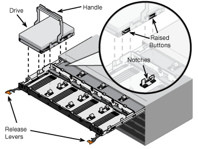

= Installazione nell'armadietto o nel rack (SG5700)
:allow-uri-read: 
:icons: font
:imagesdir: ../media/

[role="lead"]
Installare una serie di guide nell'armadietto o nel rack, quindi far scorrere l'apparecchio sulle guide. Se si dispone di un sistema SG5760, installare le unità dopo l'installazione dell'apparecchio.

.Prima di iniziare
* Hai esaminato il documento Safety Notices incluso nella confezione e compreso le precauzioni per lo spostamento e l'installazione dell'hardware.
* Le istruzioni sono fornite con il kit di guide.

== Installare SG5712

Per installare un'appliance SG5712 in un rack o in un cabinet, procedere come segue.

CAUTION: SG5712 pesa circa 29 kg (64 lb) quando è completamente carico di dischi. Per spostare in sicurezza il sistema SG5712 sono necessarie due persone o un sollevatore meccanico.

CAUTION: Installare l'hardware dalla parte inferiore del rack, dell'armadio o del rack per evitare che l'apparecchiatura si ribalti.

.Fasi
. Seguire le istruzioni del kit di guide per installare le guide.
. Posizionate il retro dell'apparecchio (l'estremità con i connettori) sulle guide.
. Far scorrere con cautela l'apparecchio completamente all'interno del cabinet o del rack.
. Fissare l'apparecchio all'armadietto o al rack come indicato nelle istruzioni del kit di guide.
. Fissare il pannello anteriore.

== Installare SG5760

Per installare un'appliance SG5760 e gli eventuali shelf di espansione in un rack o in un cabinet, procedere come segue.

CAUTION: Installare l'hardware dalla parte inferiore del rack, dell'armadio o del rack per evitare che l'apparecchiatura si ribalti.

CAUTION: SG5760 pesa circa 60 kg (132 lb) senza unità installate. Sono necessarie quattro persone o un sollevatore meccanico per spostare in sicurezza un SG5760 vuoto.

CAUTION: Per evitare di danneggiare l'hardware, non spostare mai un SG5760 se sono installati dischi. Rimuovere tutti i dischi prima di spostare lo shelf.

.Fasi
. Seguire le istruzioni del kit di guide per installare le guide nel cabinet o nel rack.
. Preparazione allo spostamento dell'apparecchio:
+
.. Rimuovere la confezione esterna.
.. Piegare verso il basso le alette della scatola interna.
.. Se si solleva l'unità SG5760 manualmente, fissare le quattro maniglie ai lati del telaio.
+
Rimuovete queste maniglie mentre fate scorrere l'apparecchio sulle guide.

. Se il cabinet dispone di un foro quadrato, installare i dadi della gabbia in modo da poter fissare la parte anteriore e posteriore del ripiano con le viti.
. Posizionate il retro dell'apparecchio (l'estremità con i connettori) sulle guide.
. Sostenendo l'apparecchio dalla parte inferiore, farlo scorrere nel rack o nell'armadietto.
+
Utilizzare i fermi per pollice per staccare le maniglie mentre si fa scorrere l'apparecchio.

. Fissare l'apparecchio alla parte anteriore del rack inserendo due viti nel primo e nel terzo foro (partendo dall'alto) su ciascun lato.
. Fissare l'apparecchio alla parte posteriore del rack o dell'armadietto con le staffe.
. Installare 12 dischi in ciascuno dei cinque cassetti.
+
Per garantire il corretto funzionamento, è necessario installare tutti e 60 i dischi.

+
.. Indossare il braccialetto ESD e rimuovere le unità dalla confezione.
.. Rilasciare le leve sul cassetto superiore e far scorrere il cassetto verso l'esterno utilizzando le leve.
.. Sollevare la maniglia dell'unità in verticale e allineare i pulsanti dell'unità con le tacche del cassetto.
+

.. Premendo delicatamente sulla parte superiore dell'unità, ruotare la maniglia verso il basso fino a quando l'unità non scatta in posizione.
.. Dopo aver installato le prime 12 unità, far scorrere nuovamente il cassetto spingendo al centro e chiudendo delicatamente entrambe le leve.
.. Ripetere questa procedura per gli altri quattro cassetti.

. Fissare il pannello anteriore.

