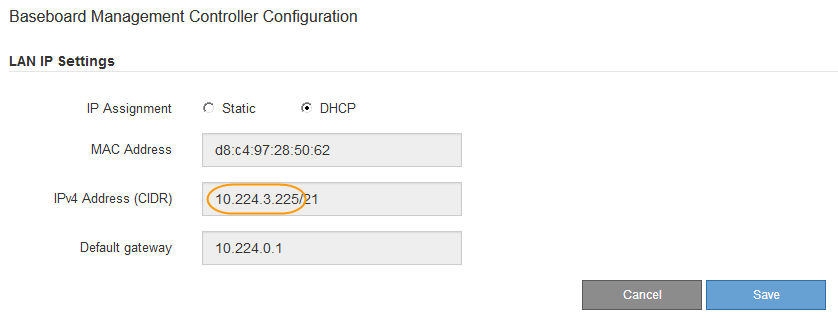

= Impostare l'indirizzo IP per la porta di gestione BMC
:allow-uri-read: 
:icons: font
:imagesdir: ../media/

[role="lead"]
Prima di accedere all'interfaccia BMC, configurare l'indirizzo IP per la porta di gestione BMC sul controller SGF6112, SG6000-CN o sulle appliance di servizi.

Se si utilizza ConfigBuilder per generare un file JSON, è possibile configurare automaticamente gli indirizzi IP. Vedere link:automating-appliance-installation-and-configuration.html["Automazione dell'installazione e della configurazione delle appliance"].

.Prima di iniziare
* Il client di gestione utilizza un https://docs.netapp.com/us-en/storagegrid-118/admin/web-browser-requirements.html["browser web supportato"^].
* Si sta utilizzando qualsiasi client di gestione in grado di connettersi a una rete StorageGRID.
* La porta di gestione BMC è connessa alla rete di gestione che si intende utilizzare.
+
[role="tabbed-block"]
====
.SG100
--
image::../media/sg100_bmc_management_port.png[SG100 porta di gestione BMC]

--
.SG1000
--
image::../media/sg1000_bmc_management_port.png[Porta di gestione BMC SG1000]

--
.SG6000
--
image::../media/sg6000_cn_bmc_management_port.gif[Porta di gestione BMC sul controller SG6000-CN]

--
.SG6100
--
image::../media/sgf6112_cn_bmc_management_port.png[Porta di gestione BMC SGF6112]

--
====

.A proposito di questa attività
A scopo di supporto, la porta di gestione BMC consente un accesso hardware di basso livello.

NOTE: Collegare questa porta solo a una rete di gestione interna sicura e affidabile. Se tale rete non è disponibile, lasciare la porta BMC disconnessa o bloccata, a meno che non venga richiesta una connessione BMC dal supporto tecnico.

.Fasi
. Dal client, immettere l'URL del programma di installazione dell'appliance StorageGRID: +
`*https://_Appliance_IP_:8443*`
+
Per `Appliance_IP`, Utilizzare l'indirizzo IP dell'appliance su qualsiasi rete StorageGRID.

+
Viene visualizzata la pagina iniziale del programma di installazione dell'appliance StorageGRID.

. Selezionare *Configura hardware* > *Configurazione BMC*.
+
image::../media/bmc_configuration_page.gif[Schermata con l'opzione Advanced > BMC Configuration (Avanzate > Configurazione BMC)]

+
Viene visualizzata la pagina Baseboard Management Controller Configuration.

. Annotare l'indirizzo IPv4 visualizzato automaticamente.
+
DHCP è il metodo predefinito per assegnare un indirizzo IP a questa porta.

+

NOTE: La visualizzazione dei valori DHCP potrebbe richiedere alcuni minuti.

+

. Facoltativamente, impostare un indirizzo IP statico per la porta di gestione BMC.
+

NOTE: È necessario assegnare un indirizzo IP statico alla porta di gestione BMC o un lease permanente per l'indirizzo sul server DHCP.

+
.. Selezionare *statico*.
.. Inserire l'indirizzo IPv4 utilizzando la notazione CIDR.
.. Inserire il gateway predefinito.
+
image::../media/bmc_configuration_static_ip.gif[Baseboard Management Controller Configuration Static Option (opzione statica)]

.. Fare clic su *Save* (Salva).
+
L'applicazione delle modifiche potrebbe richiedere alcuni minuti.

