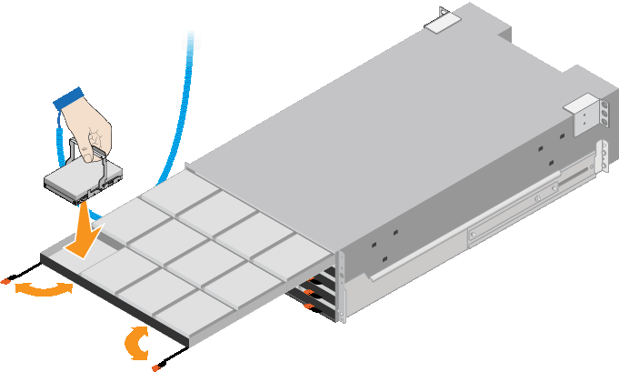

= Installazione di shelf da 60 dischi (SG6160)
:allow-uri-read: 
:icons: font
:imagesdir: ../media/

[role="lead"]
È necessario installare un set di guide per il ripiano del controller E4000 nel cabinet o nel rack, quindi far scorrere il ripiano del controller sulle guide. Se si installano shelf di espansione a 60 dischi, si applica la stessa procedura.

.Prima di iniziare
* Hai esaminato il https://library.netapp.com/ecm/ecm_download_file/ECMP12475945["Avvisi di sicurezza"^] documento incluso nella confezione e comprendere le precauzioni per lo spostamento e l'installazione dell'hardware.
* Le istruzioni sono fornite con il kit di guide.

CAUTION: Per evitare di danneggiare l'hardware, non spostare mai lo shelf se sono installati i dischi. Rimuovere tutti i dischi prima di spostare lo shelf.

CAUTION: Quando si installa lo shelf del controller E4000 o gli shelf di espansione opzionali, installare l'hardware dal basso verso la parte superiore del rack o dell'armadietto per evitare che l'apparecchiatura si ribalti. Per assicurarsi che l'apparecchiatura più pesante si trovi nella parte inferiore del cabinet o del rack, installare il controller SG6100-CN sopra il ripiano del controller E4000 e i ripiani di espansione.

CAUTION: Prima di eseguire l'installazione, verificare che i cavi forniti con l'apparecchio o i cavi forniti siano sufficientemente lunghi per la disposizione prevista.

.Fasi
. Seguire attentamente le istruzioni del kit di guide per installare le guide nel cabinet o nel rack.
+
Per gli armadi a foro quadrato, installare prima i dadi della gabbia in dotazione per fissare la parte anteriore e posteriore del ripiano con le viti.

. Rimuovete la confezione esterna dell'apparecchio. Quindi, piegare verso il basso le alette della scatola interna.
. Se si solleva l'apparecchio manualmente, collegare le quattro maniglie ai lati del telaio.
+
Spingere verso l'alto ciascuna maniglia fino a farla scattare in posizione.

+
image::../media/lift_handles.gif[Sollevare le maniglie]

. Posizionare il retro del ripiano (l'estremità con i connettori) sulle guide.
. Sostenendo lo shelf dal basso, farlo scorrere nel cabinet. Se si utilizzano le maniglie, utilizzare i fermi per pollice per staccare una maniglia alla volta mentre si fa scorrere lo scaffale.
+
Per rimuovere le maniglie, tirare indietro il fermo di rilascio, spingere verso il basso, quindi allontanarlo dallo scaffale.

. Fissare lo shelf alla parte anteriore del cabinet.
+
Inserire le viti nel primo e nel terzo foro dalla parte superiore del ripiano su entrambi i lati.

. Fissare lo shelf alla parte posteriore del cabinet.
+
Posizionare due staffe posteriori su ciascun lato della sezione posteriore superiore del ripiano. Inserire le viti nel primo e nel terzo foro di ciascuna staffa.

+
image::../media/mount_hardware.gif[Montare l'hardware]

. Ripetere questa procedura per tutti gli shelf di espansione.
. Installa 12 dischi NL-SAS in ciascuno dei cinque cassetti dei dischi.
+
.. Avvolgere l'estremità del braccialetto ESD intorno al polso e fissare l'estremità del fermaglio a una messa a terra metallica per evitare scariche elettrostatiche.
.. Rilasciare le leve sul cassetto superiore e far scorrere il cassetto verso l'esterno utilizzando le leve.
.. Sollevare ciascuna maniglia del disco in posizione verticale.
.. Posizionare delicatamente ciascun disco nel relativo slot e abbassare la maniglia sollevata fino a quando non scatta in posizione.
+

.. Installare 12 unità NL-SAS nel cassetto superiore.
.. Far scorrere il cassetto verso l'interno premendo al centro e chiudendo delicatamente entrambe le leve.
+

CAUTION: Interrompere la pressione del cassetto in caso di inceppamento. Utilizzare le leve di rilascio nella parte anteriore del cassetto per far scorrere il cassetto all'indietro. Quindi, reinserire con cautela il cassetto nell'alloggiamento.

.. Ripetere questa procedura per installare le unità NL-SAS negli altri quattro cassetti.
+

CAUTION: Per garantire il corretto funzionamento, è necessario installare tutti e 60 i dischi.

.. Fissare il frontalino anteriore al ripiano, se in dotazione.

. Se disponi di shelf di espansione, ripeti questi passaggi per installare 12 dischi NL-SAS in ogni cassetto di ogni shelf di espansione.
. Procedere con le istruzioni per l'installazione di SG6100-CN in un cabinet o in un rack.

