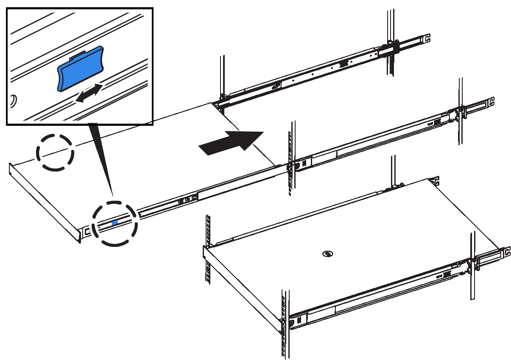

= Installare il controller SG6200-CN per un SG6260
:allow-uri-read: 
:icons: font
:imagesdir: ../media/

[role="lead"]
Si installa un set di guide per il controller SG6200-CN all'interno dell'armadio o del rack, quindi si fa scorrere il controller sulle guide.

.Prima di iniziare
* Hai esaminato il https://library.netapp.com/ecm/ecm_download_file/ECMP12475945["Avvisi di sicurezza"^] documento incluso nella confezione e comprendere le precauzioni per lo spostamento e l'installazione dell'hardware.
* Le istruzioni sono fornite con il kit di guide.
* Hai installato lo shelf e i dischi del controller E4000.

.Fasi
. Seguire attentamente le istruzioni del kit di guide per installare le guide nel cabinet o nel rack.
. Sulle due guide installate nell'armadietto o nel rack, estendere le parti mobili delle guide fino a udire uno scatto.
+
image::../media/rails_extended_out.gif[Binari SG6200]

. Inserire il controller SG6200-CN nelle guide.
. Far scorrere il controller nel cabinet o nel rack.
+
Se non è possibile spostare ulteriormente il controller, tirare i fermi blu su entrambi i lati dello chassis per farlo scorrere completamente all'interno.

+

+

NOTE: Non collegare il pannello anteriore fino a quando non si accende il controller.

. Serrare le viti di fissaggio sul pannello anteriore del controller per fissare il controller nel rack.
+
image::../media/s25_rack_retaining_screws.png[Viti di fissaggio per rack SG6260]

