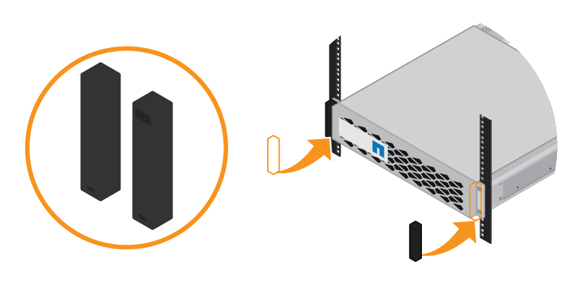

= Installazione di shelf da 24 dischi (SGF6024)
:allow-uri-read: 
:icons: font
:imagesdir: ../media/

[role="lead"]
Installare un set di guide per lo shelf del controller EF570 nel cabinet o nel rack, quindi far scorrere l'array sulle guide.

.Prima di iniziare
* Hai esaminato il https://library.netapp.com/ecm/ecm_download_file/ECMP12475945["Avvisi di sicurezza"^] documento incluso nella confezione e comprendere le precauzioni per lo spostamento e l'installazione dell'hardware.
* Le istruzioni sono fornite con il kit di guide.

.Fasi
. Seguire attentamente le istruzioni del kit di guide per installare le guide nel cabinet o nel rack.
+
Per gli armadi a foro quadrato, installare prima i dadi della gabbia in dotazione per fissare la parte anteriore e posteriore del ripiano con le viti.

. Rimuovete la confezione esterna dell'apparecchio. Quindi, piegare verso il basso le alette della scatola interna.
. Posizionare il retro del ripiano (l'estremità con i connettori) sulle guide.
+

CAUTION: Un ripiano completamente caricato pesa circa 24 kg (52 lb). Sono necessarie due persone per spostare l'enclosure in modo sicuro.

. Far scorrere con cautela il contenitore fino in posizione sulle guide.
+

CAUTION: Potrebbe essere necessario regolare le guide per assicurarsi che il contenitore scorra completamente sulle guide.

+

CAUTION: Non posizionare apparecchiature aggiuntive sulle guide dopo aver terminato l'installazione dell'enclosure. Le guide non sono progettate per sostenere un peso aggiuntivo.

+

NOTE: Se applicabile, potrebbe essere necessario rimuovere i cappucci terminali del ripiano o il pannello frontale del sistema per fissare il contenitore al supporto del rack; in tal caso, è necessario sostituire i cappucci terminali o il pannello frontale al termine dell'operazione.

. Fissare il contenitore alla parte anteriore del cabinet o del rack e delle guide inserendo due viti M5 attraverso le staffe di montaggio (preinstallate su entrambi i lati della parte anteriore del contenitore), i fori sul rack o sull'armadietto del sistema e i fori sulla parte anteriore delle guide.
+
image::../media/secure_shelf.png[Fissare lo shelf alla parte anteriore del cabinet]

. Fissare il contenitore alla parte posteriore delle guide inserendo due viti M5 attraverso le staffe del contenitore e la staffa del kit guide.
. Se applicabile, sostituire i cappucci terminali del ripiano o il pannello frontale del sistema.
+

