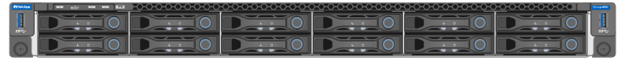
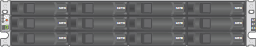
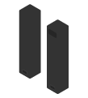

= Disimballare le scatole
:allow-uri-read: 
:icons: font
:imagesdir: ../media/

[role="lead"]
Prima di installare l'appliance StorageGRID, disimballare tutte le confezioni e confrontarne il contenuto con gli elementi riportati sulla confezione.

[role="tabbed-block"]
====
.SG100 e SG1000
--
* *Hardware*
+
SG100 o SG1000::
+
--
image::../media/sg6000_cn_front_without_bezel.gif[Unità frontali SG 100 o SG1000 Services appliance]

--
Kit di guide con istruzioni::
+
--
image::../media/rail_kit.gif[Kit di guide]

--

* *Cavi di alimentazione*
+

TIP: Il cabinet potrebbe essere dotato di cavi di alimentazione speciali utilizzati al posto dei cavi di alimentazione forniti con l'apparecchio.

+
Due cavi di alimentazione per il tuo paese::
+
--
image::../media/power_cords.gif[Cavi di alimentazione]

--

--
.SG110 e SG1100
--
* *Hardware*
+
SG110 o SG1100::
+
--

--
Kit di guide con istruzioni::
+
--
image::../media/rail_kit.gif[Kit di guide]

--
Pannello anteriore::
+
--
image::../media/sgf_6112_front_bezel.png[Pannello anteriore]

--

* *Cavi di alimentazione*
+

TIP: Il cabinet potrebbe essere dotato di cavi di alimentazione speciali utilizzati al posto dei cavi di alimentazione forniti con l'apparecchio.

+
Due cavi di alimentazione per il tuo paese::
+
--
image::../media/power_cords.gif[Cavi di alimentazione]

--

--
.SG5700
--
* *Hardware*
+
Appliance SG5712 con 12 dischi installati::
+
--

--
Appliance SG5760 senza unità installate::
+
--
image::../media/de460c_table_size.gif[Appliance SG5760 4U]

--
Pannello anteriore dell'apparecchio::
+
--
image::../media/sg5700_front_bezels.gif[Cornici di SG5712 e SG5760]

--
Kit di guide con istruzioni::
+
--
image::../media/rail_kit.gif[Kit di guide]

--
SG5760: Sessanta dischi::
+
--
image::../media/sg5760_drive.gif[Disco]

--
SG5760: Maniglie::
+
--
image::../media/handles.gif[Maniglie SG5760]

--
SG5760: Staffe posteriori e dadi a gabbia per l'installazione in rack a foro quadrato::
+
--
image::../media/back_brackets_table_size.gif[Staffe posteriori e dadi a gabbia per SG5760]

--

* *Cavi e connettori*
+

TIP: Il cabinet potrebbe essere dotato di cavi di alimentazione speciali utilizzati al posto dei cavi di alimentazione forniti con l'apparecchio.

+
Due cavi di alimentazione per il tuo paese::
+
--
image::../media/power_cords.gif[Cavi di alimentazione]

--
Cavi ottici e ricetrasmettitori SFP::
+
--
image::../media/fc_cable_and_sfp.gif[Cavi ottici e SFP]

** Due cavi ottici per le porte di interconnessione FC
** Otto ricetrasmettitori SFP+, compatibili con le quattro porte di interconnessione FC da 16 GB/s e le quattro porte di rete da 10 GbE

--

--
.SG6000
--
* *Hardware SG6060*
+
Centralina SG6000-CN::
+
--
image::../media/sg6000_cn_front_without_bezel.gif[Centralina SG6000-CN]

--
Shelf di controller E2860 senza unità installate::
+
--
image::../media/de460c_table_size.gif[Appliance SG5760 4U]

--
Due cornici anteriori::
+
--
image::../media/sg6000_front_bezels_for_table.gif[Cornici anteriori]

--
Due kit di guide con istruzioni::
+
--
image::../media/rail_kit.gif[Kit di guide]

--
60 dischi (2 SSD e 58 NL-SAS)::
+
--
image::../media/sg5760_drive.gif[Disco]

--
Quattro maniglie::
+
--
image::../media/handles.gif[Maniglie SG5760]

--
Staffe posteriori e dadi a gabbia per l'installazione in rack a foro quadrato::
+
--
image::../media/back_brackets_table_size.gif[Staffe posteriori e dadi a gabbia per SG5760]

--

* *SG6060 ripiano di espansione*
+
Shelf di espansione senza dischi installati::
+
--
image::../media/de460c_table_size.gif[Appliance SG5760 4U]

--
Pannello anteriore::
+
--
image::../media/front_bezel_for_table_de460c.gif[Pannello anteriore DE460C]

--
Dischi NL-SAS da 60 TB::
+
--
image::../media/sg5760_drive.gif[Disco]

--
Un kit di guide con istruzioni::
+
--
image::../media/rail_kit.gif[Kit di guide]

--
Quattro maniglie::
+
--
image::../media/handles.gif[Maniglie SG5760]

--
Staffe posteriori e dadi a gabbia per l'installazione in rack a foro quadrato::
+
--
image::../media/back_brackets_table_size.gif[Staffe posteriori e dadi a gabbia per SG5760]

--

* *Hardware SGF6024*
+
Centralina SG6000-CN::
+
--
image::../media/sg6000_cn_front_without_bezel.gif[Centralina SG6000-CN]

--
Flash array EF570 con 24 unità a stato solido (flash) installate::
+
--
image::../media/de224c_with_drives.gif[Shelf controller EF570]

--
Due cornici anteriori::
+
--
image::../media/sgf6024_front_bezels_for_table.png[SG6024 Bezel anteriori]

--
Due kit di guide con istruzioni::
+
--
image::../media/rail_kit.gif[Kit di guide]

--
Cappucci terminali per shelf::
+
--

--

* *Cavi e connettori*
+

TIP: Il cabinet potrebbe essere dotato di cavi di alimentazione speciali utilizzati al posto dei cavi di alimentazione forniti con l'apparecchio.

+
Quattro cavi di alimentazione per il tuo paese::
+
--
image::../media/power_cords.gif[Cavi di alimentazione]

--
Cavi ottici e ricetrasmettitori SFP::
+
--
image::../media/fc_cable_and_sfp.gif[Cavi ottici e SFP]

** Quattro cavi ottici per le porte di interconnessione FC
** Quattro ricetrasmettitori SFP+ che supportano FC a 16 GB/s.

--
Opzionale: Due cavi SAS per il collegamento di ogni shelf di espansione SG6060::
+
--
image::../media/sas_cable.gif[Cavi SAS]

--

--
.SG6100
--
* *Hardware*
+
SGF6112::
+
--

--
Kit di guide con istruzioni::
+
--
image::../media/rail_kit.gif[Kit di guide]

--
Pannello anteriore::
+
--
image::../media/sgf_6112_front_bezel.png[Pannello anteriore]

--

* *Cavi di alimentazione*
+

TIP: Il cabinet potrebbe essere dotato di cavi di alimentazione speciali utilizzati al posto dei cavi di alimentazione forniti con l'apparecchio.

+
Due cavi di alimentazione per il tuo paese::
+
--
image::../media/power_cords.gif[Cavi di alimentazione]

--

--
====