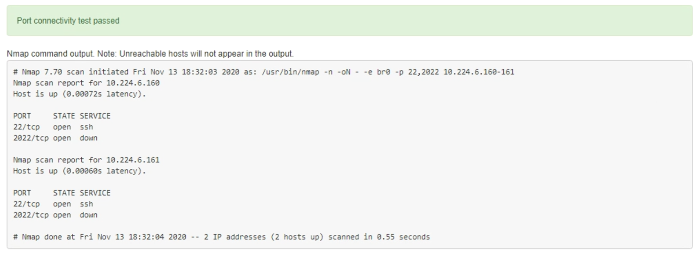

= Verificare le connessioni di rete a livello di porta
:allow-uri-read: 
:icons: font
:imagesdir: ../media/

[role="lead"]
Per garantire che l'accesso tra il programma di installazione dell'appliance StorageGRID e gli altri nodi non sia ostacolato da firewall, verificare che il programma di installazione dell'appliance StorageGRID sia in grado di connettersi a una porta TCP o a un set di porte specifico all'indirizzo IP o all'intervallo di indirizzi specificati.

.A proposito di questa attività
Utilizzando l'elenco delle porte fornito nel programma di installazione dell'appliance StorageGRID, è possibile verificare la connettività tra l'appliance e gli altri nodi della rete grid.

Inoltre, è possibile verificare la connettività sulle reti Admin e Client e sulle porte UDP, ad esempio quelle utilizzate per server NFS o DNS esterni. Per un elenco di queste porte, consultare https://docs.netapp.com/us-en/storagegrid-118/network/network-port-reference.html["riferimento porta di rete"^].

NOTE: Le porte di rete elencate nella tabella di connettività delle porte sono valide solo per StorageGRID versione 11,7 o successiva. Per verificare quali porte sono corrette per ciascun tipo di nodo, consultare sempre le linee guida di rete per la versione di StorageGRID in uso.

.Fasi
. Dal programma di installazione dell'appliance StorageGRID, fare clic su *Configura rete* > *Test di connettività della porta (nmap)*.
+
Viene visualizzata la pagina Port Connectivity Test (Test connettività porta).

+
La tabella di connettività delle porte elenca i tipi di nodo che richiedono la connettività TCP sulla rete Grid. Per ciascun tipo di nodo, la tabella elenca le porte Grid Network che devono essere accessibili all'appliance.

+
È possibile verificare la connettività tra le porte dell'appliance elencate nella tabella e gli altri nodi della rete Grid.

. Dal menu a discesa *Network* (rete), selezionare la rete che si desidera testare: *Grid*, *Admin* o *Client*.
. Specificare un intervallo di indirizzi IPv4 per gli host su tale rete.
+
Ad esempio, è possibile verificare il gateway sulla rete o sul nodo di amministrazione primario.

+
Specificare un intervallo utilizzando un trattino, come illustrato nell'esempio.

. Inserire un numero di porta TCP, un elenco di porte separate da virgole o un intervallo di porte.
+
image::../media/port_connectivity_test_start.png[Test di connettività della porta]

. Fare clic su *Test Connectivity* (verifica connettività).
+
** Se le connessioni di rete a livello di porta selezionate sono valide, viene visualizzato il messaggio "`Port Connectivity test passed`" (Test di connettività porta superato) in un banner verde. L'output del comando nmap è elencato sotto il banner.
+

** Se viene stabilita una connessione di rete a livello di porta all'host remoto, ma l'host non è in ascolto su una o più porte selezionate, viene visualizzato il messaggio "`Port Connectivity test failed`" (Test di connettività porta non riuscito) in un banner giallo. L'output del comando nmap è elencato sotto il banner.
+
Tutte le porte remote che l'host non sta ascoltando hanno uno stato "`chiuso`". Ad esempio, questo banner giallo potrebbe essere visualizzato quando il nodo a cui si sta tentando di connettersi è preinstallato e il servizio NMS StorageGRID non è ancora in esecuzione su tale nodo.

+
image::../media/nmap_test_yellow_banner.png[Banner giallo di prova NMAP]

** Se non è possibile stabilire una connessione di rete a livello di porta per una o più porte selezionate, viene visualizzato il messaggio "`Port Connectivity test failed`" (Test di connettività porta non riuscito) in un banner rosso. L'output del comando nmap è elencato sotto il banner.
+
Il banner rosso indica che è stato eseguito un tentativo di connessione TCP a una porta dell'host remoto, ma non è stato restituito nulla al mittente. Quando non viene restituita alcuna risposta, la porta ha uno stato "filtrato" e probabilmente è bloccata da un firewall.

+

NOTE: Vengono elencate anche le porte con "`closed`".

+
image::../media/nmap_test_red_banner.png[Banner rosso di prova NMAP]

