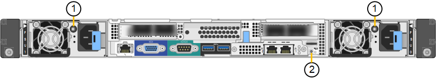
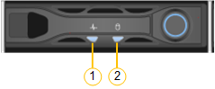

= Visualizzare gli indicatori e i codici di stato
:allow-uri-read: 
:icons: font
:imagesdir: ../media/

[role="lead"]
Gli appliance e i controller includono indicatori che consentono di determinare lo stato dei componenti dell'appliance.

[role="tabbed-block"]
====
.SG100 e SG1000
--
L'appliance include indicatori che consentono di determinare lo stato del controller dell'appliance e dei due SSD:

* <<appliance_indicators_SG100_1000,Indicatori e pulsanti dell'apparecchio>>
* <<general_boot_codes_SG100_1000,Codici generali di boot>>
* <<ssd_indicators_SG100_1000,Indicatori SSD>>

Utilizzare queste informazioni per ottenere assistenza link:troubleshooting-hardware-installation-sg100-and-sg1000.html["Risolvere i problemi di installazione dell'hardware SG100 e SG1000"].

[[appliance_indicators_SG100_1000]]
Indicatori e pulsanti dell'apparecchio::
+
--
La figura seguente mostra gli indicatori di stato e i pulsanti sulla parte anteriore dei modelli SG100 e SG1000.

image::../media/sg6000_cn_front_indicators.gif[Indicatori anteriori - SG1000]

[cols="1a,2a,2a"]
|===
| Didascalia | Display | Stato 

 a| 
1
 a| 
Pulsante di accensione
 a| 
* Blu: L'apparecchio è acceso.
* Spento: L'apparecchio è spento.

 a| 
2
 a| 
Pulsante di reset
 a| 
Utilizzare questo pulsante per eseguire un hard reset del controller.

 a| 
3
 a| 
Identificare il pulsante
 a| 
Questo pulsante può essere impostato su lampeggiante, acceso (fisso) o spento.

* Blu, lampeggiante: Identifica l'apparecchio nell'armadio o nel rack.
* Blu, fisso: Identifica l'apparecchio nell'armadio o nel rack.
* OFF: L'apparecchio non è identificabile visivamente nell'armadio o nel rack.

 a| 
4
 a| 
LED di allarme
 a| 
* Ambra, fisso: Si è verificato un errore.
+
*Nota:* per visualizzare i codici di avvio e di errore, link:accessing-bmc-interface.html["Accedere all'interfaccia BMC"].

* OFF: Non sono presenti errori.

|===
--

La figura seguente mostra la posizione dell'alimentatore e identifica i LED sul retro di SG100 e SG1000. Ulteriori LED di stato e di attività si trovano sulle porte dell'appliance. Questi LED possono variare in base al modello di apparecchio.

[cols="1a,2a,3a"]
|===
| Didascalia | LED | Stato 

 a| 
1
 a| 
LED dell'alimentatore
 a| 
* Verde, fisso: Alimentazione applicata all'apparecchio, pulsante di accensione acceso.
* Verde lampeggiante: Alimentazione applicata all'apparecchio, pulsante di accensione spento.
* Spento: L'apparecchio non è alimentato.
* Ambra: Guasto all'alimentazione.

 a| 
2
 a| 
Identificare il LED
 a| 
* Blu, lampeggiante: Identifica l'apparecchio nell'armadio o nel rack.
* Blu, fisso: Identifica l'apparecchio nell'armadio o nel rack.
* OFF: L'apparecchio non è identificabile visivamente nell'armadio o nel rack.

|===
[[general_boot_codes_SG100_1000]]
Codici generali di boot::
+
--
Durante l'avvio o dopo una reimpostazione a freddo dell'appliance, si verifica quanto segue:

. Il BMC (Baseboard Management Controller) registra i codici per la sequenza di avvio, inclusi gli eventuali errori che si verificano.
. Il pulsante di alimentazione si illumina.
. Se si verificano errori durante l'avvio, il LED di allarme si accende.
+
Per visualizzare i codici di avvio e di errore, link:accessing-bmc-interface.html["Accedere all'interfaccia BMC"].

--

[[ssd_indicators_SG100_1000]]
Indicatori SSD::
+
--
La figura seguente mostra gli indicatori SSD su SG100 e SG1000.

[cols="1a,2a,2a"]
|===
| LED | Display | Stato 

 a| 
1
 a| 
Stato/guasto del disco
 a| 
* Blu (fisso): L'unità è in linea
* Ambra (fisso): Guasto al disco
* Ambra (lampeggiante): La spia del localizzatore dell'unità è accesa
* OFF: Slot vuoto

 a| 
2
 a| 
Disco attivo
 a| 
Blu (lampeggiante): Accesso all'unità in corso

|===
--

--
.SG110 e SG1100
--
L'appliance include indicatori che consentono di determinare lo stato del controller dell'appliance e degli SSD:

* <<appliance_indicators,Indicatori e pulsanti dell'apparecchio>>
* <<general_boot_codes,Codici generali di boot>>
* <<ssd_indicators,Indicatori SSD>>

Utilizzare queste informazioni per ottenere assistenza link:troubleshooting-hardware-installation-sg110-and-sg1100.html["Risolvere i problemi di installazione hardware SG110 e SG1100"].

[[appliance_indicators]]
Indicatori e pulsanti dell'apparecchio::
+
--
La figura seguente mostra gli indicatori e i pulsanti sulla parte anteriore degli apparecchi SG110 e SG1100.

image::../media/sgf6112_front_indicators.png[Indicatori anteriori - SG110 e SG1100]

[cols="1a,2a,3a"]
|===
| Didascalia | Display | Stato 

 a| 
1
 a| 
Pulsante di accensione
 a| 
* Blu: L'apparecchio è acceso.
* Spento: L'apparecchio è spento.

 a| 
2
 a| 
Pulsante di reset
 a| 
Utilizzare questo pulsante per eseguire un hard reset del controller.

 a| 
3
 a| 
Identificare il pulsante
 a| 
Utilizzando BMC, questo pulsante può essere impostato su lampeggiante, acceso (fisso) o spento.

* Blu, lampeggiante: Identifica l'apparecchio nell'armadio o nel rack.
* Blu, fisso: Identifica l'apparecchio nell'armadio o nel rack.
* OFF: L'apparecchio non è identificabile visivamente nell'armadio o nel rack.

 a| 
4
 a| 
LED di stato
 a| 
* Ambra, fisso: Si è verificato un errore.
+
*Nota:* per visualizzare i codici di avvio e di errore, link:accessing-bmc-interface.html["Accedere all'interfaccia BMC"].

* OFF: Non sono presenti errori.

 a| 
5
 a| 
PFR
 a| 
Questa luce non viene utilizzata dagli apparecchi SG110 e SG1100 e rimane spenta.

|===
--

La figura seguente mostra la posizione dell'alimentatore e identifica i LED sul retro di SG110 e SG1100. Ulteriori LED di stato e di attività si trovano sulle porte dell'appliance. Questi LED possono variare in base al modello di apparecchio.

image::../media/q2024_rear_leds.png[LED posteriori SG110 e SG1100]

[cols="1a,2a,3a"]
|===
| Didascalia | LED | Stato 

 a| 
1
 a| 
LED dell'alimentatore
 a| 
* Verde, fisso: Alimentazione applicata all'apparecchio, pulsante di accensione acceso.
* Verde lampeggiante: Alimentazione applicata all'apparecchio, pulsante di accensione spento.
* Spento: L'apparecchio non è alimentato.
* Ambra: Guasto all'alimentazione.

 a| 
2
 a| 
Identificare il LED
 a| 
* Blu, lampeggiante: Identifica l'apparecchio nell'armadio o nel rack.
* Blu, fisso: Identifica l'apparecchio nell'armadio o nel rack.
* OFF: L'apparecchio non è identificabile visivamente nell'armadio o nel rack.

|===
[[general_boot_codes]]
Codici generali di boot::
+
--
Durante l'avvio o dopo una reimpostazione a freddo dell'appliance, si verifica quanto segue:

. Il BMC (Baseboard Management Controller) registra i codici per la sequenza di avvio, inclusi gli eventuali errori che si verificano.
. Il pulsante di alimentazione si illumina.
. Se si verificano errori durante l'avvio, il LED di allarme si accende.
+
Per visualizzare i codici di avvio e di errore, link:accessing-bmc-interface.html["Accedere all'interfaccia BMC"].

--

[[ssd_indicators]]
Indicatori SSD::
+
--
La figura seguente mostra gli indicatori SSD sugli appliance SG110 e SG1100.

[cols="1a,2a,2a"]
|===
| LED | Display | Stato 

 a| 
1
 a| 
Stato/guasto del disco
 a| 
* Blu (fisso): L'unità è in linea
* Ambra (fisso): Guasto al disco
* OFF: Slot vuoto

 a| 
2
 a| 
Disco attivo
 a| 
Blu (lampeggiante): Accesso all'unità in corso

|===
--

--
.SG5700
--
I controller dell'appliance includono indicatori che consentono di determinare lo stato del controller dell'appliance:

* <<boot_codes_sg5700,Codici di stato dell'avvio di SG5700>>
* <<status_indicators_e5700sg_controller,Indicatori di stato sul controller E5700SG>>
* <<general_boot_codes_sg5700,Codici generali di boot>>
* <<boot_codes_e5700sg_controller,Codici di avvio del controller E5700SG>>
* <<error_codes_e5700sg_controller,Codici di errore della centralina E5700SG>>

Utilizzare queste informazioni per ottenere assistenza link:troubleshooting-hardware-installation.html["Risolvere i problemi di installazione dell'hardware SG5700"].

[[boot_codes_sg5700]]
Codici di stato dell'avvio di SG5700::
+
--
I display a sette segmenti di ciascun controller mostrano codici di stato e di errore all'accensione dell'appliance.

Il controller E2800 e il controller E5700SG visualizzano stati e codici di errore diversi.

Per comprendere il significato di questi codici, consulta le seguenti risorse:

[cols="1a,2a"]
|===
| Controller | Riferimento 

 a| 
Controller E2800
 a| 
_Guida al monitoraggio dei sistemi E5700 e E2800_

*Nota:* i codici elencati per il controller e-Series E5700 non si applicano al controller E5700SG dell'appliance.

 a| 
Controller E5700SG
 a| 
"`sindicatori di stato sul controller E5700SG`"

|===
--

.Fasi
. Durante l'avvio, monitorare l'avanzamento visualizzando i codici visualizzati sui display a sette segmenti.
+
** Il display a sette segmenti del controller E2800 mostra la sequenza di ripetizione *OS*, *SD*, `*_blank_*` per indicare che sta eseguendo l'elaborazione all'inizio della giornata.
** Il display a sette segmenti del controller E5700SG mostra una sequenza di codici, che termina con *AA* e *FF*.

. Dopo l'avvio dei controller, verificare che i display a sette segmenti mostrino quanto segue:
+
image::../media/seven_segment_display_codes.gif[Display a sette segmenti dopo l'avvio dei controller.]

+
[cols="1a,2a"]
|===
| Controller | Display a sette segmenti 

 a| 
Controller E2800
 a| 
Mostra 99, che è l'ID predefinito per uno shelf di controller e-Series.

 a| 
Controller E5700SG
 a| 
Mostra *ho*, seguito da una sequenza di ripetizione di due numeri.

[listing]
----
HO -- IP address for Admin Network -- IP address for Grid Network HO
----
Nella sequenza, il primo set di numeri è l'indirizzo IP assegnato da DHCP per la porta di gestione 1 del controller. Questo indirizzo viene utilizzato per collegare il controller alla rete di amministrazione per StorageGRID. Il secondo gruppo di numeri è l'indirizzo IP assegnato da DHCP utilizzato per collegare l'appliance alla rete di rete per StorageGRID.

*Nota:* se non è stato possibile assegnare un indirizzo IP utilizzando DHCP, viene visualizzato 0.0.0.0.

|===
. Se i display a sette segmenti mostrano altri valori, vedere link:troubleshooting-hardware-installation.html["Risoluzione dei problemi relativi all'installazione dell'hardware (SG6000 o SG5700)"] e confermare che la procedura di installazione è stata completata correttamente. Se non si riesce a risolvere il problema, contattare il supporto tecnico.

[[status_indicators_e5700sg_controller]]
Indicatori di stato sul controller E5700SG::
+
--
Il display a sette segmenti e i LED sul controller E5700SG mostrano codici di stato e di errore durante l'accensione dell'appliance e durante l'inizializzazione dell'hardware. È possibile utilizzare questi display per determinare lo stato e risolvere gli errori.

Una volta avviato il programma di installazione dell'appliance StorageGRID, è necessario esaminare periodicamente gli indicatori di stato sul controller E5700SG.

La figura seguente mostra gli indicatori di stato sul controller E5700SG.

image::../media/e5700sg_leds.gif[Indicatori di stato sul controller E5700SG]

[cols="1a,2a,2a"]
|===
| Didascalia | Display | Descrizione 

 a| 
1
 a| 
LED di attenzione
 a| 
Ambra: Il controller è guasto e richiede l'attenzione dell'operatore oppure lo script di installazione non è stato trovato.

OFF: Il controller funziona normalmente.

 a| 
2
 a| 
Display a sette segmenti
 a| 
Mostra un codice diagnostico

Le sequenze di visualizzazione a sette segmenti consentono di comprendere gli errori e lo stato operativo dell'appliance.

 a| 
3
 a| 
LED di attenzione della porta di espansione
 a| 
Ambra: Questi LED sono sempre di colore ambra (nessun collegamento stabilito) perché l'appliance non utilizza le porte di espansione.

 a| 
4
 a| 
LED di stato del collegamento della porta host
 a| 
Verde: Il collegamento è attivo.

OFF: Il collegamento non è attivo.

 a| 
5
 a| 
LED di stato del collegamento Ethernet
 a| 
Verde: Viene stabilito un collegamento.

OFF: Nessun collegamento stabilito.

 a| 
6
 a| 
LED di attività Ethernet
 a| 
Verde: Il collegamento tra la porta di gestione e il dispositivo a cui è collegata (ad esempio uno switch Ethernet) è attivo.

OFF: Non è presente alcun collegamento tra il controller e il dispositivo collegato.

Verde lampeggiante: È presente un'attività Ethernet.

|===
--

[[general_boot_codes_sg5700]]
Codici generali di boot::
+
--
Durante l'avvio o dopo una reimpostazione a freddo dell'appliance, si verifica quanto segue:

. Il display a sette segmenti sul controller E5700SG mostra una sequenza generale di codici non specifici del controller. La sequenza generale termina con i codici AA e FF.
. Vengono visualizzati i codici di avvio specifici del controller E5700SG.

--

[[boot_codes_e5700sg_controller]]
Codici di avvio del controller E5700SG::
+
--
Durante il normale avvio dell'appliance, il display a sette segmenti del controller E5700SG mostra i seguenti codici nell'ordine indicato:

[cols="1a,3a"]
|===
| Codice | Indica 

 a| 
ALT
 a| 
Lo script di avvio principale è in attesa del completamento dell'avvio del sistema operativo.

 a| 
CIAO
 a| 
Lo script di boot master è stato avviato.

 a| 
PP
 a| 
Il sistema sta verificando se l'FPGA deve essere aggiornato.

 a| 
HP
 a| 
Il sistema sta verificando se è necessario aggiornare il firmware del controller 10/25-GbE.

 a| 
RB
 a| 
Il sistema viene riavviato dopo l'applicazione degli aggiornamenti del firmware.

 a| 
FP
 a| 
I controlli di aggiornamento del firmware del sottosistema hardware sono stati completati. Avvio dei servizi di comunicazione tra controller in corso.

 a| 
LUI
 a| 
Il sistema è in attesa di connettività con il controller E2800 e di sincronizzazione con il sistema operativo SANtricity.

*Nota:* se questa procedura di avvio non procede oltre questa fase, controllare i collegamenti tra i due controller.

 a| 
HC
 a| 
Il sistema sta verificando la presenza di dati di installazione di StorageGRID.

 a| 
HO
 a| 
Il programma di installazione dell'appliance StorageGRID è in esecuzione.

 a| 
HA
 a| 
StorageGRID è in esecuzione.

|===
--

[[error_codes_e5700sg_controller]]
Codici di errore della centralina E5700SG::
+
--
Questi codici rappresentano le condizioni di errore che potrebbero essere visualizzate sul controller E5700SG all'avvio dell'appliance. Se si verificano errori hardware specifici di basso livello, vengono visualizzati altri codici esadecimali a due cifre. Se uno di questi codici persiste per più di un secondo o due, o se non si riesce a risolvere l'errore seguendo una delle procedure di risoluzione dei problemi prescritte, contattare il supporto tecnico.

[cols="1a,3a"]
|===
| Codice | Indica 

 a| 
22
 a| 
Nessun record di boot master trovato su qualsiasi dispositivo di boot.

 a| 
23
 a| 
Il disco flash interno non è collegato.

 a| 
2A, 2B
 a| 
Bus bloccato, impossibile leggere i dati SPD DIMM.

 a| 
40
 a| 
DIMM non validi.

 a| 
41
 a| 
DIMM non validi.

 a| 
42
 a| 
Test della memoria non riuscito.

 a| 
51
 a| 
Errore di lettura SPD.

 a| 
da 92 a 96
 a| 
Inizializzazione del bus PCI.

 a| 
Da A0 ad A3
 a| 
Inizializzazione del disco SATA.

 a| 
AB
 a| 
Codice di boot alternativo.

 a| 
AE
 a| 
Avvio del sistema operativo.

 a| 
EEA
 a| 
Training DDR4 non riuscito.

 a| 
E8
 a| 
Memoria non installata.

 a| 
UE
 a| 
Impossibile trovare lo script di installazione.

 a| 
EP
 a| 
L'installazione o la comunicazione con il controller E2800 non è riuscita.

|===
--

.Informazioni correlate
* https://mysupport.netapp.com/site/global/dashboard["Supporto NetApp"^]
* https://library.netapp.com/ecmdocs/ECMLP2588751/html/frameset.html["Guida al monitoraggio dei sistemi E5700 ed E2800"^]

--
.SG5800
--
I controller dell'apparecchio includono indicatori che consentono di determinare lo stato del controller dell'apparecchio. Utilizzare queste informazioni per ottenere assistenza link:troubleshooting-hardware-installation.html["Risolvere i problemi di installazione dell'hardware SG5800"].

Indicatori di stato sul controller SG5800::
+
--
Dopo l'avvio del programma di installazione dell'appliance StorageGRID, è necessario esaminare periodicamente gli indicatori di stato sul controller SG5800.

La figura seguente mostra gli indicatori di stato sul controller SG5800.

image::../media/sg5800_leds.png[Indicatori di stato sul controller SG5800]

[cols="1a,2a,2a"]
|===
| Didascalia | Display | Descrizione 

 a| 
1
 a| 
LED di attenzione
 a| 
Ambra: Il controller è guasto e richiede l'attenzione dell'operatore oppure lo script di installazione non è stato trovato.

OFF: Il controller funziona normalmente.

 a| 
2
 a| 
LED di attenzione della porta di espansione
 a| 
Ambra: Questi LED sono sempre di colore ambra (nessun collegamento stabilito) perché l'appliance non utilizza le porte di espansione.

 a| 
3
 a| 
LED di stato del collegamento della porta host
 a| 
Verde: Il collegamento è attivo.

OFF: Il collegamento non è attivo.

 a| 
4
 a| 
LED di stato del collegamento Ethernet
 a| 
Verde: Viene stabilito un collegamento.

OFF: Nessun collegamento stabilito.

 a| 
5
 a| 
LED di attività Ethernet
 a| 
Verde: Il collegamento tra la porta di gestione e il dispositivo a cui è collegata (ad esempio uno switch Ethernet) è attivo.

OFF: Non è presente alcun collegamento tra il controller e il dispositivo collegato.

Verde lampeggiante: È presente un'attività Ethernet.

|===
--

.Informazioni correlate
link:https://mysupport.netapp.com/site/global/dashboard["Supporto NetApp"^]

--
.SG6000
--
I controller appliance SG6000 includono indicatori che consentono di determinare lo stato del controller dell'appliance:

* <<status_indicators_sg6000cn,Indicatori di stato e pulsanti sul controller SG6000-CN>>
* <<general_boot_codes_sg6000,Codici generali di boot>>
* <<boot_codes_sg6000_storage_controller,Codici di stato per l'avvio dei controller di storage SG6000>>

Utilizzare queste informazioni per ottenere assistenza link:troubleshooting-hardware-installation.html["Risolvere i problemi relativi all'installazione di SG6000"].

[[status_indicators_sg6000cn]]
Indicatori di stato e pulsanti sul controller SG6000-CN::
+
--
Il controller SG6000-CN include indicatori che consentono di determinare lo stato del controller, inclusi i seguenti indicatori e pulsanti.

La figura seguente mostra gli indicatori di stato e i pulsanti sulla parte anteriore del controller SG6000-CN.

image::../media/sg6000_cn_front_indicators.gif[Indicatori anteriori - SG6000-CN]

[cols="1a,2a,3a"]
|===
| Didascalia | Display | Descrizione 

 a| 
1
 a| 
Pulsante di accensione
 a| 
* Blu: Il controller è acceso.
* OFF: Il controller è spento.

 a| 
2
 a| 
Pulsante di reset
 a| 
_Nessun indicatore_

Utilizzare questo pulsante per eseguire un hard reset del controller.

 a| 
3
 a| 
Identificare il pulsante
 a| 
* Blu lampeggiante o fisso: Identifica il controller nell'armadio o nel rack.
* OFF: Il controller non è visivamente identificabile nell'armadio o nel rack.

Questo pulsante può essere impostato su lampeggiante, acceso (fisso) o spento.

 a| 
4
 a| 
LED di allarme
 a| 
* Ambra: Si è verificato un errore.
+
*Nota:* per visualizzare i codici di avvio e di errore, link:accessing-bmc-interface.html["Accedere all'interfaccia BMC"].

* OFF: Non sono presenti errori.

|===
--

La figura seguente mostra la posizione dell'alimentatore e identifica i LED sul retro del controller SG6000-CN. Ulteriori LED di stato e di attività si trovano sulle porte dell'appliance. Questi LED possono variare in base al modello di apparecchio.

[cols="1a,2a,3a"]
|===
| Didascalia | LED | Stato 

 a| 
1
 a| 
LED dell'alimentatore
 a| 
* Verde, fisso: Alimentazione applicata all'apparecchio, pulsante di accensione acceso.
* Verde lampeggiante: Alimentazione applicata all'apparecchio, pulsante di accensione spento.
* Spento: L'apparecchio non è alimentato.
* Ambra: Guasto all'alimentazione.

 a| 
2
 a| 
Identificare il LED
 a| 
* Blu, lampeggiante: Identifica l'apparecchio nell'armadio o nel rack.
* Blu, fisso: Identifica l'apparecchio nell'armadio o nel rack.
* OFF: L'apparecchio non è identificabile visivamente nell'armadio o nel rack.

|===
[[general_boot_codes_sg6000]]
Codici generali di boot::
+
--
Durante l'avvio o dopo un hard reset del controller SG6000-CN, si verifica quanto segue:

. Il BMC (Baseboard Management Controller) registra i codici per la sequenza di avvio, inclusi gli eventuali errori che si verificano.
. Il pulsante di alimentazione si illumina.
. Se si verificano errori durante l'avvio, il LED di allarme si accende.
+
Per visualizzare i codici di avvio e di errore, link:accessing-bmc-interface.html["Accedere all'interfaccia BMC"].

--

[[boot_codes_sg6000_storage_controller]]
Codici di stato per l'avvio dei controller di storage SG6000::
+
--
Ogni controller di storage dispone di un display a sette segmenti che fornisce codici di stato all'accensione del controller. I codici di stato sono gli stessi per il controller E2800 e per il controller EF570.

Per le descrizioni di questi codici, consultare le informazioni di monitoraggio del sistema e-Series relative al tipo di controller storage.

--

.Fasi
. Durante l'avvio, monitorare l'avanzamento visualizzando i codici visualizzati sul display a sette segmenti per ciascun controller di storage.
+
Il display a sette segmenti di ciascun controller di storage mostra la sequenza di ripetizione *OS*, *SD*, `*_blank_*` per indicare che il controller sta eseguendo l'elaborazione all'inizio della giornata.

. Dopo l'avvio dei controller, verificare che ogni controller di storage indichi 99, che è l'ID predefinito per uno shelf di controller e-Series.
+
Assicurarsi che questo valore sia visualizzato su entrambi i controller storage, come mostrato in questo esempio controller E2800.

+
image::../media/seven_segment_display_codes_for_e2800.gif[Codici di visualizzazione a sette segmenti per E2800]

. Se uno o entrambi i controller mostrano altri valori, vedere link:troubleshooting-hardware-installation.html["Risoluzione dei problemi relativi all'installazione dell'hardware (SG6000 o SG5700)"] e confermare che la procedura di installazione è stata completata correttamente. Se non si riesce a risolvere il problema, contattare il supporto tecnico.

.Informazioni correlate
* https://mysupport.netapp.com/site/global/dashboard["Supporto NetApp"^]
* link:../sg6000/power-sg6000-cn-controller-off-on.html#power-on-sg6000-cn-controller-and-verify-operation["Accendere il controller SG6000-CN e verificarne il funzionamento"]

--
.SG6100
--
L'appliance include indicatori che consentono di determinare lo stato del controller dell'appliance e degli SSD:

* <<appliance_indicators_SG6100,Indicatori e pulsanti dell'apparecchio>>
* <<general_boot_codes_SG6100,Codici generali di boot>>
* <<ssd_indicators_SG6100,Indicatori SSD>>

Utilizzare queste informazioni per ottenere assistenza link:troubleshooting-hardware-installation-sg6100.html["Risolvere i problemi di installazione dell'hardware SG6100"].

[[appliance_indicators_SG6100]]
Indicatori e pulsanti dell'apparecchio::
+
--
La figura seguente mostra gli indicatori e i pulsanti sulla parte anteriore degli apparecchi SG6100.

image::../media/sgf6112_front_indicators.png[Indicatori anteriori - SGF6112]

[cols="1a,2a,3a"]
|===
| Didascalia | Display | Stato 

 a| 
1
 a| 
Pulsante di accensione
 a| 
* Blu: L'apparecchio è acceso.
* Spento: L'apparecchio è spento.

 a| 
2
 a| 
Pulsante di reset
 a| 
Utilizzare questo pulsante per eseguire un hard reset del controller.

 a| 
3
 a| 
Identificare il pulsante
 a| 
Utilizzando BMC, questo pulsante può essere impostato su lampeggiante, acceso (fisso) o spento.

* Blu, lampeggiante: Identifica l'apparecchio nell'armadio o nel rack.
* Blu, fisso: Identifica l'apparecchio nell'armadio o nel rack.
* OFF: L'apparecchio non è identificabile visivamente nell'armadio o nel rack.

 a| 
4
 a| 
LED di stato
 a| 
* Ambra, fisso: Si è verificato un errore.
+
*Nota:* per visualizzare i codici di avvio e di errore, link:accessing-bmc-interface.html["Accedere all'interfaccia BMC"].

* OFF: Non sono presenti errori.

 a| 
5
 a| 
PFR
 a| 
Questa luce non viene utilizzata dagli apparecchi SG6100 e rimane spenta.

|===
--

La figura seguente mostra la posizione dell'alimentatore e identifica i LED sul retro di SGF6112 e SG6100-CN. Ulteriori LED di stato e di attività si trovano sulle porte dell'appliance. Questi LED possono variare in base al modello di apparecchio.

image::../media/q2024_rear_leds.png[LED posteriori SGF6112 e SG6100-CN]

[cols="1a,2a,3a"]
|===
| Didascalia | LED | Stato 

 a| 
1
 a| 
LED dell'alimentatore
 a| 
* Verde, fisso: Alimentazione applicata all'apparecchio, pulsante di accensione acceso.
* Verde lampeggiante: Alimentazione applicata all'apparecchio, pulsante di accensione spento.
* Spento: L'apparecchio non è alimentato.
* Ambra: Guasto all'alimentazione.

 a| 
2
 a| 
Identificare il LED
 a| 
* Blu, lampeggiante: Identifica l'apparecchio nell'armadio o nel rack.
* Blu, fisso: Identifica l'apparecchio nell'armadio o nel rack.
* OFF: L'apparecchio non è identificabile visivamente nell'armadio o nel rack.

|===
[[general_boot_codes_SG6100]]
Codici generali di boot::
+
--
Durante l'avvio o dopo una reimpostazione a freddo dell'appliance, si verifica quanto segue:

. Il BMC (Baseboard Management Controller) registra i codici per la sequenza di avvio, inclusi gli eventuali errori che si verificano.
. Il pulsante di alimentazione si illumina.
. Se si verificano errori durante l'avvio, il LED di allarme si accende.
+
Per visualizzare i codici di avvio e di errore, link:accessing-bmc-interface.html["Accedere all'interfaccia BMC"].

--

[[ssd_indicators_SG6100]]
Indicatori SSD::
+
--
La figura seguente mostra gli indicatori SSD sull'appliance SGF6112 o SG6160.

[cols="1a,2a,2a"]
|===
| LED | Display | Stato 

 a| 
1
 a| 
Stato/guasto del disco
 a| 
* Blu (fisso): L'unità è in linea
* Ambra (fisso): Guasto al disco
* OFF: Slot vuoto

*Nota:* se una nuova unità SSD funzionante viene inserita in un nodo SGF6112 o SG6160 StorageGRID funzionante, i LED sull'unità SSD dovrebbero lampeggiare inizialmente, ma smettono di lampeggiare non appena il sistema determina che l'unità ha sufficiente capacità ed è funzionante.

 a| 
2
 a| 
Disco attivo
 a| 
Blu (lampeggiante): Accesso all'unità in corso

|===
--

.Informazioni correlate
https://mysupport.netapp.com/site/global/dashboard["Supporto NetApp"^]

--
====