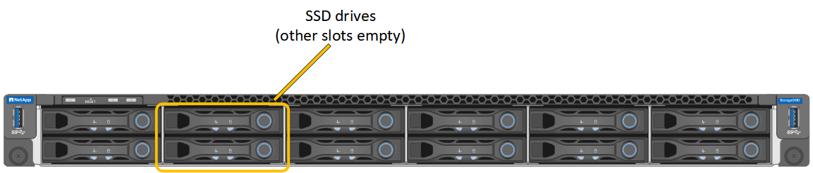
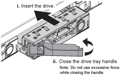

= Sostituire un'unità in un SG100 o SG1000
:allow-uri-read: 
:icons: font
:imagesdir: ../media/

[role="lead"]
Gli SSD nell'appliance di servizi contengono il sistema operativo StorageGRID. Inoltre, quando l'appliance è configurata come nodo di amministrazione, gli SSD contengono anche registri di audit, metriche e tabelle di database. I dischi vengono mirrorati utilizzando RAID1 per la ridondanza. Se uno dei dischi si guasta, è necessario sostituirlo il prima possibile per garantire la ridondanza.

.Prima di iniziare
* Lo hai fatto link:locating-controller-in-data-center.html["posizionato fisicamente l'apparecchio"].
* È stato verificato quale unità ha rilevato un guasto notando che il LED sinistro lampeggia in ambra.
+
I due SSD sono posizionati negli slot come mostrato nel diagramma seguente:

+

+

CAUTION: Se si rimuove il disco funzionante, si disattiva il nodo dell'appliance. Consultare le informazioni relative alla visualizzazione degli indicatori di stato per verificare l'errore.

* È stato ottenuto il disco sostitutivo.
* Hai ottenuto una protezione ESD adeguata.

.Fasi
. Verificare che il LED sinistro del disco da sostituire sia di colore ambra lampeggiante. Se è stato segnalato un problema di unità nell'interfaccia utente di Grid Manager o BMC, HDD02 o HDD2 si riferiscono all'unità nello slot superiore e HDD03 o HDD3 si riferiscono all'unità nello slot inferiore.
+
È possibile utilizzare anche Grid Manager per monitorare lo stato degli SSD. Selezionare *Nodes*. Quindi selezionare  `*Appliance Node*` > *Hardware*. Se un drive si è guastato, il campo Storage RAID Mode contiene un messaggio che indica quale drive si è guastato.

. Avvolgere l'estremità del braccialetto ESD intorno al polso e fissare l'estremità del fermaglio a una messa a terra metallica per evitare scariche elettrostatiche.
. Disimballare l'unità sostitutiva e appoggiarla su una superficie piana e priva di elettricità statica vicino all'apparecchio.
+
Conservare tutti i materiali di imballaggio.

. Premere il pulsante di rilascio sul disco guasto.
+
image::../media/h600s_driveremoval.gif[Rimozione del disco]

+
La maniglia delle molle del disco si apre parzialmente e il disco si libera dallo slot.

. Aprire la maniglia, estrarre l'unità e posizionarla su una superficie piana e priva di scariche elettrostatiche.
. Premere il pulsante di rilascio sull'unità sostitutiva prima di inserirla nello slot.
+
Le molle del dispositivo di chiusura si aprono.

+

. Inserire l'unità sostitutiva nello slot, quindi chiudere la maniglia dell'unità.
+

CAUTION: Non esercitare una forza eccessiva durante la chiusura della maniglia.

+
Quando l'unità è completamente inserita, si sente uno scatto.

+
L'unità viene ricostruita automaticamente con dati mirrorati dall'unità funzionante. È possibile verificare lo stato della ricostruzione utilizzando Grid Manager. Selezionare *Nodi*. Quindi selezionare  `*Appliance Node*` > *Hardware*. Il campo Modalità RAID di archiviazione visualizza il messaggio "`in fase di ricostruzione`" finché l'unità non è completamente ricostruita.

Dopo aver sostituito il componente, restituire il componente difettoso a NetApp, come descritto nelle istruzioni RMA fornite con il kit. Consultare la  https://mysupport.netapp.com/site/info/rma["Restituzione e sostituzione dei pezzi"^] pagina per ulteriori informazioni.
