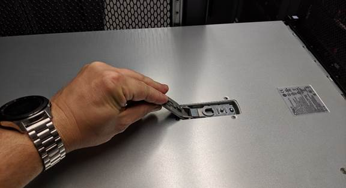

= Sostituire il coperchio di un'appliance SG110 o SG1100
:allow-uri-read: 
:icons: font
:imagesdir: ../media/

[role="lead"]
Rimuovete il coperchio dell'apparecchio per accedere ai componenti interni e riposizionatelo al termine della manutenzione.

== Rimuovere il coperchio

.Prima di iniziare
link:reinstalling-sg110-and-sg1100-into-cabinet-or-rack.html["Rimuovete l'apparecchio dal cabinet o dal rack"] per accedere al coperchio superiore.

.Fasi
. Assicurarsi che il fermo del coperchio dell'apparecchio non sia bloccato. Se necessario, ruotare il fermo di plastica blu di un quarto di giro in direzione di sblocco, come indicato sul fermo stesso.
. Ruotare il dispositivo di chiusura verso l'alto e verso il retro del telaio dell'apparecchio fino a quando non si arresta, quindi sollevare con cautela il coperchio dal telaio e metterlo da parte.
+

+

CAUTION: Avvolgere l'estremità del cinturino di un braccialetto antistatico intorno al polso e fissare l'estremità del fermaglio a una messa a terra metallica per evitare scariche elettrostatiche quando si lavora all'interno dell'apparecchio.

== Reinstallare il coperchio

.Prima di iniziare
Tutte le procedure di manutenzione all'interno dell'apparecchio sono state completate.

.Fasi
. Con la chiusura a scatto del coperchio aperta, tenere il coperchio sopra il telaio e allineare il foro nella chiusura a scatto del coperchio superiore con il perno nel telaio. Una volta allineato il coperchio, abbassarlo sul telaio.
+
image::../media/sg6060_cover_latch_alignment_pin.jpg[Perno di allineamento del fermo del coperchio SG6060]

. Ruotare il dispositivo di chiusura del coperchio in avanti e in basso fino a quando non si arresta e il coperchio non si inserisce completamente nel telaio. Verificare che non vi siano spazi vuoti lungo il bordo anteriore del coperchio.
+
Se il coperchio non è completamente in posizione, potrebbe non essere possibile inserire l'appliance nel rack.

. Opzionale: Ruotare di un quarto di giro il fermo di plastica blu nella direzione di blocco, come mostrato sul fermo, per bloccarlo.

.Al termine
link:reinstalling-sg110-and-sg1100-into-cabinet-or-rack.html["Reinserite l'apparecchio nell'armadietto o nel rack"].
