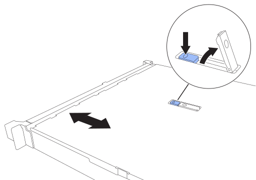

= Sostituire il coperchio SG120 e SG1200
:allow-uri-read: 
:icons: font
:imagesdir: ../media/

[role="lead"]
Rimuovete il coperchio dell'apparecchio per accedere ai componenti interni e riposizionatelo al termine della manutenzione.

== Passaggio 1: Rimuovere il coperchio

.Fasi
. Avvolgere l'estremità del cinturino di un braccialetto antistatico intorno al polso e fissare l'estremità del fermaglio a una messa a terra metallica per evitare scariche elettrostatiche quando si lavora all'interno dell'apparecchio.
. link:reinstalling-sg120-and-sg1200-into-cabinet-or-rack.html["Rimuovete l'apparecchio dal cabinet o dal rack"] per accedere al coperchio superiore.

. Sblocca il fermo del coperchio premendo il pulsante di blocco blu presente sul coperchio dell'apparecchio.
+

. Ruotare il dispositivo di chiusura verso l'alto e verso il retro del telaio dell'apparecchio fino a quando non si arresta, quindi sollevare con cautela il coperchio dal telaio e metterlo da parte.

== Passaggio 2: Reinstallare il coperchio

.Fasi
. Con il fermo del coperchio aperto, allineare il coperchio sopra lo chassis e abbassarlo con cautela.
. Ruotare il dispositivo di chiusura del coperchio in avanti e in basso fino a quando non si arresta e il coperchio non si inserisce completamente nel telaio. Verificare che non vi siano spazi vuoti lungo il bordo anteriore del coperchio.
+
Se il coperchio non è completamente inserito, potrebbe non essere possibile inserire l'apparecchio nel rack.

. link:reinstalling-sg120-and-sg1200-into-cabinet-or-rack.html["Reinserite l'apparecchio nell'armadietto o nel rack"].

