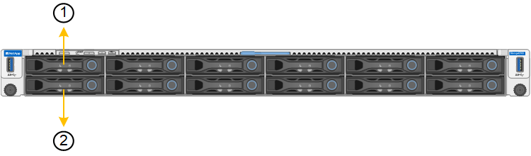

= Sostituire gli apparecchi SG120 o SG1200
:allow-uri-read: 
:icons: font
:imagesdir: ../media/

[role="lead"]
Potrebbe essere necessario sostituire l'apparecchio se non funziona in modo ottimale o se si è guastato.

.A proposito di questa attività
Il nodo StorageGRID non sarà accessibile durante la sostituzione dell'appliance. Se l'apparecchio funziona a sufficienza, è possibile eseguire uno spegnimento controllato all'inizio di questa procedura.

NOTE: Se si sostituisce l'appliance prima di installare il software StorageGRID, potrebbe non essere possibile accedere al programma di installazione dell'appliance StorageGRID subito dopo aver completato questa procedura. Sebbene sia possibile accedere al programma di installazione dell'appliance StorageGRID da altri host sulla stessa sottorete dell'appliance, non è possibile accedervi da host su altre subnet. Questa condizione dovrebbe risolversi automaticamente entro 15 minuti (in caso di timeout di qualsiasi voce della cache ARP per l'appliance originale), oppure è possibile cancellare immediatamente la condizione cancellando manualmente le vecchie voci della cache ARP dal router o dal gateway locale.

.Prima di iniziare
* Si dispone di un apparecchio sostitutivo con lo stesso codice prodotto dell'apparecchio che si sta sostituendo. Controllare le etichette applicate sulla parte anteriore degli apparecchi per verificare che i numeri di parte corrispondano.
* Sono presenti etichette per identificare ciascun cavo collegato all'apparecchio.
* Hai link:locating-sg120-and-sg1200-in-data-center.html["posizionato fisicamente l'apparecchio"].

.Fasi
. Visualizzare le configurazioni correnti dell'appliance e registrarle.
+
.. Accedere all'apparecchio da sostituire:
+
... Immettere il seguente comando: `ssh admin@_grid_node_IP_`
... Immettere la password elencata in `Passwords.txt` file.
... Immettere il seguente comando per passare a root: `su -`
... Immettere la password elencata in `Passwords.txt` file.
+
Una volta effettuato l'accesso come root, il prompt cambia da `$` a. `#`.

.. Inserire: `*run-host-command ipmitool lan print*` Per visualizzare le configurazioni BMC correnti per l'appliance.

. link:power-sg120-and-sg1200-off-on.html#shut-down-the-sg120-or-sg1200-appliance["Spegnere l'apparecchio"].
. Se una delle interfacce di rete di questo dispositivo StorageGRID è configurata per DHCP, è necessario aggiornare le assegnazioni di lease DHCP permanenti sui server DHCP per fare riferimento agli indirizzi MAC del dispositivo sostitutivo. In questo modo si assicura che all'apparecchio siano assegnati gli indirizzi IP previsti.
+
Contattare l'amministratore della rete o del server DHCP per aggiornare le assegnazioni permanenti del lease DHCP. L'amministratore può determinare gli indirizzi MAC del dispositivo sostitutivo dai registri del server DHCP o esaminando le tabelle degli indirizzi MAC negli switch a cui sono collegate le porte Ethernet del dispositivo.

. Rimuovere e sostituire l'apparecchio:
+
.. Etichettare i cavi, quindi scollegare i cavi e i ricetrasmettitori di rete.
+

IMPORTANT: Per evitare prestazioni degradate, non attorcigliare, piegare, pizzicare o salire sui cavi.

.. link:reinstalling-sg120-and-sg1200-into-cabinet-or-rack.html["Rimuovere l'apparecchio guasto dall'armadietto o dal rack"].
.. Si noti la posizione dei componenti sostituibili (due alimentatori, sette ventole di raffreddamento, tre NIC e due SSD) nell'apparecchio guasto.
+
Le due unità si trovano nelle seguenti posizioni nello chassis (parte anteriore dello chassis con il pannello rimosso in figura):

+

+
|===
|  | Disco 

 a| 
1
 a| 
HDD00

 a| 
2
 a| 
HDD01

|===
.. Trasferire i componenti sostituibili sull'appliance sostitutiva.
+
Seguire le istruzioni di manutenzione fornite per reinstallare i componenti sostituibili.

+

CAUTION: Se si desidera conservare i dati presenti sulle unità, inserire le unità SSD negli stessi slot che occupavano nell'appliance guasta. In caso contrario, Appliance Installer visualizzerà un messaggio di avviso e sarà necessario inserire le unità negli slot corretti e riavviare l'appliance prima che questa possa riconnettersi alla grid.

.. link:reinstalling-sg120-and-sg1200-into-cabinet-or-rack.html["Installare l'apparecchio sostitutivo nell'armadietto o nel rack"].
.. Sostituire i cavi e i ricetrasmettitori ottici.

. Accendere l'apparecchio.
. Se l'appliance sostituita ha abilitato la crittografia dell'unità hardware per le unità SED, è necessario link:../installconfig/optional-enabling-node-encryption.html#access-an-encrypted-drive["immettere la passphrase di crittografia dell'unità"] per accedere ai dischi crittografati al primo avvio dell'appliance sostitutiva.
. Attendete che l'apparecchio si unisca nuovamente alla griglia. Se l'appliance non si ricongiungerà alla griglia, seguire le istruzioni riportate nella home page del programma di installazione dell'appliance StorageGRID per risolvere eventuali problemi.
+

WARNING: Per evitare la perdita di dati se il programma di installazione dell'appliance indica la necessità di apportare modifiche fisiche all'hardware, ad esempio lo spostamento dei dischi in slot diversi, spegnere l'appliance prima di apportare modifiche all'hardware.

. Se l'appliance sostituita utilizzava un server di gestione delle chiavi (KMS) per gestire le chiavi di crittografia per la crittografia dei nodi, potrebbe essere necessaria una configurazione aggiuntiva prima che il nodo possa unirsi al grid. Se il nodo non si unisce automaticamente alla griglia, assicurarsi che queste impostazioni di configurazione siano state trasferite alla nuova appliance e configurare manualmente le impostazioni che non hanno la configurazione prevista:
+
** link:../installconfig/accessing-storagegrid-appliance-installer.html["Configurare le connessioni StorageGRID"]
** https://docs.netapp.com/us-en/storagegrid/admin/kms-overview-of-kms-and-appliance-configuration.html#set-up-the-appliance["Configurare la crittografia dei nodi per l'appliance"^]

. Accedere all'appliance sostituita:
+
.. Immettere il seguente comando: `ssh admin@_grid_node_IP_`
.. Immettere la password elencata in `Passwords.txt` file.
.. Immettere il seguente comando per passare a root: `su -`
.. Immettere la password elencata in `Passwords.txt` file.

. Ripristinare la connettività di rete BMC per l'appliance sostituita. Sono disponibili due opzioni:
+
** Utilizzare IP statico, netmask e gateway
** Utilizzare DHCP per ottenere un IP, una netmask e un gateway
+
... Per ripristinare la configurazione BMC in modo che utilizzi un IP statico, una netmask e un gateway, immettere i seguenti comandi:
+
`*run-host-command ipmitool lan set 1 ipaddr _Appliance_IP_*`

+
`*run-host-command ipmitool lan set 1 netmask _Netmask_IP_*`

+
`*run-host-command ipmitool lan set 1 defgw ipaddr _Default_gateway_*`

... Per ripristinare la configurazione BMC in modo che utilizzi DHCP per ottenere un IP, una netmask e un gateway, immettere il seguente comando:
+
`*run-host-command ipmitool lan set 1 ipsrc dhcp*`

. Dopo aver ripristinato la connettività di rete BMC, connettersi all'interfaccia BMC per controllare e ripristinare eventuali configurazioni BMC personalizzate aggiuntive applicate. Ad esempio, è necessario confermare le impostazioni per le destinazioni dei messaggi trap SNMP e le notifiche e-mail. Vedere link:../installconfig/configuring-bmc-interface.html["Configurare l'interfaccia BMC"].
. Verificare che il nodo appliance sia visualizzato in Grid Manager e che non vengano visualizzati avvisi.

Dopo aver sostituito il componente, restituire il componente difettoso a NetApp, come descritto nelle istruzioni RMA fornite con il kit. Consultare la  https://mysupport.netapp.com/site/info/rma["Restituzione e sostituzione dei pezzi"^] pagina per ulteriori informazioni.

.Informazioni correlate
* link:../installconfig/viewing-status-indicators.html["Visualizzare gli indicatori di stato"]
* link:../installconfig/troubleshooting-hardware-installation-sg120-and-sg1200.html#view-error-codes["Visualizzare i codici di avvio dell'appliance"]

