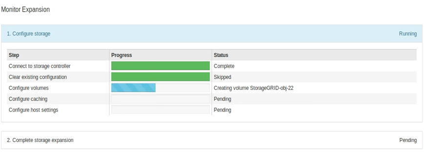

= Aggiunta di shelf di espansione a SG6060 implementato
:allow-uri-read: 
:icons: font
:imagesdir: ../media/

[role="lead"]
Per aumentare la capacità di storage, è possibile aggiungere uno o due shelf di espansione a un SG6060 già implementato in un sistema StorageGRID.

.Prima di iniziare
* È necessario disporre della passphrase di provisioning.
* È necessario eseguire StorageGRID 11.4 o versione successiva.
* Si dispone dello shelf di espansione e di due cavi SAS per ogni shelf di espansione.
* L'appliance di storage è stata fisicamente posizionata in cui si sta aggiungendo lo shelf di espansione nel data center.
+
link:locating-controller-in-data-center.html["Individuare il controller nel data center"]

.A proposito di questa attività
Per aggiungere uno shelf di espansione, eseguire i seguenti passaggi di alto livello:

* Installare l'hardware nel cabinet o nel rack.
* Impostare SG6060 in modalità di manutenzione.
* Collegare lo shelf di espansione allo shelf del controller E2860 o a un altro shelf di espansione.
* Avviare l'espansione utilizzando il programma di installazione dell'appliance StorageGRID
* Attendere la configurazione dei nuovi volumi.

Il completamento della procedura per uno o due shelf di espansione richiede un'ora o meno per nodo appliance. Per ridurre al minimo i tempi di inattività, attenersi alle istruzioni riportate di seguito per installare i nuovi shelf di espansione e i nuovi dischi prima di mettere il sistema SG6060 in modalità di manutenzione. I passaggi rimanenti dovrebbero richiedere da 20 a 30 minuti circa per nodo appliance.

.Fasi
. Seguire le istruzioni per link:../installconfig/sg6060-installing-60-drive-shelves-into-cabinet-or-rack.html["installazione di shelf da 60 dischi in un cabinet o rack"].
. Seguire le istruzioni per link:../installconfig/sg6060-installing-drives.html["installazione dei dischi"].
. Da Grid Manager, link:../commonhardware/placing-appliance-into-maintenance-mode.html["Impostare il controller SG6000-CN in modalità di manutenzione"].
. Collegare ogni shelf di espansione allo shelf del controller E2860 come mostrato nello schema.
+
Questo disegno mostra due shelf di espansione. Se ne hai uno solo, collega IOM A controller A e collega IOM B a controller B.

+
image::../media/expansion_shelves_connections_sg6060.png[Connessioni shelf di espansione SG6060]

+
[cols="1a,2a"]
|===
| Didascalia | Descrizione 

 a| 
1
 a| 
SG6000-CN

 a| 
2
 a| 
Shelf di controller E2860

 a| 
3
 a| 
Controller A.

 a| 
4
 a| 
Controller B

 a| 
5
 a| 
Shelf di espansione 1

 a| 
6
 a| 
IOM A per shelf di espansione 1

 a| 
7
 a| 
IOM B per shelf di espansione 1

 a| 
8
 a| 
Shelf di espansione 2

 a| 
9
 a| 
IOM A per shelf di espansione 2

 a| 
10
 a| 
IOM B per shelf di espansione 2

|===
. Collegare i cavi di alimentazione e alimentare gli shelf di espansione.
+
.. Collegare un cavo di alimentazione a ciascuna delle due unità di alimentazione di ogni shelf di espansione.
.. Collegare i due cavi di alimentazione di ogni shelf di espansione a due diverse PDU nell'armadio o nel rack.
.. Accendere i due interruttori di alimentazione per ogni shelf di espansione.
+
*** Non spegnere gli interruttori di alimentazione durante il processo di accensione.
*** Le ventole negli shelf di espansione potrebbero essere molto rumorose al primo avvio. Il rumore forte durante l'avvio è normale.

. Controllare la home page del programma di installazione dell'appliance StorageGRID.
+
In circa cinque minuti, gli shelf di espansione finiscono di accendersi e vengono rilevati dal sistema. La pagina iniziale mostra il numero di nuovi shelf di espansione rilevati e il pulsante Avvia espansione è attivato.

+
La schermata mostra alcuni esempi dei messaggi che potrebbero essere visualizzati nella home page, a seconda del numero di shelf di espansione esistenti o nuovi, come segue:

+
** Il banner cerchiato nella parte superiore della pagina indica il numero totale di shelf di espansione rilevati.
+
*** Il banner indica il numero totale di shelf di espansione, sia che gli shelf siano configurati e implementati, sia che siano nuovi e non configurati.
*** Se non vengono rilevati shelf di espansione, il banner non viene visualizzato.

** Il messaggio cerchiato nella parte inferiore della pagina indica che l'espansione è pronta per essere avviata.
+
*** Il messaggio indica il numero di nuovi shelf di espansione rilevati da StorageGRID. "`Attached`" indica che lo shelf è stato rilevato. "`unconfigured`" indica che lo shelf è nuovo e non ancora configurato utilizzando il programma di installazione dell'appliance StorageGRID.
+

NOTE: Gli shelf di espansione già implementati non sono inclusi in questo messaggio. Sono inclusi nel conteggio nel banner nella parte superiore della pagina.

*** Il messaggio non viene visualizzato se non vengono rilevati nuovi shelf di espansione.
+
image::../media/appl_installer_home_expansion_shelf_ready_to_install.png[Installazione shelf di espansione]

. Se necessario, risolvere eventuali problemi descritti nei messaggi della home page.
+
Ad esempio, utilizzare Gestione di sistema di SANtricity per risolvere eventuali problemi relativi all'hardware dello storage.

. Verificare che il numero di shelf di espansione visualizzato nella pagina iniziale corrisponda al numero di shelf di espansione che si desidera aggiungere.
+

NOTE: Se i nuovi shelf di espansione non sono stati rilevati, verificare che siano cablati e accesi correttamente.

. [[start_expansion]]fare clic su *Start Expansion* per configurare gli shelf di espansione e renderli disponibili per lo storage a oggetti.
. Monitorare l'avanzamento della configurazione dello shelf di espansione.
+
Le barre di avanzamento vengono visualizzate sulla pagina Web, proprio come durante l'installazione iniziale.

+

+
Una volta completata la configurazione, l'appliance si riavvia automaticamente per uscire dalla modalità di manutenzione e ricongiungersi alla griglia. Questo processo può richiedere fino a 20 minuti.

+

NOTE: Per riprovare la configurazione dello shelf di espansione in caso di errore, accedere al programma di installazione dell'appliance StorageGRID, selezionare *Avanzate* > *Riavvia controller*, quindi selezionare *Riavvia in modalità di manutenzione*. Una volta riavviato il nodo, riprovare <<start_expansion,configurazione dello shelf di espansione>>.

+
Al termine del riavvio, la scheda *Tasks* appare come la seguente schermata:

+
image::../media/appliance_installer_reboot_complete.png[Riavvio completato]

. Verificare lo stato del nodo di storage dell'appliance e dei nuovi shelf di espansione.
+
.. In Grid Manager, selezionare *NODES* e verificare che l'icona del nodo di storage dell'appliance sia contrassegnata da un segno di spunta verde.
+
L'icona del segno di spunta verde indica che non sono attivi avvisi e che il nodo è connesso alla griglia. Per una descrizione delle icone dei nodi, vedere https://docs.netapp.com/us-en/storagegrid/monitor/monitoring-system-health.html#monitor-node-connection-states["Monitorare gli stati di connessione del nodo"^].

.. Selezionare la scheda *Storage* e verificare che nella tabella Storage oggetti siano visualizzati 16 nuovi archivi di oggetti per ogni shelf di espansione aggiunto.
.. Verificare che ogni nuovo shelf di espansione abbia uno stato di shelf nominale e uno stato di configurazione configurato.

