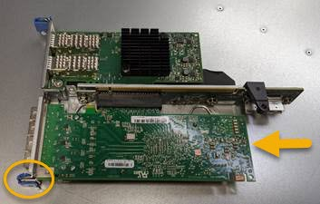

= Sostituire l'HBA Fibre Channel nella versione SG6000
:allow-uri-read: 
:icons: font
:imagesdir: ../media/

[role="lead"]
Potrebbe essere necessario sostituire un HBA Fibre Channel se non funziona in modo ottimale o se si è verificato un errore.

== Verificare l'HBA Fibre Channel da sostituire

In caso di dubbi sull'adattatore bus host Fibre Channel (HBA) da sostituire, completare questa procedura per identificarlo.

.Prima di iniziare
* Si dispone del numero di serie dell'appliance di storage o del controller SG6000-CN in cui è necessario sostituire l'HBA Fibre Channel.
+

NOTE: Se il numero di serie del dispositivo di storage contenente l'HBA Fibre Channel da sostituire inizia con la lettera Q, non verrà elencato in Grid Manager. È necessario controllare le etichette applicate sulla parte anteriore di ciascun controller SG6000-CN del data center fino a quando non si trova una corrispondenza.

* Hai effettuato l'accesso a Grid Manager utilizzando un https://docs.netapp.com/us-en/storagegrid-118/admin/web-browser-requirements.html["browser web supportato"^].

.Fasi
. Da Grid Manager, selezionare *NODES*.
. Dalla tabella della pagina Nodes (nodi), selezionare un nodo di storage dell'appliance.
. Selezionare la scheda *hardware*.
+
Controllare il numero di serie del telaio dell'appliance di storage* e il numero di serie del controller di calcolo* nella sezione dell'appliance StorageGRID. Verificare se uno di questi numeri di serie corrisponde al numero di serie dell'appliance di storage in cui si sostituisce l'HBA Fibre Channel. Se uno dei numeri di serie corrisponde, è stato trovato il dispositivo corretto.

+
image::../media/nodes_page_hardware_tab_for_appliance_verify_HBA.png[Sezione appliance per Fibre Channel HCA]

+
** Se la sezione dell'appliance StorageGRID non viene visualizzata, il nodo selezionato non è un'appliance StorageGRID. Selezionare un nodo diverso dalla vista ad albero.
** Se il modello di appliance non è SG6060 o SG6060X, selezionare un nodo diverso dalla vista ad albero.
** Se i numeri seriali non corrispondono, selezionare un nodo diverso dalla vista ad albero.

. Dopo aver individuato il nodo in cui deve essere sostituito l'HBA Fibre Channel, annotare l'indirizzo IP BMC del controller di calcolo elencato nella sezione appliance StorageGRID.
+
È possibile utilizzare questo indirizzo IP per link:turning-controller-identify-led-on-and-off.html["Accendere il LED di identificazione del controller di elaborazione"], per facilitare l'individuazione dell'appliance nel centro dati.

== Rimuovere l'HBA Fibre Channel

Potrebbe essere necessario sostituire l'HBA (host bus adapter) Fibre Channel nel controller SG6000-CN se non funziona in modo ottimale o se si è verificato un guasto.

.Prima di iniziare
* Si dispone dell'HBA Fibre Channel sostitutivo corretto.
* Lo hai fatto link:reinstalling-fibre-channel-hba.html#verify-fibre-channel-hba-to-replace["Determinato quale controller SG6000-CN contiene l'HBA Fibre Channel da sostituire"].
* Lo hai fatto link:locating-controller-in-data-center.html["Situato fisicamente nel controller SG6000-CN"] nel data center.
* Lo hai fatto link:power-sg6000-cn-controller-off-on.html#shut-down-sg6000-cn-controller["Spegnere il controller SG6000-CN"].
+

CAUTION: Prima di rimuovere il controller dal rack, è necessario eseguire uno shutdown controllato.

* Lo hai fatto link:reinstalling-sg6000-cn-controller-into-cabinet-or-rack.html#remove-sg6000-cn-controller-from-cabinet-or-rack["il controller è stato rimosso dal cabinet o dal rack"].
* Lo hai fatto link:reinstalling-sg6000-cn-controller-cover.html#remove-sg6000-cn-controller-cover["rimozione del coperchio del controller"].

.A proposito di questa attività
Per evitare interruzioni del servizio, verificare che tutti gli altri nodi di storage siano collegati alla rete prima di avviare la sostituzione dell'HBA Fibre Channel o sostituire l'adattatore durante una finestra di manutenzione programmata quando i periodi di interruzione del servizio sono accettabili. Consultare le informazioni su https://docs.netapp.com/us-en/storagegrid-118/monitor/monitoring-system-health.html#monitor-node-connection-states["monitoraggio degli stati di connessione del nodo"^].

CAUTION: Se è stata utilizzata una regola ILM che crea una sola copia di un oggetto, è necessario sostituire l'HBA Fibre Channel durante una finestra di manutenzione pianificata. In caso contrario, è possibile che l'accesso a tali oggetti venga temporaneamente perso durante questa procedura. +
Vedere le informazioni su https://docs.netapp.com/us-en/storagegrid-118/ilm/why-you-should-not-use-single-copy-replication.html["perché non utilizzare la replica a copia singola"^].

.Fasi
. Avvolgere l'estremità del braccialetto ESD intorno al polso e fissare l'estremità del fermaglio a una messa a terra metallica per evitare scariche elettrostatiche.
. Individuare il gruppo riser sul retro del controller che contiene l'HBA Fibre Channel.
+
image::../media/sg6060_riser_assembly_location.jpg[Posizione del gruppo del riser SG6060]

. Afferrare il gruppo riser attraverso i fori blu e sollevarlo con cautela verso l'alto. Spostare il gruppo riser verso la parte anteriore dello chassis mentre lo si solleva per consentire ai connettori esterni degli adattatori installati di liberare lo chassis.
. Posizionare la scheda di montaggio su una superficie piana antistatica con il lato del telaio metallico rivolto verso il basso per accedere agli adattatori.
+

+
Nel gruppo riser sono presenti due adattatori: Un HBA Fibre Channel e un adattatore di rete Ethernet. L'HBA Fibre Channel è indicato nell'illustrazione.

. Aprire il fermo blu dell'adattatore (cerchiato) e rimuovere con cautela l'HBA Fibre Channel dal gruppo riser. Far oscillare leggermente l'adattatore per rimuoverlo dal connettore. Non esercitare una forza eccessiva.
. Posizionare l'adattatore su una superficie piana antistatica.

.Al termine
link:reinstalling-fibre-channel-hba.html["Installare l'HBA Fibre Channel sostitutivo"].

Dopo aver sostituito il componente, restituire il componente guasto a NetApp, come descritto nelle istruzioni RMA fornite con il kit. Vedere https://mysupport.netapp.com/site/info/rma[" di restituzione della parte; sostituzioni"^] per ulteriori informazioni.

== Reinstallare l'HBA Fibre Channel

L'HBA Fibre Channel sostitutivo viene installato nella stessa posizione di quello rimosso.

.Prima di iniziare
* Si dispone dell'HBA Fibre Channel sostitutivo corretto.
* L'HBA Fibre Channel esistente è stato rimosso.
+
link:reinstalling-fibre-channel-hba.html#remove-fibre-channel-hba["Rimuovere l'HBA Fibre Channel"]

.Fasi
. Avvolgere l'estremità del braccialetto ESD intorno al polso e fissare l'estremità del fermaglio a una messa a terra metallica per evitare scariche elettrostatiche.
. Rimuovere l'HBA Fibre Channel sostitutivo dalla confezione.
. Con il dispositivo di chiusura blu dell'adattatore in posizione aperta, allineare l'HBA Fibre Channel con il relativo connettore sul gruppo riser, quindi premere con cautela l'adattatore nel connettore fino a inserirlo completamente.
+

+
Nel gruppo riser sono presenti due adattatori: Un HBA Fibre Channel e un adattatore di rete Ethernet. L'HBA Fibre Channel è indicato nell'illustrazione.

. Individuare il foro di allineamento sul gruppo riser (cerchiato) che si allinea con un perno guida sulla scheda di sistema per garantire il corretto posizionamento del gruppo riser.
+
image::../media/sg6060_riser_alignment_hole.jpg[Foro di allineamento sul gruppo riser SG6060]

. Posizionare il gruppo riser nello chassis, assicurandosi che sia allineato con il connettore e il perno guida sulla scheda di sistema, quindi inserire il gruppo riser.
. Premere con cautela il gruppo riser in posizione lungo la linea centrale, accanto ai fori blu, fino a posizionarlo completamente.
. Rimuovere i cappucci di protezione dalle porte HBA Fibre Channel in cui verranno reinstallati i cavi.

.Al termine
Se non sono presenti altre procedure di manutenzione da eseguire nella centralina, link:reinstalling-sg6000-cn-controller-cover.html["rimontare il coperchio della centralina"].
