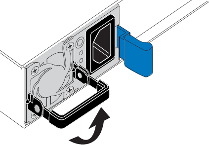
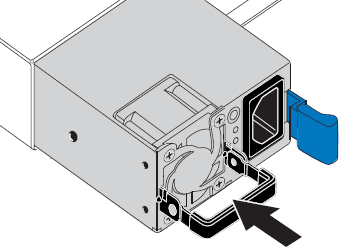

= Sostituire uno o entrambi gli alimentatori del controller SG6000-CN
:allow-uri-read: 
:icons: font
:imagesdir: ../media/

[role="lead"]
Il controller SG6000-CN dispone di due alimentatori per la ridondanza. In caso di guasto di uno degli alimentatori, è necessario sostituirlo il prima possibile per garantire che il controller di calcolo disponga di alimentazione ridondante. Entrambi gli alimentatori che operano nel controller devono essere dello stesso modello e dello stesso wattaggio.

.Prima di iniziare
* È stata determinata la posizione fisica nel data center del controller con l'alimentatore da sostituire.
+
link:locating-controller-in-data-center.html["Individuazione del controller in un data center"]

* Se si sta sostituendo un solo alimentatore:
+
** L'alimentatore sostitutivo è stato disimballato e si è assicurato che sia dello stesso modello e wattaggio dell'alimentatore che si sta sostituendo.
** Hai confermato che l'altro alimentatore è installato e funzionante.

* Se si stanno sostituendo entrambi gli alimentatori contemporaneamente:
+
** Le unità di alimentazione sostitutive sono state disimballate e si sono assicurate che siano dello stesso modello e della stessa potenza.

.A proposito di questa attività
La figura mostra le due unità di alimentazione del controller SG6000-CN, accessibili dal retro del controller. Utilizzare questa procedura per sostituire uno o entrambi gli alimentatori. In caso di sostituzione di entrambi gli alimentatori, è necessario prima eseguire uno spegnimento controllato dell'apparecchio.

image::../media/sg6000_cn_power_supplies.gif[Retro di SG6000-CN con due alimentatori]

.Fasi
. Se si sostituisce un solo alimentatore, non è necessario spegnere l'apparecchio. Accedere alla <<Unplug_the_power_cord,Scollegare il cavo di alimentazione>> fase. Se si stanno sostituendo entrambi gli alimentatori contemporaneamente, prima di scollegare i cavi di alimentazione procedere come segue:
+
.. link:power-sg6000-cn-controller-off-on.html#shut-down-sg6000-cn-controller["Spegnere l'apparecchio"].

. [[scollega_il_cavo_di_alimentazione, start=2]]scollegare il cavo di alimentazione da ogni alimentatore da sostituire.
. Sollevare la maniglia della camma sul primo materiale di consumo da sostituire.
+

. Premere il fermo blu ed estrarre l'alimentatore.
+
image::../media/sg6000_cn_remove_power_supply.gif[Rimozione di un alimentatore SG6000-CN]

. Con il fermo blu a destra, far scorrere l'alimentatore sostitutivo nel telaio.
+

NOTE: Entrambi gli alimentatori devono essere dello stesso modello e dello stesso wattaggio.

+
Assicurarsi che il fermo blu si trovi sul lato destro quando si inserisce l'unità sostitutiva.

+

. Spingere la maniglia della camma verso il basso per fissare l'alimentatore sostitutivo.
. Se si stanno sostituendo entrambi gli alimentatori, ripetere i passi da 2 a 6 per sostituire il secondo alimentatore.
. link:../installconfig/connecting-power-cords-and-applying-power.html["Collegare i cavi di alimentazione alle unità sostituite e collegare l'alimentazione"].

Dopo aver sostituito il componente, restituire il componente guasto a NetApp, come descritto nelle istruzioni RMA fornite con il kit. Vedere https://mysupport.netapp.com/site/info/rma[" di restituzione della parte; sostituzioni"^] per ulteriori informazioni.
