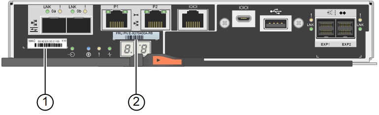

= Sostituire il controller storage in SG6000
:allow-uri-read: 
:icons: font
:imagesdir: ../media/

[role="lead"]
Potrebbe essere necessario sostituire un controller della serie E2800 o un controller EF570 se non funziona in modo ottimale o se si è verificato un guasto.

.Prima di iniziare
* Si dispone di un controller sostitutivo con lo stesso numero di parte del controller che si sta sostituendo.
* Sono presenti etichette per identificare ciascun cavo collegato al controller.
* Si dispone di un braccialetto ESD o si sono prese altre precauzioni antistatiche.
* Hai un cacciavite Phillips n. 1.
* L'appliance di storage in cui si sta sostituendo il controller nel data center è stata fisicamente posizionata.
+
link:locating-controller-in-data-center.html["Individuare il controller nel data center"]

NOTE: Non fare affidamento sulle istruzioni e-Series per sostituire un controller nell'appliance StorageGRID, perché le procedure non sono le stesse.

.A proposito di questa attività
È possibile determinare se si dispone di un controller guasto in due modi:

* Il guru del ripristino in Gestione di sistema di SANtricity indica di sostituire il controller.
* Il LED di attenzione ambra sul controller è acceso, a indicare che il controller è guasto.
+

NOTE: Se entrambi i controller dello shelf hanno i LED di attenzione accesi, contattare il supporto tecnico per assistenza.

Se l'appliance contiene due controller di storage, è possibile sostituire uno dei controller mentre l'appliance è accesa ed esegue operazioni di lettura/scrittura, a condizione che siano soddisfatte le seguenti condizioni:

* Il secondo controller nello shelf ha uno stato ottimale.
* Il campo *OK per rimuovere* nell'area Dettagli del guru del ripristino in Gestione sistema di SANtricity visualizza *Sì*, a indicare che è possibile rimuovere questo componente in tutta sicurezza.

NOTE: Se possibile, impostare l'apparecchio in modalità di manutenzione per questa procedura di sostituzione per ridurre al minimo l'impatto potenziale di errori o guasti imprevisti.

NOTE: Se il secondo controller nello shelf non ha uno stato ottimale o se il Recovery Guru indica che non è possibile rimuovere il controller, contattare il supporto tecnico.

Quando si sostituisce un controller, è necessario rimuovere la batteria dal controller originale e installarlo nel controller sostitutivo. In alcuni casi, potrebbe essere necessario rimuovere la scheda di interfaccia host dal controller originale e installarla nel controller sostitutivo.

NOTE: I controller di storage nella maggior parte dei modelli di appliance non includono schede di interfaccia host (HIC).

Questa attività comprende le seguenti parti:

. Preparatevi
. Portare il controller offline
. Rimuovere il controller
. Spostare la batteria sul nuovo controller
. Spostare HIC sul nuovo controller, se necessario
. Sostituire il controller

== Preparatevi

.Fasi
. Disimballare il nuovo controller e impostarlo su una superficie piana e priva di elettricità statica.
+
Conservare il materiale di imballaggio da utilizzare per la spedizione del controller guasto.

. Individuare le etichette dell'indirizzo MAC e del numero di parte FRU sul retro del controller sostitutivo.

Queste figure mostrano il controller E2800A e il controller E2800B. La procedura per la sostituzione dei controller della serie E2800 e del controller EF570 è identica.

Storage controller E2800A:

Storage controller E2800B:

image::../media/e2800B_labels_on_controller.gif[Etichette MAC e FRU sul controller E2800A]

[cols="1a,2a,4a"]
|===
| Etichetta | componente | Descrizione 

 a| 
1
 a| 
Indirizzo MAC
 a| 
L'indirizzo MAC per la porta di gestione 1 ("`P1 su E2800A e 0a su E2800B`"). Se si è utilizzato DHCP per ottenere l'indirizzo IP del controller originale, sarà necessario questo indirizzo per connettersi al nuovo controller.

 a| 
2
 a| 
Numero di parte della FRU
 a| 
Il numero di parte della FRU. Questo numero deve corrispondere al numero di parte di ricambio per il controller attualmente installato.

 a| 
3
 a| 
HIC a 4 porte
 a| 
La scheda HIC (host Interface Card) a 4 porte. Questa scheda deve essere spostata nel nuovo controller quando si esegue la sostituzione.

*Nota*: Il controller E2800A non dispone di un HIC.

|===

== Portare il controller offline

.Fasi
. Prepararsi a rimuovere il controller. Per eseguire questa procedura, utilizzare Gestione di sistema di SANtricity.
+
.. Verificare che il numero di parte sostitutivo del controller guasto sia lo stesso del numero di parte FRU del controller sostitutivo.
+
Quando un controller presenta un guasto e deve essere sostituito, il codice del ricambio viene visualizzato nell'area Details (Dettagli) del Recovery Guru. Se è necessario trovare questo numero manualmente, consultare la scheda *base* del controller.

+

CAUTION: *Possibile perdita di accesso ai dati e n. 8212;* se i due codici ricambio non sono gli stessi, non tentare questa procedura.

.. Eseguire il backup del database di configurazione.
+
Se si verifica un problema durante la rimozione di un controller, è possibile utilizzare il file salvato per ripristinare la configurazione.

.. Raccogliere i dati di supporto per l'appliance.
+

NOTE: La raccolta dei dati di supporto prima e dopo la sostituzione di un componente consente di inviare una serie completa di registri al supporto tecnico se la sostituzione non risolve il problema.

.. Portare offline il controller che si intende sostituire.

== Rimuovere il controller

.Fasi
. Rimuovere il controller dall'apparecchio:
+
.. Indossare un braccialetto ESD o adottare altre precauzioni antistatiche.
.. Etichettare i cavi, quindi scollegarli.
+

NOTE: Per evitare prestazioni degradate, non attorcigliare, piegare, pizzicare o salire sui cavi.

.. Rilasciare il controller dall'apparecchio premendo il fermo sull'impugnatura della camma fino a rilasciarlo, quindi aprire l'impugnatura della camma verso destra.
.. Estrarre il controller dall'apparecchio con due mani e la maniglia della camma.
+

CAUTION: Utilizzare sempre due mani per sostenere il peso del controller.

.. Posizionare il controller su una superficie piana e priva di scariche elettrostatiche con il coperchio rimovibile rivolto verso l'alto.
.. Rimuovere il coperchio premendo verso il basso il pulsante e facendo scorrere il coperchio verso l'esterno.

== Spostare la batteria sul nuovo controller

.Fasi
. Rimuovere la batteria dal controller guasto e installarla nel controller sostitutivo:
+
.. Verificare che il LED verde all'interno del controller (tra la batteria e i DIMM) sia spento.
+
Se questo LED verde è acceso, il controller sta ancora utilizzando l'alimentazione a batteria. Prima di rimuovere qualsiasi componente, è necessario attendere che il LED si spenga.

+
image::../media/e2800_internal_cache_active_led.gif[LED verde su E2800]

+
[cols="1a,2a"]
|===
| Elemento | Descrizione 

 a| 
1
 a| 
LED cache interna attiva

 a| 
2
 a| 
Batteria

|===
.. Individuare il dispositivo di chiusura blu della batteria.
.. Sganciare la batteria spingendo il dispositivo di chiusura verso il basso e allontanandolo dal controller.
+
image::../media/e2800_remove_battery.gif[Dispositivo di chiusura della batteria]

+
[cols="1a,2a"]
|===
| Elemento | Descrizione 

 a| 
1
 a| 
Dispositivo di chiusura a scatto della batteria

 a| 
2
 a| 
Batteria

|===
.. Sollevare la batteria ed estrarla dal controller.
.. Rimuovere il coperchio dal controller sostitutivo.
.. Orientare il controller sostitutivo in modo che lo slot della batteria sia rivolto verso di sé.
.. Inserire la batteria nel controller inclinandola leggermente verso il basso.
+
Inserire la flangia metallica nella parte anteriore della batteria nello slot sul fondo del controller e far scorrere la parte superiore della batteria sotto il piccolo perno di allineamento sul lato sinistro del controller.

.. Spostare il dispositivo di chiusura della batteria verso l'alto per fissare la batteria.
+
Quando il dispositivo di chiusura scatta in posizione, la parte inferiore del dispositivo di chiusura si aggancia in uno slot metallico sul telaio.

.. Capovolgere il controller per verificare che la batteria sia installata correttamente.
+

CAUTION: *Possibili danni all'hardware* -- la flangia metallica sulla parte anteriore della batteria deve essere inserita completamente nello slot del controller (come mostrato nella prima figura). Se la batteria non è installata correttamente (come mostrato nella seconda figura), la flangia metallica potrebbe entrare in contatto con la scheda del controller, causando danni.

+
*** *Esatto -- la flangia metallica della batteria è completamente inserita nello slot del controller:*
+
image::../media/e2800_battery_flange_ok.gif[Flangia della batteria corretta]

*** *Errato -- la flangia metallica della batteria non è inserita nello slot del controller:*
+
image::../media/e2800_battery_flange_not_ok.gif[Flangia della batteria non corretta]

. Riposizionare il coperchio del controller.

== Spostare HIC sul nuovo controller, se necessario

.Fasi
. Se il controller guasto include una scheda di interfaccia host (HIC), spostare l'HIC dal controller guasto al controller sostitutivo.
+
Un HIC separato viene utilizzato solo per il controller E2800B. L'HIC è montato sulla scheda del controller principale e include due connettori SPF.

+

NOTE: Le illustrazioni di questa procedura mostrano un HIC a 2 porte. L'HIC del controller potrebbe avere un numero di porte diverso.

. Se il controller non dispone di un HIC (E2800A), sostituire il coperchio del controller. Se il controller dispone di un HIC (E2800B), passare a. <<move_the_HIC_to_the_replacement_controller,Spostare l'HIC dal controller guasto al controller sostitutivo>>.
+
.. [[Move_the_HIC_to_the_replacement_controller]]se dotato di HIC, spostare l'HIC dal controller guasto al controller sostitutivo.
.. Rimuovere eventuali SFP dall'HIC.
.. Utilizzando un cacciavite Phillips n. 1, rimuovere le viti che fissano la mascherina HIC al controller.
+
Sono presenti quattro viti: Una sulla parte superiore, una laterale e due sulla parte anteriore.

+
image::../media/28_dwg_e2800_hic_faceplace_screws_maint-e2800.png[Viti della piastra anteriore E2800]

.. Rimuovere la piastra anteriore dell'HIC.
.. Utilizzando le dita o un cacciavite Phillips, allentare le tre viti a testa zigrinata che fissano l'HIC alla scheda del controller.
.. Scollegare con cautela l'HIC dalla scheda del controller sollevandola e facendola scorrere all'indietro.
+

CAUTION: Fare attenzione a non graffiare o urtare i componenti sul fondo dell'HIC o sulla parte superiore della scheda del controller.

+
image::../media/28_dwg_e2800_hic_thumbscrews_maint-e2800.png[Viti a testa zigrinata HIC E2800A]

+
[cols="1a,2a"]
|===
| Etichetta | Descrizione 

 a| 
1
 a| 
Scheda di interfaccia host

 a| 
2
 a| 
Viti a testa zigrinata

|===
.. Posizionare l'HIC su una superficie priva di elettricità statica.
.. Utilizzando un cacciavite Phillips n. 1, rimuovere le quattro viti che fissano la mascherina vuota al controller sostitutivo, quindi rimuovere la mascherina.
.. Allineare le tre viti a testa zigrinata sull'HIC con i fori corrispondenti sul controller sostitutivo e allineare il connettore sulla parte inferiore dell'HIC con il connettore di interfaccia HIC sulla scheda del controller.
+
Fare attenzione a non graffiare o urtare i componenti sul fondo dell'HIC o sulla parte superiore della scheda del controller.

.. Abbassare con cautela l'HIC in posizione e inserire il connettore HIC premendo delicatamente sull'HIC.
+

CAUTION: *Possibili danni all'apparecchiatura* -- fare attenzione a non stringere il connettore a nastro dorato dei LED del controller tra l'HIC e le viti a testa zigrinata.

+
image::../media/28_dwg_e2800_hic_thumbscrews_maint-e2800.gif[Viti HIC E2800A]

+
[cols="1a,2a"]
|===
| Etichetta | Descrizione 

 a| 
1
 a| 
Scheda di interfaccia host

 a| 
2
 a| 
Viti a testa zigrinata

|===
.. Serrare manualmente le viti a testa zigrinata HIC.
+
Non utilizzare un cacciavite per evitare di serrare eccessivamente le viti.

.. Utilizzando un cacciavite Phillips n. 1, fissare la mascherina HIC rimossa dal controller originale al nuovo controller con quattro viti.
+
image::../media/28_dwg_e2800_hic_faceplace_screws_maint-e2800.png[E2800A viti della mascherina]

.. Reinstallare eventuali SFP rimossi nell'HIC.

== Sostituire il controller

.Fasi
. Installare il controller sostitutivo nell'appliance.
+
.. Capovolgere il controller, in modo che il coperchio rimovibile sia rivolto verso il basso.
.. Con la maniglia della camma in posizione aperta, far scorrere il controller fino in fondo nell'apparecchio.
.. Spostare la maniglia della camma verso sinistra per bloccare il controller in posizione.
.. Sostituire i cavi e gli SFP.
.. Se il controller originale utilizzava DHCP per l'indirizzo IP, individuare l'indirizzo MAC sull'etichetta sul retro del controller sostitutivo. Chiedere all'amministratore di rete di associare il DNS/rete e l'indirizzo IP del controller rimosso con l'indirizzo MAC del controller sostitutivo.
+

NOTE: Se il controller originale non ha utilizzato DHCP per l'indirizzo IP, il nuovo controller adotterà l'indirizzo IP del controller rimosso.

. Portare il controller online utilizzando Gestione di sistema di SANtricity:
+
.. Selezionare *hardware*.
.. Se la figura mostra i dischi, selezionare *Mostra retro dello shelf*.
.. Selezionare il controller che si desidera mettere in linea.
.. Selezionare *Place Online* (Esegui online) dal menu di scelta rapida e confermare che si desidera eseguire l'operazione.
.. Verificare che il display a sette segmenti visualizzi uno stato di `99`.

. Verificare che il nuovo controller sia ottimale e raccogliere i dati di supporto.

Dopo aver sostituito il componente, restituire il componente guasto a NetApp, come descritto nelle istruzioni RMA fornite con il kit. Vedere https://mysupport.netapp.com/site/info/rma[" di restituzione della parte; sostituzioni"^] per ulteriori informazioni.
