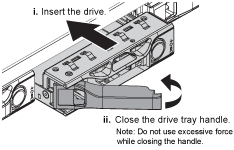

= Sostituisci le unità nel SGF6112
:allow-uri-read: 
:icons: font
:imagesdir: ../media/

[role="lead"]
L'appliance di storage SGF6112 contiene 12 unità SSD. I dati sui dischi sono protetti da uno schema RAID che consente all'appliance di eseguire il ripristino da qualsiasi guasto a un singolo disco senza dover copiare i dati da un altro nodo.

Il guasto di un secondo disco prima che sia stato corretto un guasto iniziale del disco potrebbe richiedere la copia dei dati da altri nodi per ripristinare la ridondanza. Questo ripristino della ridondanza può richiedere più tempo e potrebbe essere impossibile se le regole ILM a copia singola sono in uso o sono state utilizzate in passato o se la ridondanza dei dati è stata influenzata da errori su altri nodi. Pertanto, se uno dei dischi SGF6112 si guasta, è necessario sostituirlo il prima possibile per garantire la ridondanza.

.Prima di iniziare
* Lo hai fatto link:locating-sgf6112-in-data-center.html["posizionato fisicamente l'apparecchio"].
* Hai verificato quale disco ha avuto un guasto notando che il LED sinistro del disco è di colore ambra fisso o utilizzando Grid Manager per link:verify-component-to-replace.html["visualizzare l'avviso causato dal disco guasto"].
+

NOTE: Consultare le informazioni relative alla visualizzazione degli indicatori di stato per verificare l'errore.

* È stato ottenuto il disco sostitutivo.
* Hai ottenuto una protezione ESD adeguata.

.Fasi
. Verificare che il LED di errore sinistro dell'unità sia di colore ambra o utilizzare l'ID dello slot dell'unità visualizzato nell'avviso per individuare l'unità.
+
Le dodici unità si trovano nelle seguenti posizioni nello chassis (nella parte anteriore dello chassis con il pannello rimosso):

+
image::../media/sgf6112_ssds_locations.png[Posizioni delle unità]

+
|===
| Posizione | Disco 

 a| 
1
 a| 
HDD00

 a| 
2
 a| 
HDD01

 a| 
3
 a| 
HDD02

 a| 
4
 a| 
HDD03

 a| 
5
 a| 
HDD04

 a| 
6
 a| 
HDD05

 a| 
7
 a| 
HDD06

 a| 
8
 a| 
HDD07

 a| 
9
 a| 
HDD08

 a| 
10
 a| 
HDD09

 a| 
11
 a| 
HDD10

 a| 
12
 a| 
HDD11

|===
+
È inoltre possibile utilizzare Grid Manager per monitorare lo stato dei dischi SSD. Selezionare *NODI*. Quindi selezionare `*Storage Node*` > *hardware*. In caso di guasto di un disco, il campo Storage RAID Mode (modalità RAID storage) contiene un messaggio relativo al disco guasto.

. Avvolgere l'estremità del braccialetto ESD intorno al polso e fissare l'estremità del fermaglio a una messa a terra metallica per evitare scariche elettrostatiche.
. Disimballare l'unità sostitutiva e appoggiarla su una superficie piana e priva di elettricità statica vicino all'apparecchio.
+
Conservare tutti i materiali di imballaggio.

. Premere il pulsante di rilascio sul disco guasto.
+
image::../media/h600s_driveremoval.gif[Rimozione del disco]

+
La maniglia delle molle del disco si apre parzialmente e il disco si libera dallo slot.

. Aprire la maniglia, estrarre l'unità e posizionarla su una superficie piana e priva di scariche elettrostatiche.
. Premere il pulsante di rilascio sull'unità sostitutiva prima di inserirla nello slot.
+
Le molle del dispositivo di chiusura si aprono.

+

. Inserire l'unità sostitutiva nello slot, quindi chiudere la maniglia dell'unità.
+

NOTE: Non esercitare una forza eccessiva durante la chiusura della maniglia.

+
Quando l'unità è completamente inserita, si sente uno scatto.

+
L'unità sostituita viene automaticamente ricostruita con dati mirrorati dai dischi funzionanti. Il LED del disco dovrebbe lampeggiare inizialmente, ma poi smettere di lampeggiare non appena il sistema rileva che il disco ha una capacità sufficiente ed è funzionante.

+
È possibile controllare lo stato della ricostruzione utilizzando Grid Manager.

. Se più di un disco si è guastato ed è stato sostituito, potrebbero essere visualizzati avvisi che indicano che alcuni volumi devono essere ripristinati. Se si riceve un avviso, prima di tentare il ripristino del volume, selezionare *NODI* > `*appliance Storage Node*` > *hardware*. Nella sezione dell'appliance StorageGRID della pagina, verificare che la modalità RAID dello storage sia funzionante o in fase di ricostruzione. Se lo stato elenca uno o più dischi guasti, correggere questa condizione prima di tentare il ripristino del volume.
. In Grid Manager, andare a *NODES* > `*appliance Storage Node*` > *hardware*. Nella sezione dell'appliance StorageGRID della pagina, verificare che la modalità RAID dello storage sia corretta.

Dopo aver sostituito il componente, restituire il componente guasto a NetApp, come descritto nelle istruzioni RMA fornite con il kit. Vedere https://mysupport.netapp.com/site/info/rma[" di restituzione della parte; sostituzioni"^] per ulteriori informazioni.
