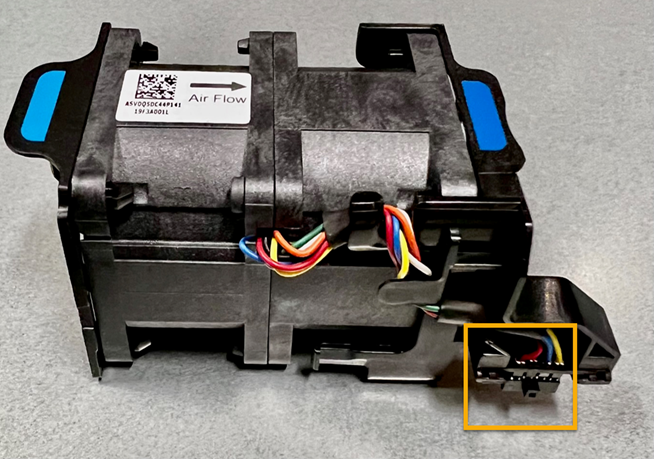
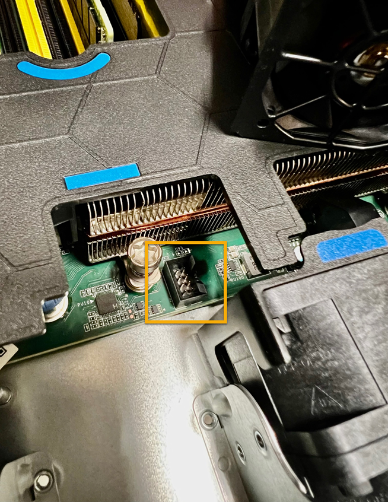

= Sostituire la ventola in un SGF6112 o SG6100-CN (SG6160)
:allow-uri-read: 
:icons: font
:imagesdir: ../media/

[role="lead"]
L'appliance SGF6112 e il controller SG6100-CN sono dotati di otto ventole di raffreddamento. Se una delle ventole si guasta, è necessario sostituirla il prima possibile per assicurarsi che l'apparecchio sia raffreddato correttamente.

.Prima di iniziare
* Si dispone della ventola sostitutiva corretta.
* Lo hai fatto link:verify-component-to-replace.html["determinata la posizione della ventola da sostituire"].
* Lo hai fatto link:locating-sgf6112-in-data-center.html["Situato fisicamente l'apparecchio SGF6112 o il controller SG6100-CN"] dove si sta sostituendo la ventola nel centro dati.
+

NOTE: È necessario un link:power-sgf6112-off-on.html#shut-down-the-sgf6112-appliance-or-sg6100-cn-controller["spegnimento controllato dell'apparecchio"] prima di rimuovere l'apparecchio dal rack.

* Tutti i cavi sono stati scollegati e. link:reinstalling-sgf6112-cover.html["rimuovere il coperchio dell'apparecchio"].
* Hai confermato che le altre ventole sono installate e in esecuzione.

.A proposito di questa attività
Per evitare interruzioni del servizio, verificare che tutti gli altri nodi storage siano collegati alla griglia prima di iniziare la sostituzione della ventola o sostituire la ventola durante una finestra di manutenzione programmata in caso di accettabili periodi di interruzione del servizio. Vedere le informazioni su https://docs.netapp.com/us-en/storagegrid/monitor/monitoring-system-health.html#monitor-node-connection-states["monitoraggio degli stati di connessione del nodo"^].

CAUTION: Se è stata utilizzata una regola ILM che crea solo una copia di un oggetto, è necessario sostituire la ventola durante una finestra di manutenzione pianificata poiché durante questa procedura potrebbe essere temporaneamente perso l'accesso a tali oggetti. Vedere informazioni su https://docs.netapp.com/us-en/storagegrid/ilm/why-you-should-not-use-single-copy-replication.html["perché non utilizzare la replica a copia singola"^].

Il nodo dell'appliance non sarà accessibile durante la sostituzione della ventola.

L'immagine mostra una ventola per l'apparecchio con il connettore elettrico evidenziato. Le ventole di raffreddamento sono accessibili dopo aver aperto il coperchio superiore dell'apparecchio.

NOTE: Ciascuna delle due unità di alimentazione contiene anche una ventola. Le ventole dell'alimentatore non sono incluse in questa procedura.

.Fasi
. Avvolgere l'estremità del braccialetto ESD intorno al polso e fissare l'estremità del fermaglio a una messa a terra metallica per evitare scariche elettrostatiche.
. Individuare la ventola da sostituire.
+
Le otto ventole si trovano nelle seguenti posizioni nello chassis (in figura è mostrata la metà anteriore dell'apparecchio StorageGRID con il coperchio superiore rimosso):

+
image::../media/SGF6112-fan-locations.png[Posizioni delle ventole]

+
|===
|  | Gruppo ventola 

 a| 
1
 a| 
Fan_SYS0

 a| 
2
 a| 
Fan_SYS1

 a| 
3
 a| 
Fan_SYS2

 a| 
4
 a| 
Fan_SYS3

 a| 
5
 a| 
Fan_SYS4

 a| 
6
 a| 
Fan_SYS5

 a| 
7
 a| 
Fan_SYS6

 a| 
8
 a| 
Fan_SYS7

|===
. Utilizzando le linguette blu sulla ventola, estrarre la ventola guasta dal telaio.
+
image::../media/fan_removal.png[Rimozione della ventola]

. Far scorrere la ventola sostitutiva nello slot aperto dello chassis.
+
Allineare il connettore sulla ventola con la presa sulla scheda del circuito.

. Premere con decisione il connettore della ventola nella scheda a circuiti stampati (presa evidenziata).
+

.Al termine
. link:reinstalling-sgf6112-cover.html["Riposizionate il coperchio superiore sull'apparecchio"]e premere il fermo verso il basso per fissare il coperchio in posizione.
. link:power-sgf6112-off-on.html["Accendere l'apparecchio"] E monitorare i LED dell'apparecchio e i codici di avvio.
+
Utilizzare l'interfaccia BMC per monitorare lo stato di avvio.

. Verificare che il nodo appliance sia visualizzato in Grid Manager e che non vengano visualizzati avvisi.

Dopo aver sostituito il componente, restituire il componente guasto a NetApp, come descritto nelle istruzioni RMA fornite con il kit. Vedere https://mysupport.netapp.com/site/info/rma[" di restituzione della parte; sostituzioni"^] per ulteriori informazioni.
