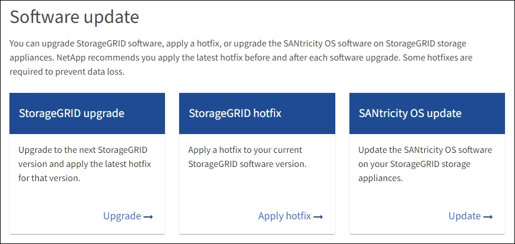

= Aggiorna il sistema operativo SANtricity sugli storage controller SG6160 usando Grid Manager
:allow-uri-read: 
:icons: font
:imagesdir: ../media/

[role="lead"]
Per gli storage controller che attualmente utilizzano SANtricity OS 08.42.20.00 (11,42) o versione successiva, è possibile utilizzare il Grid Manager o la modalità di manutenzione per applicare un aggiornamento.

.Prima di iniziare
* Se non è stata ottenuta la versione di SANtricity OS da cui si desidera eseguire l'aggiornamento https://mysupport.netapp.com/site/products/all/details/storagegrid-appliance/downloads-tab["Download NetApp: Appliance StorageGRID"^], è stata effettuata la consultazione https://mysupport.netapp.com/site/products/all/details/storagegrid-appliance/downloads-tab["Download NetApp: Appliance StorageGRID"^] o il https://imt.netapp.com/matrix/#welcome["Tool di matrice di interoperabilità NetApp (IMT)"^] Per confermare che la versione di SANtricity OS utilizzata per l'aggiornamento è compatibile con l'appliance.
* Hai il https://docs.netapp.com/us-en/storagegrid-118/admin/admin-group-permissions.html["Autorizzazione di manutenzione o di accesso root"^].
* Hai effettuato l'accesso a Grid Manager utilizzando un https://docs.netapp.com/us-en/storagegrid-118/admin/web-browser-requirements.html["browser web supportato"^].
* Si dispone della passphrase di provisioning.

.A proposito di questa attività
Non è possibile eseguire altri aggiornamenti software (aggiornamento software StorageGRID o hotfix) mentre è in corso un aggiornamento del sistema operativo SANtricity. Se si tenta di avviare una correzione rapida o un aggiornamento del software StorageGRID prima che il processo di aggiornamento del sistema operativo SANtricity sia terminato, si viene reindirizzati alla pagina di aggiornamento del sistema operativo SANtricity.

La procedura non sarà completa fino a quando l'aggiornamento del sistema operativo SANtricity non sarà stato applicato correttamente a tutti i nodi applicabili selezionati per l'aggiornamento. Potrebbero essere necessari più di 30 minuti per caricare il sistema operativo SANtricity su ciascun nodo (in sequenza) e fino a 90 minuti per riavviare ogni appliance di storage StorageGRID. Tutti i nodi della griglia che non utilizzano SANtricity OS non saranno interessati da questa procedura.

CAUTION: I seguenti passaggi sono applicabili solo quando si utilizza Grid Manager per eseguire l'aggiornamento. Non è possibile aggiornare i controller di storage dell'appliance utilizzando Grid Manager se i controller utilizzano sistemi operativi SANtricity precedenti alla 08.42.20.00 (11.42).

NOTE: Questa procedura aggiornerà AUTOMATICAMENTE NVSRAM alla versione più recente associata all'aggiornamento del sistema operativo SANtricity. Non è necessario applicare un file di aggiornamento NVSRAM separato.

NOTE: Assicurarsi di applicare la correzione rapida StorageGRID più recente prima di iniziare questa procedura. Vedere https://docs.netapp.com/us-en/storagegrid-118/maintain/storagegrid-hotfix-procedure.html["Procedura di hotfix StorageGRID"^] per ulteriori informazioni.

.Fasi
. [[download-santricity-os]] Scarica il nuovo file del software SANtricity OS da https://mysupport.netapp.com/site/products/all/details/storagegrid-appliance/downloads-tab["Download NetApp: Appliance StorageGRID"^].
+
Assicurarsi di scegliere la versione del sistema operativo SANtricity per i controller di storage.

. Selezionare *MANUTENZIONE* > *sistema* > *aggiornamento software*.
+

. Nella sezione aggiornamento del sistema operativo SANtricity, selezionare *Aggiorna*.
+
Viene visualizzata la pagina di aggiornamento del sistema operativo SANtricity che elenca i dettagli per ciascun nodo appliance, tra cui:

+
** Nome del nodo
** Sito
** Modello di appliance
** Versione del sistema operativo SANtricity
** Stato
** Stato dell'ultimo aggiornamento

. Consultare le informazioni riportate nella tabella relative a tutte le appliance aggiornabili. Verificare che tutti i controller storage abbiano lo stato *nominale*. Se lo stato di un controller è *Sconosciuto*, andare a *nodi* > *_nodo appliance_* > *hardware* per analizzare e risolvere il problema.
. Selezionare il file di aggiornamento del sistema operativo SANtricity scaricato dal sito del supporto NetApp.
+
.. Selezionare *Sfoglia*.
.. Individuare e selezionare il file.
.. Selezionare *Apri*.

+
Il file viene caricato e validato. Al termine del processo di convalida, il nome del file viene visualizzato con un segno di spunta verde accanto al pulsante *Sfoglia*. Non modificare il nome del file perché fa parte del processo di verifica.

. Inserire la passphrase di provisioning e selezionare *continua*.
+
Viene visualizzata una finestra di avviso che indica che la connessione del browser potrebbe andare persa temporaneamente quando i servizi sui nodi aggiornati vengono riavviati.

. Selezionare *Sì* per impostare il file di aggiornamento del sistema operativo SANtricity sul nodo di amministrazione primario.
+
All'avvio dell'aggiornamento del sistema operativo SANtricity:

+
.. Viene eseguito il controllo dello stato di salute. Questo processo verifica che nessun nodo abbia lo stato di intervento richiesto.
+

NOTE: Se vengono segnalati errori, risolverli e selezionare di nuovo *Avvia*.

.. Viene visualizzata la tabella di avanzamento dell'aggiornamento del sistema operativo SANtricity. Questa tabella mostra tutti i nodi di storage nella griglia e la fase corrente dell'aggiornamento per ciascun nodo.
+

NOTE: La tabella mostra tutti i nodi di storage dell'appliance. I nodi di storage basati su software non vengono visualizzati. Selezionare *approva* per tutti i nodi che richiedono l'aggiornamento.

+
image::../media/santricity_upgrade_progress_table.png[Schermata che mostra la parte relativa all'avanzamento dell'aggiornamento del sistema operativo SANtricity della pagina aggiornamento sistema operativo SANtricity]

. Facoltativamente, ordinare l'elenco dei nodi in ordine crescente o decrescente in base a:
+
** Nome del nodo
** Versione corrente
** Progresso
** Fase
** Stato

+
È inoltre possibile inserire un termine nella casella Cerca per cercare nodi specifici.

. Approvare i nodi della griglia che si desidera aggiungere alla coda di aggiornamento. I nodi approvati vengono aggiornati uno alla volta.
+

CAUTION: Non approvare l'aggiornamento del sistema operativo SANtricity per un nodo di storage dell'appliance a meno che non si sia certi che il nodo sia pronto per essere arrestato e riavviato. Quando l'aggiornamento del sistema operativo SANtricity viene approvato su un nodo, i servizi su quel nodo vengono arrestati e inizia il processo di aggiornamento. In seguito, quando il nodo ha terminato l'aggiornamento, il nodo appliance viene riavviato. Queste operazioni potrebbero causare interruzioni del servizio per i client che comunicano con il nodo.

+
** Selezionare il pulsante *approva tutto* per aggiungere tutti i nodi di storage alla coda di aggiornamento del sistema operativo SANtricity.
+

NOTE: Se l'ordine in cui i nodi vengono aggiornati è importante, approvare i nodi o i gruppi di nodi uno alla volta e attendere il completamento dell'aggiornamento su ciascun nodo prima di approvare il nodo successivo.

** Selezionare uno o più pulsanti *approva* per aggiungere uno o più nodi alla coda di aggiornamento del sistema operativo SANtricity. Il pulsante *approva* è disattivato se lo stato non è nominale.
+
Dopo aver selezionato *Approve*, il processo di aggiornamento determina se il nodo può essere aggiornato. Se è possibile aggiornare un nodo, questo viene aggiunto alla coda di aggiornamento.

+
Per alcuni nodi, il file di aggiornamento selezionato non viene intenzionalmente applicato ed è possibile completare il processo di aggiornamento senza aggiornare questi nodi specifici. I nodi intenzionalmente non aggiornati mostrano una fase di completamento (tentativo di aggiornamento) ed elencano il motivo per cui il nodo non è stato aggiornato nella colonna Dettagli.

. Se si desidera rimuovere un nodo o tutti i nodi dalla coda di aggiornamento del sistema operativo SANtricity, selezionare *Rimuovi* o *Rimuovi tutto*.
+
Quando la fase procede oltre la coda, il pulsante *Rimuovi* è nascosto e non è più possibile rimuovere il nodo dal processo di aggiornamento del sistema operativo SANtricity.

. Attendere che l'aggiornamento del sistema operativo SANtricity venga applicato a ciascun nodo Grid approvato.
+
** Se un nodo mostra una fase di errore durante l'aggiornamento del sistema operativo SANtricity, l'aggiornamento del nodo non è riuscito. Con l'assistenza del supporto tecnico, potrebbe essere necessario impostare la modalità di manutenzione dell'apparecchio per ripristinarlo.
** Se il firmware sul nodo è troppo vecchio per essere aggiornato con Grid Manager, il nodo mostra una fase di errore con i dettagli che è necessario utilizzare la modalità di manutenzione per aggiornare SANtricity OS sul nodo. Per risolvere l'errore, procedere come segue:
+
... Utilizzare la modalità di manutenzione per aggiornare il sistema operativo SANtricity sul nodo che mostra una fase di errore.
... Utilizzare Grid Manager per riavviare e completare l'aggiornamento del sistema operativo SANtricity.

+
Una volta completato l'aggiornamento del sistema operativo SANtricity su tutti i nodi approvati, la tabella di avanzamento dell'aggiornamento del sistema operativo SANtricity si chiude e un banner verde mostra il numero di nodi aggiornati e la data e l'ora di completamento dell'aggiornamento.

. Se un nodo non può essere aggiornato, annotare il motivo mostrato nella colonna Dettagli e intraprendere l'azione appropriata.
+

NOTE: Il processo di aggiornamento del sistema operativo SANtricity non sarà completo fino a quando non verrà approvato l'aggiornamento del sistema operativo SANtricity su tutti i nodi di storage elencati.

+
[cols="1a,2a"]
|===
| Motivo | Azione consigliata 

 a| 
Il nodo di storage è già stato aggiornato.
 a| 
Non sono necessarie ulteriori azioni.

 a| 
L'aggiornamento del sistema operativo SANtricity non è applicabile a questo nodo.
 a| 
Il nodo non dispone di un controller di storage che può essere gestito dal sistema StorageGRID. Completare il processo di aggiornamento senza aggiornare il nodo che visualizza questo messaggio.

 a| 
Il file del sistema operativo SANtricity non è compatibile con questo nodo.
 a| 
Il nodo richiede un file SANtricity OS diverso da quello selezionato.
Dopo aver completato l'aggiornamento corrente, scaricare il file SANtricity OS corretto per il nodo e ripetere il processo di aggiornamento.

|===
. Se si desidera terminare l'approvazione dei nodi e tornare alla pagina SANtricity OS per consentire il caricamento di un nuovo file SANtricity OS, procedere come segue:
+
.. Selezionare *Ignora nodi e fine*.
+
Viene visualizzato un avviso che chiede se si desidera completare il processo di aggiornamento senza aggiornare tutti i nodi applicabili.

.. Selezionare *OK* per tornare alla pagina *SANtricity OS*.
.. Quando si è pronti a continuare ad approvare i nodi, <<download-santricity-os,Scarica il sistema operativo SANtricity>> per riavviare il processo di aggiornamento.
+

NOTE: I nodi già approvati e aggiornati senza errori rimangono aggiornati.

. Ripetere questa procedura di aggiornamento per tutti i nodi con una fase di completamento che richiedono un file di aggiornamento del sistema operativo SANtricity diverso.
+

NOTE: Per i nodi con stato di attenzione alle esigenze, utilizzare la modalità di manutenzione per eseguire l'aggiornamento.

.Informazioni correlate
https://mysupport.netapp.com/matrix["Tool di matrice di interoperabilità NetApp"^]

link:upgrading-santricity-os-on-storage-controllers-using-maintenance-mode-sg6160.html["Aggiornare il sistema operativo SANtricity sul controller SG6160 usando la modalità di manutenzione"]
