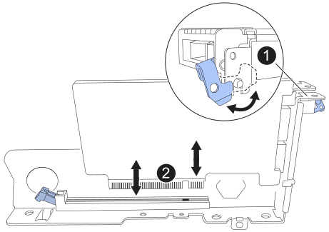
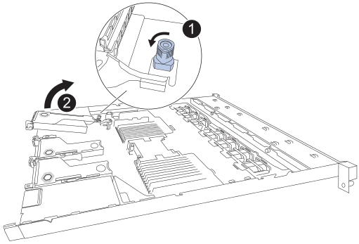

= Sostituire la scheda di rete interna nei modelli SGF6212 o SG6200-CN
:allow-uri-read: 
:icons: font
:imagesdir: ../media/

[role="lead"]
Potrebbe essere necessario sostituire una scheda di interfaccia di rete (NIC) interna nel SGF6212 o SG6200-CN se non funziona in modo ottimale o se si è guastata.

.A proposito di questa attività
Per evitare interruzioni del servizio, verificare che tutti gli altri nodi di archiviazione siano collegati alla rete prima di avviare la sostituzione della scheda di interfaccia di rete (NIC) o sostituire la scheda durante una finestra di manutenzione programmata quando i periodi di interruzione del servizio sono accettabili. Vedere le informazioni su https://docs.netapp.com/us-en/storagegrid/monitor/monitoring-system-health.html#monitor-node-connection-states["monitoraggio degli stati di connessione del nodo"^].

CAUTION: Se è stata utilizzata una regola ILM che crea una sola copia di un oggetto, è necessario sostituire la scheda di rete durante una finestra di manutenzione pianificata poiché durante questa procedura potrebbe essere temporaneamente perso l'accesso a tali oggetti. Vedere informazioni su https://docs.netapp.com/us-en/storagegrid/ilm/why-you-should-not-use-single-copy-replication.html["perché non utilizzare la replica a copia singola"^].

.Prima di iniziare
* Si dispone della scheda NIC sostitutiva corretta.
* Ti trovi link:locating-sg6200-in-data-center.html["individuare fisicamente l'appliance SGF6212 o il controller SG6200-CN"] nella situazione in cui stai sostituendo la scheda di rete nel data center.
+

NOTE: A link:power-sg6200-off-on.html#shut-down-the-sgf6212-appliance-or-sg6200-cn-controller["spegnimento controllato dell'apparecchio"] è necessario prima di rimuovere l'apparecchio dal rack.

* Hai scollegato tutti i cavi e link:reinstalling-sg6200-cover.html["rimuovere il coperchio dell'apparecchio"].
* È stato determinato il link:verify-component-to-replace.html["Posizione della scheda di rete da sostituire"].
+
Le tre schede di rete (NIC) presenti nell'apparecchio sono alloggiate in tre riser nelle seguenti posizioni all'interno dello chassis (nella figura è mostrato il retro dell'apparecchio con il coperchio superiore rimosso):

+
image:../media/drw_s2025_io_numbers_ieops-2554.svg["Posizione delle schede di rete nell'appliance"]

== Passaggio 1: Rimuovere la scheda di rete

[role="tabbed-block"]
====
.NIC 1/NIC 2
--
.Fasi
. Avvolgere l'estremità del braccialetto ESD intorno al polso e fissare l'estremità del fermaglio a una messa a terra metallica per evitare scariche elettrostatiche.
. Individuare il gruppo di montaggio che contiene la scheda NIC sul retro dell'apparecchio.
. Ruotare il fermo di bloccaggio blu sul riser con la scheda di rete guasta rivolto verso l'alto e in posizione aperta.
+
image:../media/drw_s2025_io_1_2_replace_ieops-2555.svg["Rimozione di NIC 1 o NIC 2 dal gruppo riser"]

. Sollevare con cautela il gruppo riser con la scheda di rete guasta utilizzando i fori contrassegnati in blu. Spostare il gruppo riser verso la parte anteriore dello chassis mentre lo si solleva, per consentire ai connettori esterni della scheda di rete installata di liberare lo chassis.
. Posizionare il supporto su una superficie piana antistatica con il lato della struttura metallica rivolto verso il basso per accedere alla scheda di rete.
. Aprire il fermo blu sulla scheda di rete guasta e rimuoverla con cautela dal supporto. Muovere leggermente la scheda di rete per facilitarne la rimozione dal connettore. Non esercitare una forza eccessiva.
+

. Posizionare il riser e la scheda di rete su una superficie piana antistatica.

--
.NIC 3
--
.Fasi
. Avvolgere l'estremità del braccialetto ESD intorno al polso e fissare l'estremità del fermaglio a una messa a terra metallica per evitare scariche elettrostatiche.
. Ruotare il blocco blu sul riser con la scheda di rete guasta in posizione aperta.
+

. Sollevare con cautela il gruppo riser verso l'alto utilizzando il foro contrassegnato in blu e il bordo del riser. Spostare il gruppo riser verso la parte anteriore dello chassis mentre lo si solleva per consentire ai connettori esterni della NIC installata di liberare lo chassis.
. Posizionare il supporto su una superficie piana antistatica con il lato della struttura metallica rivolto verso il basso per accedere alla scheda di rete.
. Aprire il fermo blu sulla scheda di rete guasta e rimuoverla con cautela dal supporto. Muovere leggermente la scheda di rete per facilitarne la rimozione dal connettore. Non esercitare una forza eccessiva.
+

. Posizionare il riser e la scheda di rete su una superficie piana antistatica.

--
====

== Passaggio 2: Reinstallare la scheda di rete interna

Installare la scheda NIC sostitutiva nella stessa posizione di quella rimossa.

[role="tabbed-block"]
====
.NIC 1/NIC 2
--
.Fasi
. Avvolgere l'estremità del braccialetto ESD intorno al polso e fissare l'estremità del fermaglio a una messa a terra metallica per evitare scariche elettrostatiche.
. Rimuovere la scheda di rete sostitutiva dalla confezione.
. Installare la scheda di rete sostitutiva nell'assemblaggio riser.
+
.. Assicurarsi che il fermo blu sia in posizione aperta.
+

.. Allineare la scheda di rete con il relativo connettore sul supporto. Premere con cautela la scheda di rete nel connettore fino a quando non è completamente inserita, quindi chiudere il fermo blu.

. Reinstallare il gruppo riser nel chassis.
+
.. Individuare il foro di allineamento sul gruppo riser che si allinea con un perno guida sulla scheda di sistema per garantire il corretto posizionamento del gruppo riser.
+
image:../media/drw_s2025_io_1_2_reinstall_ieops-2685.svg["Sostituzione della scheda di rete NIC 1 o NIC 2 nel gruppo riser"]

.. Posizionare il gruppo riser nello chassis, assicurandosi che sia allineato con il connettore sulla scheda di sistema e con il pin guida.
.. Premere con cautela il gruppo riser in posizione lungo la linea centrale, accanto ai fori blu, fino a posizionarlo completamente.

. Se non si dispone di altre procedure di manutenzione da eseguire nell'apparecchio, reinstallare il coperchio dell'apparecchio, riposizionare l'apparecchio nel rack, collegare i cavi e alimentare.

Dopo aver sostituito il componente, restituire il componente difettoso a NetApp, come descritto nelle istruzioni RMA fornite con il kit. Consultare la  https://mysupport.netapp.com/site/info/rma["Restituzione e sostituzione dei pezzi"^] pagina per ulteriori informazioni.

--
.NIC 3
--
.Fasi
. Avvolgere l'estremità del braccialetto ESD intorno al polso e fissare l'estremità del fermaglio a una messa a terra metallica per evitare scariche elettrostatiche.
. Rimuovere la scheda di rete sostitutiva dalla confezione.
. Installare la scheda di rete sostitutiva nell'assemblaggio riser.
+
.. Assicurarsi che il fermo blu sia in posizione aperta.
+

.. Allineare la scheda di rete con il relativo connettore sul supporto. Premere con cautela la scheda di rete nel connettore fino a quando non è completamente inserita, quindi chiudere il fermo blu.

. Reinstallare il gruppo riser nel chassis.
+
.. Posizionare il gruppo di rialzo all'interno del chassis, assicurandosi che i bordi del gruppo di rialzo siano correttamente allineati con i bordi del chassis.
+
image:../media/drw_s2025_IO_3_replace_ieops-2686.svg["Sostituzione della scheda di rete NIC 3 nell'assemblaggio riser"]

.. Premere con cautela il gruppo di rialzo in posizione lungo la sua linea centrale, accanto al foro contrassegnato in blu, fino a quando non è completamente in sede.
.. Ruotare il blocco blu sul montante in posizione di chiusura.

. Rimuovere i cappucci di protezione dalle porte NIC in cui verranno reinstallati i cavi.
. Se non si dispone di altre procedure di manutenzione da eseguire nell'apparecchio, reinstallare il coperchio dell'apparecchio, riposizionare l'apparecchio nel rack, collegare i cavi e alimentare.

Dopo aver sostituito il componente, restituire il componente difettoso a NetApp, come descritto nelle istruzioni RMA fornite con il kit. Consultare la  https://mysupport.netapp.com/site/info/rma["Restituzione e sostituzione dei pezzi"^] pagina per ulteriori informazioni.

--
====